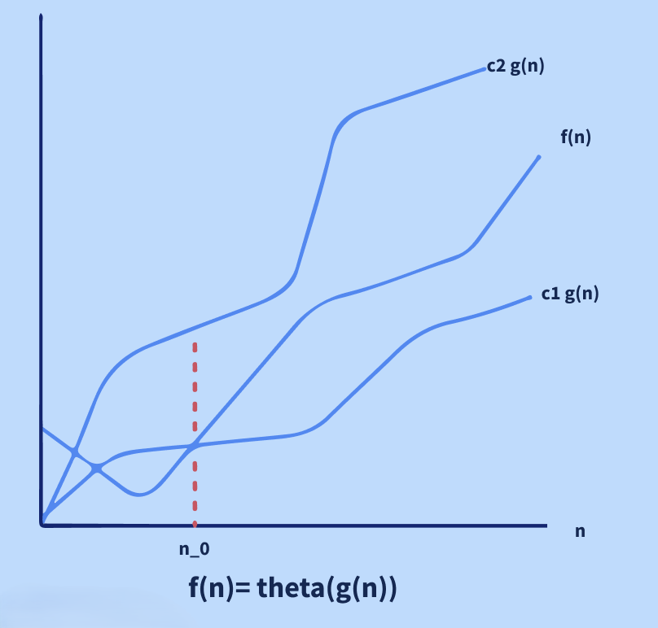
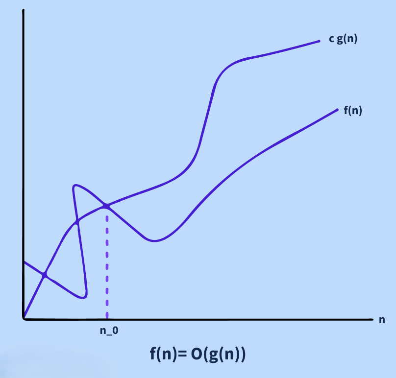
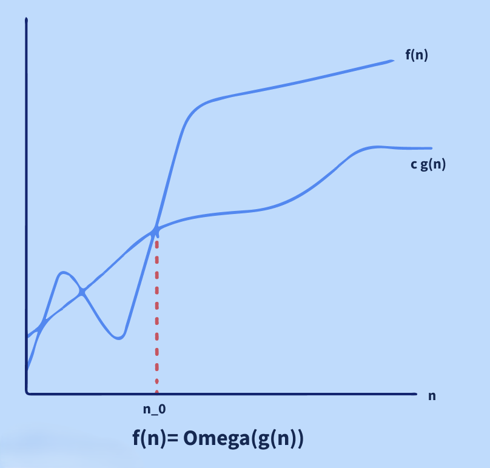
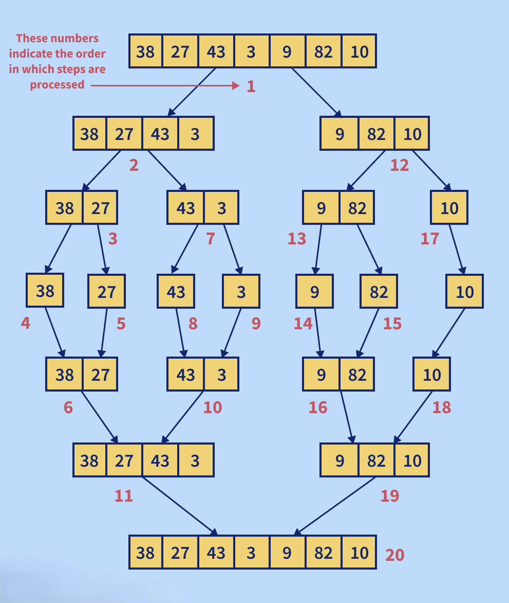

# Algorithm Interview Question

## Table of Contents

### 1. Algorithms Comparison
1.1. [How can we compare between two algorithms written for the same problem?](#11-how-can-we-compare-between-two-algorithms-written-for-the-same-problem)  
1.2. [What do you understand about the DFS (Depth First Search) algorithm?](#12-what-do-you-understand-about-the-dfs-depth-first-search-algorithm)  
1.3. [What do you understand about the BFS (Breadth First Search) algorithm?](#13-what-do-you-understand-about-the-bfs-breadth-first-search-algorithm)  

### 2. String and Dynamic Programming
2.1. [Write down a string reversal algorithm. If the given string is "kitiR," for example, the output should be "Ritik."]( #21-write-down-a-string-reversal-algorithm)  
2.2. [What do you understand about the Dynamic Programming (DP) Algorithmic Paradigm? List a few problems which can be solved using the same.](#22-what-do-you-understand-about-the-dynamic-programming-dp-algorithmic-paradigm)  
2.3. [Write an algorithm for counting the number of leaf nodes in a binary tree.](#23-write-an-algorithm-for-counting-the-number-of-leaf-nodes-in-a-binary-tree)  
2.4. [Write down an algorithm for adding a node to a linked list sorted in ascending order (maintaining the sorting property).](#24-write-down-an-algorithm-for-adding-a-node-to-a-linked-list-sorted-in-ascending-order)  

### 3. Searching Algorithms
3.1. [Describe the Binary Search Algorithm.](#31-describe-the-binary-search-algorithm)  
3.2. [Describe the Linear Search Algorithm.](#32-describe-the-linear-search-algorithm)  
3.3. [What do you understand by a searching algorithm? List a few types of searching algorithms.](#33-what-do-you-understand-by-a-searching-algorithm)  

### 4. Greedy Algorithms
4.1. [What do you understand about greedy algorithms? List a few examples of greedy algorithms.](#41-what-do-you-understand-about-greedy-algorithms)  

### 5. Algorithm Paradigms
5.1. [Explain the Divide and Conquer Algorithmic Paradigm. Also, list a few algorithms which use this paradigm.](#51-explain-the-divide-and-conquer-algorithmic-paradigm)  
5.2. [What do you understand by the Asymptotic Notations?](#52-what-do-you-understand-by-the-asymptotic-notations)  
5.3. [What do you understand by the best case, worst case, and average case scenario of an algorithm?](#53-what-do-you-understand-by-the-best-case-worst-case-and-average-case-scenario-of-an-algorithm)  

### 6. Sorting Algorithms
6.1. [What is the space complexity of the selection sort algorithm?](#61-what-is-the-space-complexity-of-the-selection-sort-algorithm)  
6.2. [What is the space complexity of the insertion sort algorithm?](#62-what-is-the-space-complexity-of-the-insertion-sort-algorithm)  
6.3. [Describe the heap sort algorithm.](#63-describe-the-heap-sort-algorithm)  
6.4. [Describe the bubble sort algorithm with the help of an example.](#64-describe-the-bubble-sort-algorithm)  
6.5. [Describe the quick sort algorithm.](#65-describe-the-quick-sort-algorithm)  
6.6. [Describe the merge sort algorithm.](#66-describe-the-merge-sort-algorithm)  

### 7. Trees and Graphs
7.1. [Define tree traversal and list some of the algorithms to traverse a binary tree.](#71-define-tree-traversal-and-list-some-of-the-algorithms-to-traverse-a-binary-tree)  
7.2. [Devise an algorithm to insert a node in a Binary Search Tree.](#72-devise-an-algorithm-to-insert-a-node-in-a-binary-search-tree)  
7.3. [Explain the Dijkstra's Algorithm to find the shortest path between a given node in a graph to any other node in the graph.](#73-explain-the-dijkstras-algorithm-to-find-the-shortest-path-between-a-given-node-in-a-graph-to-any-other-node-in-the-graph)  

### 8. Miscellaneous
8.1. [What are recursive algorithms? State the important rules which every recursive algorithm must follow.](#81-what-are-recursive-algorithms-state-the-important-rules-which-every-recursive-algorithm-must-follow)  
8.2. [Can we use the binary search algorithm for linked lists? Justify your answer.](#82-can-we-use-the-binary-search-algorithm-for-linked-lists-justify-your-answer)  
8.3. [Write an algorithm to find the maximum subarray sum for a given array.](#83-write-an-algorithm-to-find-the-maximum-subarray-sum-for-a-given-array)  
8.4. [What are few of the most widely used cryptographic algorithms?](#84-what-are-few-of-the-most-widely-used-cryptographic-algorithms)  

---

### 1. Algorithms Comparison

### 1.1. How can we compare between two algorithms written for the same problem?

The complexity of an algorithm is a technique that is used to categorise how efficient it is in comparison to other algorithms. It focuses on how the size of the data set to be processed affects execution time. In computing, the algorithm's computational complexity is critical. It is a good idea to categorise algorithms according to how much time or space they take up and to describe how much time or space they take up as a function of input size.

- **Complexity of Time:** The running time of a program as a function of the size of the input is known as time complexity.
- **Complexity of Space:** Space complexity examines algorithms based on how much space they require to fulfil their tasks. In the early days of computers, space complexity analysis was crucial (when storage space on the computer was limited).

**Note:** Nowadays, a lack of space is rarely an issue because computer storage is plentiful. Therefore, it is mostly the Time Complexity that is given more importance while evaluating an Algorithm.
  
### 1.2. What do you understand about the DFS (Depth First Search) algorithm?

Depth First Search or DFS is a technique for traversing or exploring data structures such as trees and graphs. The algorithm starts at the root node (in the case of a graph, any random node can be used as the root node) and examines each branch as far as feasible before retracing. So the basic idea is to start at the root or any arbitrary node and mark it, then advance to the next unmarked node and repeat until there are no more unmarked nodes. After that, go back and check for any more unmarked nodes to cross. Finally, print the path's nodes. The DFS algorithm is given below:

- **Step1:** Create a recursive function that takes the node's index and a visited array as input.
- **Step 2:** Make the current node a visited node and print it.
- **Step 3:** Call the recursive function with the index of the adjacent node after traversing all nearby and unmarked nodes.

### 1.3. What do you understand about the BFS (Breadth First Search) algorithm?  

BFS or Breadth-First Search is a graph traversal technique. It begins by traversing the graph from the root node and explores all of the nodes in the immediate vicinity. It chooses the closest node and then visits all of the nodes that have yet to be visited. Until it reaches the objective node, the algorithm repeats the same method for each of the closest nodes. 

The BFS Algorithm is given below:

- **Step 1:** Set status = 1 as the first step for all the nodes(ready state).
- **Step 2:** Set the status of the initial node A to 2, that is, waiting state.
- **Step 3:** Repeat steps 4 and 5 until the queue is not empty.
- **Step 4:** Dequeue and process node N from the queue, setting its status to 3, that is, the processed state.
- **Step 5:** Put all of N's neighbours in the ready state (status = 1) in the queue and set their status to 2 (waiting state)
- **Step 6:** Exit.

---

### 2. String and Dynamic Programming

#### 2.1. Write down a string reversal algorithm. If the given string is "kitiR," for example, the output should be "Ritik."

An algorithm for string reversal is as follows:

- Step 1: Start.
- Step 2: We take two variables l and r.
- Step 3: We set the values of l as 0 and r as (length of the string  - 1).
- Step 4: We interchange the values of the characters at positions l and r in the string.
- Step 5: We increment the value of l by one.
- Step 6: We decrement the value of r by one.
- Step 7: If the value of r is greater than the value of l, we go to step 4
- Step 8: Stop.

### 2.2. What do you understand about the Dynamic Programming (DP) Algorithmic Paradigm? List a few problems which can be solved using the same.

Dynamic Programming is primarily a recursion optimization. We can use Dynamic Programming to optimise any recursive solution that involves repeated calls for the same inputs. The goal is to simply save the results of subproblems so that we do not have to recalculate them later. The time complexity of this simple optimization is reduced from exponential to polynomial. For example, if we create a simple recursive solution for Fibonacci Numbers, the time complexity is exponential, but if we optimise it by storing subproblem answers using Dynamic Programming, the time complexity is linear. 

The following codes illustrate the same:

**With Recursion (no DP):** The time complexity of the given code will be exponential.
```cpp
// Function to calculate the nth Fibonacci number using recursion
int fibonacci(int n) {
    // Base cases
    if (n <= 0) return 0; // Fibonacci(0) = 0
    if (n == 1) return 1; // Fibonacci(1) = 1

    // Recursive call
    return fibonacci(n - 1) + fibonacci(n - 2);
}
```


**With DP:** The time complexity of the given code will be linear because of Dynamic Programming.
```cpp
// Function to calculate the nth Fibonacci number using dynamic programming
int fibonacci(int n) {
    // Handle base cases
    if (n <= 0) return 0; // Fibonacci(0) = 0
    if (n == 1) return 1; // Fibonacci(1) = 1

    // Create a vector to store Fibonacci numbers
    std::vector<int> fib(n + 1);
    fib[0] = 0; // Fibonacci(0)
    fib[1] = 1; // Fibonacci(1)

    // Fill the vector with Fibonacci values up to n
    for (int i = 2; i <= n; ++i) {
        fib[i] = fib[i - 1] + fib[i - 2]; // DP relation
    }

    // Return the nth Fibonacci number
    return fib[n];
}
```


A few problems which can be solved using the Dynamic Programming (DP) Algorithmic Paradigm are as follows:

- Finding the nth Fibonacci number
- Finding the Longest Common Subsequence between two strings.
- Finding the Longest Palindromic Substring in a string.
- The discrete (or 0-1) Knapsack Problem.
- Shortest Path between any two nodes in a graph (Floyd Warshall Algorithm)


### 2.3. Write an algorithm for counting the number of leaf nodes in a binary tree.

An algorithm for counting the number of leaf nodes in a binary tree is given below:

- Define a function that takes the root node of the binary tree as input.
- Check if the current node is NULL: If it is, return 0 (base case).
- Check if the current node is a leaf node: A leaf node is defined as a node with no left and right children. If both children are NULL, return 1.
- Recursively call the function for the left and right child nodes, and sum the results.
- Return the total count of leaf nodes.

```cpp
#include <iostream>

// Definition for a binary tree node
struct TreeNode {
    int val;
    TreeNode* left;
    TreeNode* right;

    TreeNode(int x) : val(x), left(NULL), right(NULL) {}
};

// Function to count the number of leaf nodes in a binary tree
int countLeafNodes(TreeNode* root) {
    // Base case: if the current node is NULL
    if (root == NULL) {
        return 0;
    }
    
    // If the current node is a leaf node
    if (root->left == NULL && root->right == NULL) {
        return 1;
    }

    // Recur for left and right children and sum the results
    return countLeafNodes(root->left) + countLeafNodes(root->right);
}

// Main function to demonstrate the countLeafNodes function
int main() {
    // Creating a simple binary tree
    TreeNode* root = new TreeNode(1);
    root->left = new TreeNode(2);
    root->right = new TreeNode(3);
    root->left->left = new TreeNode(4);
    root->left->right = new TreeNode(5);
    root->right->left = new TreeNode(6);
    root->right->right = new TreeNode(7);

    // Counting leaf nodes
    int leafCount = countLeafNodes(root);
    std::cout << "Number of leaf nodes: " << leafCount << std::endl;

    // Cleanup memory (not shown here for simplicity, but recommended in real applications)
    // ... (code to delete allocated nodes)

    return 0;
}
```

#### Explanation
- **Base Case:** The function first checks if the node is NULL and returns 0.
- **Leaf Node Check:** If both the left and right children of the node are NULL, it identifies the node as a leaf and returns 1.
- **Recursive Count:** The function is called recursively for both left and right children, adding their counts together.

#### Time Complexity
The time complexity is O(n), where n is the number of nodes in the binary tree, as each node is visited once.

### 2.4. Write down an algorithm for adding a node to a linked list sorted in ascending order (maintaining the sorting property).  

An algorithm for adding a node to a link list sorted in ascending order (maintaining the sorting property) is given below:

- **Step 1:** Check if the linked list has no value (or is empty). If yes, then set the new node as the head and return it.
- **Step 2:** Check if the value of the node to be inserted is smaller than the value of the head node. If yes, place it at the beginning and make it the head node.
- **Step 3:** Find the suitable node after which the input node should be added in a loop. To discover the required node, begin at the head and work your way forward until you reach a node whose value exceeds the input node. The preceding node is the correct node.
- **Step 4:** After the correct node is found in step 3, insert the node.
---

### 3. Searching Algorithms

### 3.1. Describe the Binary Search Algorithm.
To perform a binary search on a list of elements, the list must be sorted first. This algorithm follows the Divide and Conquer approach. The Binary Search Algorithm works by repeatedly dividing the search range in half to find the target value in the sorted list. 

<p align="center">
    
</p><br>

Here’s how it works:

**Steps:**
1. **Initialization:** Create an interval spanning the entire list.
2. **Compare** \( x \) with the middle element:
   - If \( x \) matches the middle element, return its index.
   - If \( x \) is greater, narrow the interval to the right half.
   - If \( x \) is smaller, narrow the interval to the left half.
3. **Repeat** until the element is found or the interval is empty.
4. **Terminate** the search if the interval is empty.

**Complexity:**
- **Time Complexity:** \( O(log n) \)
- **Space Complexity:** \( O(1) \)

### 3.2. Describe the Linear Search Algorithm.

To find an element in a group of elements, the linear search can be used. It works by traversing the list of elements from the beginning to the end and inspecting each element.

<p align="center">
    
</p><br>

**Steps:**
1. **Traverse the list:** Use a loop to go through each element.
2. **Compare values:** In each iteration, compare the target value (key) to the current element.
3. **Print index:** If the values match, print the current index.
4. **Continue:** If the values do not match, move to the next element.
5. **Repeat:** Continue steps 1 to 4 until the end of the list is reached.

**Complexity:**
- **Time Complexity:** \( O(n) \) where \( n \) is the size of the list.
- **Space Complexity:** \( O(1) \)

### 3.3. What do you understand by a searching algorithm? List a few types of searching algorithms.  
Searching Algorithms are used to look for an element or get it from a data structure (usually a list of elements). These algorithms are divided into two categories based on the type of search operation:

- **Sequential Search:** This method traverses the list of elements consecutively, checking each element and reporting if the element to be searched is found. Linear Search is an example of a Sequential Search Algorithm.
- **Interval Search:** These algorithms were created specifically for searching sorted data structures. Because they continually target the centre of the search structure and divide the search space in half, these types of search algorithms are far more efficient than Sequential Search algorithms. Binary Search is an example of an Interval Search Algorithm.
---

### 4. Greedy Algorithms

#### 4.1. What do you understand about greedy algorithms? List a few examples of greedy algorithms.  
A greedy algorithm is an algorithmic method that aims to choose the best optimal decision at each sub-step, eventually leading to a globally optimal solution. This means that the algorithm chooses the best answer available at the time, regardless of the consequences. In other words, when looking for an answer, an algorithm always selects the best immediate, or local, option. Greedy algorithms may identify less than perfect answers for some cases of other problems while finding the overall, ideal solution for some idealistic problems.

The Greedy algorithm is used in the following algorithms to find their solutions:

- Prim's Minimal Spanning Tree Algorithm
- Kruskal's Minimal Spanning Tree Algorithm
- Travelling Salesman Problem
- Fractional Knapsack Problem
- Dijkstra's Algorithm
- Job Scheduling Problem
- Graph  Map Coloring
- Graph  Vertex Cover.
---

### 5. Algorithm Paradigms

### 5.1. Explain the Divide and Conquer Algorithmic Paradigm. Also, list a few algorithms which use this paradigm.

Divide and Conquer is an algorithm paradigm, not an algorithm itself. It is set up in such a way that it can handle a large amount of data, split it down into smaller chunks, and determine the solution to the problem for each of the smaller chunks. It combines all of the piecewise solutions of the smaller chunks to form a single global solution. This is known as the divide and conquer technique. The Divide and Conquer algorithmic paradigm employ the steps given below:

- **Divide:** The algorithm separates the original problem into a set of subproblems in this step.
- **Conquer:** The algorithm solves each subproblem individually in this step.
- **Combine:** In this step, the algorithm combines the solutions to the subproblems to obtain the overall solution.

<p align="center">
    
</p><br>

Some of the algorithms which use the Divide and Conquer Algorithmic paradigm are as follows:

- Binary Search
- Merge Sort
- Strassen's Matrix Multiplication
- Quick Sort
- Closest pair of points.

### 5.2. What do you understand by the Asymptotic Notations?
Asymptotic analysis is a technique that is used for determining the efficiency of an algorithm that does not rely on machine-specific constants and avoids the algorithm from comparing itself to the time-consuming approach. For asymptotic analysis, asymptotic notation is a mathematical technique that is used to indicate the temporal complexity of algorithms.

The following are the three most common asymptotic notations.

- **Big Theta Notation: (θ Notation)**
The exact asymptotic behaviour is defined using the theta (θ) Notation. It binds functions from above and below to define behaviour. Dropping low order terms and ignoring leading constants is a convenient approach to get Theta notation for an expression.

<p align="center">
    
</p><br>

- **Big O Notation:**
The Big O notation defines an upper bound for an algorithm by bounding a function from above. Consider the situation of insertion sort: in the best case scenario, it takes linear time, and in the worst case, it takes quadratic time. Insertion sort has a time complexity O(n^2). It is useful when we just have an upper constraint on an algorithm's time complexity.

<p align="center">
    
</p><br>

- **Big Omega (Ω) Notation:**
The Ω Notation provides an asymptotic lower bound on a function, just like Big O notation does. It is useful when we have a lower bound on an algorithm's time complexity.

<p align="center">
    
</p><br>

### 5.3. What do you understand by the best case, worst case, and average case scenario of an algorithm?  
The mathematical foundation/framing of an algorithm's run time performance is defined by asymptotic analysis. We can easily determine the best case, average case, and worst-case scenarios of an algorithm using asymptotic analysis.

- **Best Case Scenario of an Algorithm:** The best-case scenario for an algorithm is defined as the data arrangement in which the algorithm performs the best. Take a binary search, for example, where the best-case scenario is if the target value is in the very centre of the data we are looking for. The best-case scenario for binary search would have a time complexity of O(1) or constant time complexity.
- **Worst Case Scenario of an Algorithm:** The worst collection of input for a given algorithm is referred to as the worst-case scenario of an Algorithm. For example, quicksort can perform poorly if the pivot value is set to the largest or smallest element of a sublist. Quicksort will degenerate into an algorithm with a time complexity of O(n^2), where n is the size of the list to be sorted.
- **Average Case Scenario of an Algorithm:** The average-case complexity of an algorithm is the amount of some computational resource (usually time) used by the process, averaged over all possible inputs, according to computational complexity theory. For example, the average-case complexity of the randomised quicksort algorithm is O(n*log(n)), where n is the size of the list to be sorted.
---

### 6. Sorting Algorithms

### 6.1. What is the space complexity of the selection sort algorithm?
Selection sort is an in-place sorting method, which implies it does not require any additional or minimal data storage. Therefore, the selection sort algorithm has a constant space complexity or O(1) space complexity.

### 6.2. What is the space complexity of the insertion sort algorithm?
Insertion sort is an in-place sorting method, which implies it does not require any additional or minimal data storage. In insertion sort, only a single list element must be stored outside of the starting data, resulting in a constant space complexity or O(1) space complexity.

### 6.3. Describe the heap sort algorithm.

**1. Heap Construction (buildMaxHeap):**
- The algorithm starts by turning the input array into a max heap, where each parent node is greater than its children.
- The buildMaxHeap() function creates this heap structure in O(n) time, as a result of heapifying the elements from the middle to the beginning of the array.

**2. Sorting Phase:**
- After the max heap is built, the largest element (the root of the heap) is at the first index.
- The algorithm swaps the root with the last element of the heap (effectively moving the largest element to its correct sorted position).
- Then, the size of the heap is reduced by one, and the heap property is restored by calling siftDown() (or heapify) on the new root, which takes O(log n) time.

**3. Repeat:**
- The process is repeated until only one element is left in the heap.
- Each time, the largest element is moved to the sorted portion, while the unsorted portion is re-heapified.

#### Time Complexity:
- **Heap Construction:** The buildMaxHeap() runs in O(n) time.
- **Heapify Calls:** Each call to siftDown() (heapify) takes O(log n) time, and we call it n times during the sorting process (for each element in the array).
- Therefore, the total time complexity is O(n log n), which is very efficient compared to other comparison-based sorting algorithms like Selection Sort (O(n²)).

#### Space Complexity
- Heap Sort is in-place and uses only a constant amount of extra memory for a few variables (like loop counters and a temporary variable to swap elements).
- Thus, the space complexity of Heap Sort is O(1).

### Why It's More Efficient Than Selection Sort:
- In **Selection** Sort, finding the maximum element in the unsorted portion requires scanning the unsorted part in O(n) time, and it repeats this for each element.
- **Heap** Sort improves this by using a heap to extract the maximum element in O(log n) time, making it much faster than Selection Sort.

In conclusion, Heap Sort is an efficient, comparison-based, in-place sorting algorithm with a time complexity of O(n log n) and a space complexity of O(1).

### 6.4. Describe the bubble sort algorithm with the help of an example.
Bubble Sort is a simple comparison-based sorting algorithm that repeatedly steps through the list, compares adjacent elements, and swaps them if they are in the wrong order. This process is repeated until the list is sorted.

**Steps:**
- Start from the beginning of the list.
- Compare adjacent elements.
- Swap them if they are out of order.
- Move to the next pair and repeat until the end of the list.
- Repeat the entire process for all elements, ignoring the already sorted part.

### Example List: `[5, 2, 9, 1, 5, 6]`

#### Pass 1:
1. **Compare 5 and 2** → Swap → `[2, 5, 9, 1, 5, 6]`
2. **Compare 5 and 9** → No swap.
3. **Compare 9 and 1** → Swap → `[2, 5, 1, 9, 5, 6]`
4. **Compare 9 and 5** → Swap → `[2, 5, 1, 5, 9, 6]`
5. **Compare 9 and 6** → Swap → `[2, 5, 1, 5, 6, 9]`

At the end of **Pass 1**, the largest element (9) is in its correct position.

#### Pass 2:
1. **Compare 2 and 5** → No swap.
2. **Compare 5 and 1** → Swap → `[2, 1, 5, 5, 6, 9]`
3. **Compare 5 and 5** → No swap.
4. **Compare 5 and 6** → No swap.

At the end of **Pass 2**, the second-largest element (6) is in its correct position.

#### Pass 3:
1. **Compare 2 and 1** → Swap → `[1, 2, 5, 5, 6, 9]`
2. **Compare 2 and 5** → No swap.
3. **Compare 5 and 5** → No swap.

At the end of **Pass 3**, the third-largest element (5) is in its correct position.

#### Pass 4:
1. **Compare 1 and 2** → No swap.
2. **Compare 2 and 5** → No swap.

At the end of **Pass 4**, the list is fully sorted.

### Final Sorted List: `[1, 2, 5, 5, 6, 9]`

After 4 passes, the list is completely sorted!

**Time Complexity:**
- Worst/Average: O(n²)
- Best (Optimized): O(n)

**Space Complexity:**
- O(1) (In-place)

Bubble Sort is simple but inefficient for large datasets due to its quadratic time complexity.

### 6.5. Describe the quick sort algorithm.

Quicksort is an efficient, in-place, comparison-based sorting algorithm that uses the divide and conquer strategy. It was developed by Tony Hoare in 1959 and is widely used due to its average-case performance of **O(n log n)**, making it faster than other algorithms like bubble sort or insertion sort for large datasets.

### How Quicksort Works

1. **Choose a Pivot**:
   - Select an element from the array as the pivot (this can be the first element, last element, a random element, or the median).

2. **Partition the Array**:
   - Rearrange the array elements so that:
     - Elements smaller than the pivot are moved to the left of the pivot.
     - Elements larger than the pivot are moved to the right.
   - After partitioning, the pivot is in its correct sorted position.

3. **Recursion**:
   - Recursively apply the same steps to the subarrays formed by dividing the array around the pivot.
   - **Base case**: If the subarray has fewer than two elements, it is already sorted.

### Example
Let's consider an array: `[10, 7, 8, 9, 1, 5]`

#### Step 1 - Choose a Pivot:
- Choose the last element `5` as the pivot.

#### Step 2 - Partition the Array:
- After rearranging based on the pivot, the array becomes:
  
  `[1, 5, 8, 9, 10, 7]`
  
  The pivot `5` is now in its correct position.

#### Step 3 - Recursion:
- Apply quicksort to the left subarray `[1]` (already sorted) and the right subarray `[8, 9, 10, 7]`.
- Repeat the steps for the right subarray using `7` as the pivot until the entire array is sorted.

### Time Complexity
- **Best and Average Case**: O(n log n)  
  This occurs when the pivot divides the array into roughly equal halves.
  
- **Worst Case**: O(n²)  
  This happens when the pivot consistently results in unbalanced partitions (e.g., selecting the smallest or largest element as the pivot each time).

### Space Complexity
- O(log n) due to the recursive nature of the algorithm.  
  Quicksort is an in-place algorithm, meaning it does not require extra space for an additional array.

### Key Points
- **Not Stable**: Quicksort does not preserve the relative order of elements with equal keys.
- **In-Place Algorithm**: It sorts the array without requiring additional memory.
- **Efficient**: It is faster than many other algorithms like bubble sort or insertion sort, especially for large datasets.


### 6.6. Describe the merge sort algorithm.  
Merge sort (also known as mergesort) is a general-purpose, comparison-based sorting algorithm developed in computer science. The majority of its implementations result in a **stable sort**, which indicates that the order of equal elements in the input and output is the same. In 1945, John von Neumann devised the merge sort method, which is a **divide and conquer** algorithm.

### How Merge Sort Works

1. **Separate the List**:
   - Divide the unsorted list into `n` sublists, each containing one element. 
   - A list of one element is considered sorted.

2. **Merge Sublists**:
   - Repeatedly merge sublists to create new sorted sublists until only one sublist remains. 
   - The final remaining sublist is the sorted list.

<p align="center">
    
</p><br>

### Time Complexity
- **Time Complexity**: O(n log n)  
  where `n` is the size of the list of elements to be sorted.

### Space Complexity
- **Space Complexity**: O(n)  
  Merge sort has a linear space complexity, as it requires additional space for temporary sublists during the merging process.

### Key Points
- **Stable Sort**: Maintains the relative order of equal elements.
- **Divide and Conquer**: Utilizes a divide and conquer strategy for sorting.
- **Efficiency**: Merge sort is efficient for large datasets and guarantees a time complexity of O(n log n).

---
### 7. Trees and Graphs

### 7.1. Define tree traversal and list some of the algorithms to traverse a binary tree.

Tree traversal is the process of visiting each node in a tree data structure, typically to perform an operation on each node, such as printing its value, searching for a value, or modifying the node's data. There are different methods to traverse a binary tree, each serving various purposes depending on the application.

### Types of Tree Traversal

#### 1. Depth-First Traversal (DFT)
- Visits nodes in a deep manner, exploring as far as possible along each branch before backtracking.
- Common algorithms for depth-first traversal:
  - **Inorder Traversal**: Visit the left subtree, then the root node, and finally the right subtree.
  - **Preorder Traversal**: Visit the root node first, then the left subtree, and finally the right subtree.
  - **Postorder Traversal**: Visit the left subtree first, then the right subtree, and finally the root node.

#### 2. Breadth-First Traversal (BFT)
- Visits all nodes at the present depth level before moving on to nodes at the next depth level.
- Common algorithms for breadth-first traversal:
  - **Level Order Traversal**: Visit nodes level by level from the root down to the leaves, typically using a queue.

### Summary of Traversal Algorithms

| Traversal Type       | Description                                              |
|----------------------|----------------------------------------------------------|
| **Inorder**          | Left → Root → Right                                     |
| **Preorder**         | Root → Left → Right                                     |
| **Postorder**        | Left → Right → Root                                     |
| **Level Order**      | Visit nodes level by level, using a queue               |


### 7.2. Devise an algorithm to insert a node in a Binary Search Tree.

Inserting a node in a BST involves placing the new node in the correct position based on the properties of the BST, where the left subtree contains nodes with values less than the node's value, and the right subtree contains nodes with values greater than the node's value.

### Algorithm

1. **Start at the root node.**
   - Assign the current node to the root.

2. **Compare the value to be inserted with the current node's value:**
   - If the value is **less than** the current node's value:
     - Check if the current node has a left child:
       - If yes, move to the left child and repeat step 2.
       - If no, insert the new node as the left child.
   - If the value is **greater than** the current node's value:
     - Check if the current node has a right child:
       - If yes, move to the right child and repeat step 2.
       - If no, insert the new node as the right child.

3. **End the process.**

### Example:

Consider the following BST:
 ```
                   10
                  /  \
                 5   15
```
To insert `7`:

1. Start at the root (10).
2. Since `7 < 10`, move left to (5).
3. Since `7 > 5`, insert `7` as the right child of `5`.

The updated BST:
```
                 10
                /  \
               5   15
                \
                 7
```

### 7.3. Explain the Dijkstra's Algorithm to find the shortest path between a given node in a graph to any other node in the graph. 

Dijkstra's algorithm is a method for finding the shortest paths between nodes in a graph, which can represent road networks. Developed by Edsger W. Dijkstra in 1956, it is widely used to compute the shortest path from a single source node to all other nodes in a graph.

### Algorithm Steps:

1. **Initialization:**
   - Mark all nodes as unvisited.
   - Assign a tentative distance value to each node:
     - Set the distance of the starting node to zero.
     - Set the distance of all other nodes to infinity.
   - Set the starting node as the current node.

2. **Evaluate Neighbors:**
   - For the current node, consider all of its unvisited neighbors.
   - Calculate their tentative distances through the current node. 
     - If the current node's distance is `5` and the edge to neighbor `B` is `3`, the distance to `B` will be `5 + 3 = 8`.
   - If this newly calculated distance is less than the previously assigned value, update the tentative distance.

3. **Mark Current Node as Visited:**
   - Once all neighbors have been evaluated, mark the current node as visited and remove it from the unvisited set.

4. **Select Next Current Node:**
   - If the destination node has been visited or if the smallest tentative distance among the unvisited nodes is infinity (indicating no connection), the algorithm stops.
   - Otherwise, select the unvisited node with the smallest tentative distance as the new current node and repeat from step 2.

5. **Termination:**
   - The algorithm ends when the destination node is marked as visited or when there are no remaining unvisited nodes.

<p align="center">
    
</p><br>

## Example Graph

<div style="text-align: center;">
<pre>
             A
           /   \
          1     4
         /       \
         B---2---C
</pre>
</div>

- **Edges**: A to B (1), A to C (4), B to C (2)

## Steps of the Algorithm

1. **Initialization**:
   - Start at node `A`, set its distance to `0`.
   - Set the distance of all other nodes to infinity (`∞`).

   | Node | Distance | Previous Node |
   |------|----------|---------------|
   | A    | 0        | None          |
   | B    | ∞        | None          |
   | C    | ∞        | None          |

2. **Evaluate Neighbors of A**:
   - Current Node: A
   - Update distances for neighbors:
     - Distance to B: `0 + 1 = 1`
     - Distance to C: `0 + 4 = 4`

   | Node | Distance | Previous Node |
   |------|----------|---------------|
   | A    | 0        | None          |
   | B    | 1        | A             |
   | C    | 4        | A             |

3. **Mark A as Visited** and Select Next Current Node:
   - Mark A as visited.
   - Current Node: B (smallest distance 1).

4. **Evaluate Neighbors of B**:
   - Update distance to C:
     - Distance to C through B: `1 + 2 = 3` (less than previous 4).

   | Node | Distance | Previous Node |
   |------|----------|---------------|
   | A    | 0        | None          |
   | B    | 1        | A             |
   | C    | 3        | B             |

5. **Mark B as Visited** and Select Next Current Node:
   - Mark B as visited.
   - Current Node: C (smallest distance 3).

6. **Evaluate Neighbors of C**:
   - C has no unvisited neighbors.

7. **Mark C as Visited**:
   - Mark C as visited.

### Final Distances from A

The shortest distances from A to all nodes are:

| Node | Distance | Previous Node |
|------|----------|---------------|
| A    | 0        | None          |
| B    | 1        | A             |
| C    | 3        | B             |


### Complexity

- **Time Complexity:** O(|E| + |V| log |V|), where |V| is the number of vertices and |E| is the number of edges.
- **Space Complexity:** O(|V|) for storing distances.

Dijkstra's algorithm is efficient for graphs with non-negative weights and is commonly used in various applications such as GPS navigation systems and network routing protocols.

---

### 8. Miscellaneous

### 8.1. What are recursive algorithms? State the important rules which every recursive algorithm must follow.
Recursive algorithm is a way of tackling a difficult problem by breaking it down into smaller and smaller subproblems until the problem is small enough to be solved quickly. It usually involves a function that calls itself (property of recursive functions).

The three laws which must be followed by all recursive algorithms are as follows:

- There should be a base case.
- It is necessary for a recursive algorithm to call itself.
- The state of a recursive algorithm must be changed in order for it to return to the base case.


### 8.2. Can we use the binary search algorithm for linked lists? Justify your answer.
No, we cannot use the binary search algorithm for linked lists. 

**Explanation:** 
Because random access is not allowed in linked lists, reaching the middle element in constant or O(1) time is impossible. As a result, the usage of a binary search algorithm on a linked list is not possible

### 8.3. Write an algorithm to find the maximum subarray sum for a given array.

Kadane's algorithm is an efficient method to find the maximum subarray sum for a given array. It operates in linear time, making it suitable for large datasets. The algorithm works by iterating through the array and calculating the maximum subarray sum ending at each position.

### How It Works

1. **Initialize Variables**:
   - `bestSum` = INT_MIN (a very small number to ensure any subarray sum will be larger)
   - `currentSum` = 0 (initialized to 0 for the empty subarray)

2. **Iterate Through the Array**:
   For each element `A[i]` in the array:
   - Update `currentSum` by adding the current element:
     - `currentSum = currentSum + A[i]`
   - Update `bestSum` if `currentSum` is greater:
     - If `bestSum < currentSum`, then `bestSum = currentSum`
   - If `currentSum` becomes negative, reset it to 0:
     - If `currentSum < 0`, then `currentSum = 0`

3. **Return the Result**:
   After looping through the array, return `bestSum`.

### Pseudocode:

```plaintext
function kadane(A):
    bestSum = INT_MIN
    currentSum = 0

    for each element A[i] in array A:
        currentSum = currentSum + A[i]
        if bestSum < currentSum:
            bestSum = currentSum
        if currentSum < 0:
            currentSum = 0

    return bestSum
```    
**For Example:** A = `[-2, 1, -3, 4, -1, 2, 1, -5, 4]`

#### 1.Initialization:

- bestSum = INT_MIN
- currentSum = 0

#### 2.Iteration:
- i = 0: currentSum = -2, bestSum = max(INT_MIN, -2) = -2
- i = 1: currentSum = -1, bestSum = max(-2, -1) = -1
- i = 2: currentSum = -4, bestSum = -1 (reset currentSum to 0)
- i = 3: currentSum = 4, bestSum = max(-1, 4) = 4
- i = 4: currentSum = 3, bestSum = 4
- i = 5: currentSum = 5, bestSum = max(4, 5) = 5
- i = 6: currentSum = 6, bestSum = max(5, 6) = 6
- i = 7: currentSum = 1, bestSum = 6
- i = 8: currentSum = 5, bestSum = 6

#### 3.Final Result:
- After iterating through the array, the maximum subarray sum is bestSum = `6`.


**Time Complexity:** O(n), where n is the number of elements in the array.
**Space Complexity:** O(1), as it uses a constant amount of space.

### 8.4. What are few of the most widely used cryptographic algorithms?
A few of the most widely used cryptographic algorithms are as follows:

- IDEA
- CAST
- CMEA
- 3-way
- Blowfish
- GOST
- LOKI
- DES and Triple DES.
