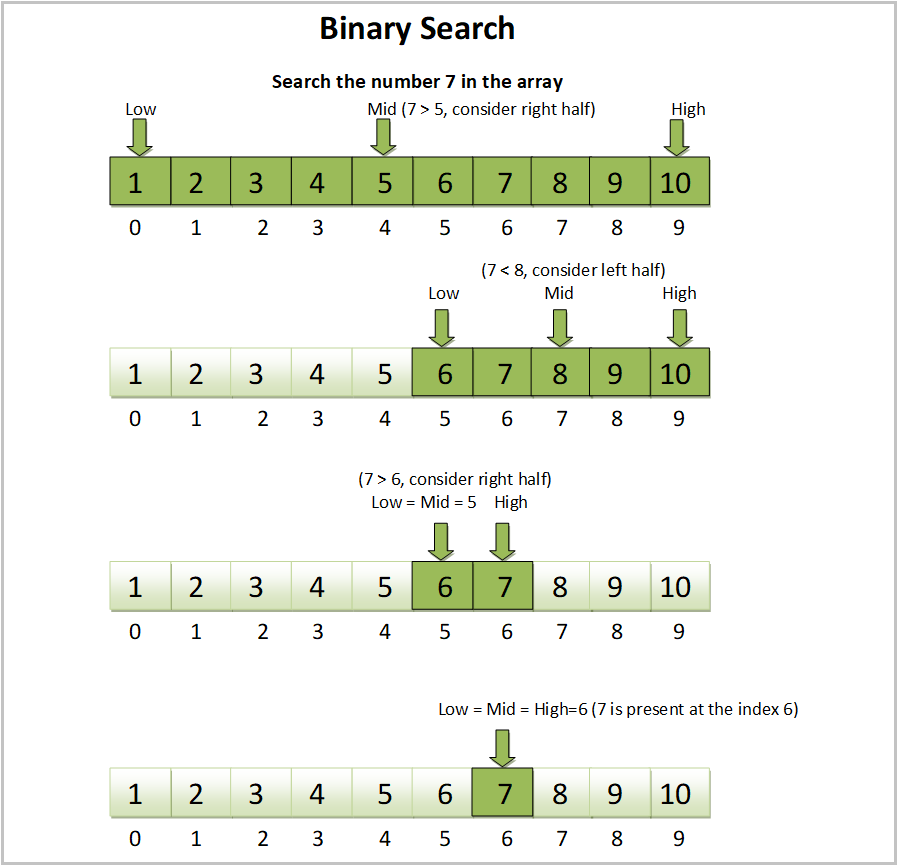
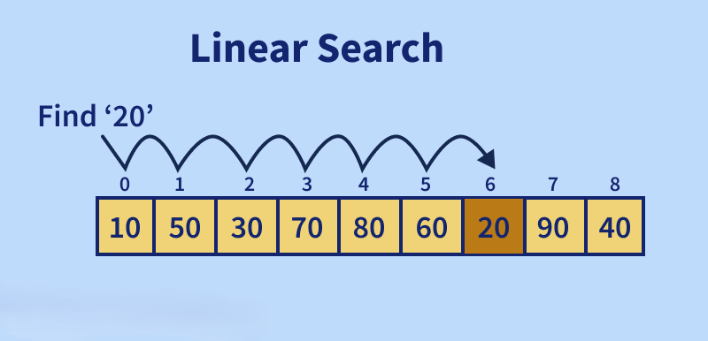
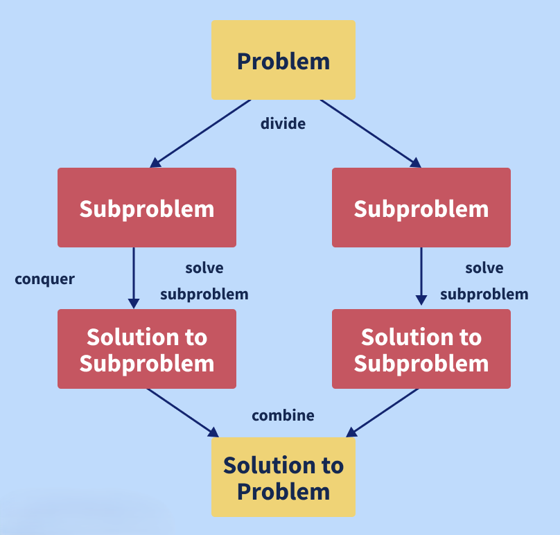

# Algorithm Interview Question

## Table of Contents

### 1. Algorithms Comparison
1.1. [How can we compare between two algorithms written for the same problem?](#11-how-can-we-compare-between-two-algorithms-written-for-the-same-problem)  
1.2. [What do you understand about the DFS (Depth First Search) algorithm?](#12-what-do-you-understand-about-the-dfs-depth-first-search-algorithm)  
1.3. [What do you understand about the BFS (Breadth First Search) algorithm?](#13-what-do-you-understand-about-the-bfs-breadth-first-search-algorithm)  

### 2. String and Dynamic Programming
2.1. [Write down a string reversal algorithm. If the given string is "kitiR," for example, the output should be "Ritik."]( #21-write-down-a-string-reversal-algorithm)  
2.2. [What do you understand about the Dynamic Programming (DP) Algorithmic Paradigm? List a few problems which can be solved using the same.](#22-what-do-you-understand-about-the-dynamic-programming-dp-algorithmic-paradigm)  
2.3. [Write an algorithm for counting the number of leaf nodes in a binary tree.](#23-write-an-algorithm-for-counting-the-number-of-leaf-nodes-in-a-binary-tree)  
2.4. [Write down an algorithm for adding a node to a linked list sorted in ascending order (maintaining the sorting property).](#24-write-down-an-algorithm-for-adding-a-node-to-a-linked-list-sorted-in-ascending-order)  

### 3. Searching Algorithms
3.1. [Describe the Binary Search Algorithm.](#31-describe-the-binary-search-algorithm)  
3.2. [Describe the Linear Search Algorithm.](#32-describe-the-linear-search-algorithm)  
3.3. [What do you understand by a searching algorithm? List a few types of searching algorithms.](#33-what-do-you-understand-by-a-searching-algorithm)  

### 4. Greedy Algorithms
4.1. [What do you understand about greedy algorithms? List a few examples of greedy algorithms.](#41-what-do-you-understand-about-greedy-algorithms)  

### 5. Algorithm Paradigms
5.1. [Explain the Divide and Conquer Algorithmic Paradigm. Also, list a few algorithms which use this paradigm.](#51-explain-the-divide-and-conquer-algorithmic-paradigm)  
5.2. [What do you understand by the Asymptotic Notations?](#52-what-do-you-understand-by-the-asymptotic-notations)  
5.3. [What do you understand by the best case, worst case, and average case scenario of an algorithm?](#53-what-do-you-understand-by-the-best-case-worst-case-and-average-case-scenario-of-an-algorithm)  

### 6. Sorting Algorithms
6.1. [What is the space complexity of the selection sort algorithm?](#61-what-is-the-space-complexity-of-the-selection-sort-algorithm)  
6.2. [What is the space complexity of the insertion sort algorithm?](#62-what-is-the-space-complexity-of-the-insertion-sort-algorithm)  
6.3. [Describe the heap sort algorithm.](#63-describe-the-heap-sort-algorithm)  
6.4. [Describe the bubble sort algorithm with the help of an example.](#64-describe-the-bubble-sort-algorithm)  
6.5. [Describe the quick sort algorithm.](#65-describe-the-quick-sort-algorithm)  
6.6. [Describe the merge sort algorithm.](#66-describe-the-merge-sort-algorithm)  

### 7. Trees and Graphs
7.1. [Define tree traversal and list some of the algorithms to traverse a binary tree.](#71-define-tree-traversal-and-list-some-of-the-algorithms-to-traverse-a-binary-tree)  
7.2. [Devise an algorithm to insert a node in a Binary Search Tree.](#72-devise-an-algorithm-to-insert-a-node-in-a-binary-search-tree)  
7.3. [Explain the Dijkstra's Algorithm to find the shortest path between a given node in a graph to any other node in the graph.](#73-explain-the-dijkstras-algorithm-to-find-the-shortest-path-between-a-given-node-in-a-graph-to-any-other-node-in-the-graph)  

### 8. Miscellaneous
8.1. [What are recursive algorithms? State the important rules which every recursive algorithm must follow.](#81-what-are-recursive-algorithms-state-the-important-rules-which-every-recursive-algorithm-must-follow)  
8.2. [Can we use the binary search algorithm for linked lists? Justify your answer.](#82-can-we-use-the-binary-search-algorithm-for-linked-lists-justify-your-answer)  
8.3. [Write an algorithm to find the maximum subarray sum for a given array.](#83-write-an-algorithm-to-find-the-maximum-subarray-sum-for-a-given-array)  
8.4. [What are few of the most widely used cryptographic algorithms?](#84-what-are-few-of-the-most-widely-used-cryptographic-algorithms)  

---

### 1. Algorithms Comparison

### 1.1. How can we compare between two algorithms written for the same problem?

The complexity of an algorithm is a technique that is used to categorise how efficient it is in comparison to other algorithms. It focuses on how the size of the data set to be processed affects execution time. In computing, the algorithm's computational complexity is critical. It is a good idea to categorise algorithms according to how much time or space they take up and to describe how much time or space they take up as a function of input size.

- **Complexity of Time:** The running time of a program as a function of the size of the input is known as time complexity.
- **Complexity of Space:** Space complexity examines algorithms based on how much space they require to fulfil their tasks. In the early days of computers, space complexity analysis was crucial (when storage space on the computer was limited).

**Note:** Nowadays, a lack of space is rarely an issue because computer storage is plentiful. Therefore, it is mostly the Time Complexity that is given more importance while evaluating an Algorithm.
  
### 1.2. What do you understand about the DFS (Depth First Search) algorithm?

Depth First Search or DFS is a technique for traversing or exploring data structures such as trees and graphs. The algorithm starts at the root node (in the case of a graph, any random node can be used as the root node) and examines each branch as far as feasible before retracing. So the basic idea is to start at the root or any arbitrary node and mark it, then advance to the next unmarked node and repeat until there are no more unmarked nodes. After that, go back and check for any more unmarked nodes to cross. Finally, print the path's nodes. The DFS algorithm is given below:

- **Step1:** Create a recursive function that takes the node's index and a visited array as input.
- **Step 2:** Make the current node a visited node and print it.
- **Step 3:** Call the recursive function with the index of the adjacent node after traversing all nearby and unmarked nodes.

### 1.3. What do you understand about the BFS (Breadth First Search) algorithm?  

BFS or Breadth-First Search is a graph traversal technique. It begins by traversing the graph from the root node and explores all of the nodes in the immediate vicinity. It chooses the closest node and then visits all of the nodes that have yet to be visited. Until it reaches the objective node, the algorithm repeats the same method for each of the closest nodes. 

The BFS Algorithm is given below:

- **Step 1:** Set status = 1 as the first step for all the nodes(ready state).
- **Step 2:** Set the status of the initial node A to 2, that is, waiting state.
- **Step 3:** Repeat steps 4 and 5 until the queue is not empty.
- **Step 4:** Dequeue and process node N from the queue, setting its status to 3, that is, the processed state.
- **Step 5:** Put all of N's neighbours in the ready state (status = 1) in the queue and set their status to 2 (waiting state)
- **Step 6:** Exit.

---

### 2. String and Dynamic Programming

#### 2.1. Write down a string reversal algorithm. If the given string is "kitiR," for example, the output should be "Ritik."

An algorithm for string reversal is as follows:

- Step 1: Start.
- Step 2: We take two variables l and r.
- Step 3: We set the values of l as 0 and r as (length of the string  - 1).
- Step 4: We interchange the values of the characters at positions l and r in the string.
- Step 5: We increment the value of l by one.
- Step 6: We decrement the value of r by one.
- Step 7: If the value of r is greater than the value of l, we go to step 4
- Step 8: Stop.

### 2.2. What do you understand about the Dynamic Programming (DP) Algorithmic Paradigm? List a few problems which can be solved using the same.

Dynamic Programming is primarily a recursion optimization. We can use Dynamic Programming to optimise any recursive solution that involves repeated calls for the same inputs. The goal is to simply save the results of subproblems so that we do not have to recalculate them later. The time complexity of this simple optimization is reduced from exponential to polynomial. For example, if we create a simple recursive solution for Fibonacci Numbers, the time complexity is exponential, but if we optimise it by storing subproblem answers using Dynamic Programming, the time complexity is linear. 

The following codes illustrate the same:

**With Recursion (no DP):** The time complexity of the given code will be exponential.
```cpp
// Function to calculate the nth Fibonacci number using recursion
int fibonacci(int n) {
    // Base cases
    if (n <= 0) return 0; // Fibonacci(0) = 0
    if (n == 1) return 1; // Fibonacci(1) = 1

    // Recursive call
    return fibonacci(n - 1) + fibonacci(n - 2);
}
```


**With DP:** The time complexity of the given code will be linear because of Dynamic Programming.
```cpp
// Function to calculate the nth Fibonacci number using dynamic programming
int fibonacci(int n) {
    // Handle base cases
    if (n <= 0) return 0; // Fibonacci(0) = 0
    if (n == 1) return 1; // Fibonacci(1) = 1

    // Create a vector to store Fibonacci numbers
    std::vector<int> fib(n + 1);
    fib[0] = 0; // Fibonacci(0)
    fib[1] = 1; // Fibonacci(1)

    // Fill the vector with Fibonacci values up to n
    for (int i = 2; i <= n; ++i) {
        fib[i] = fib[i - 1] + fib[i - 2]; // DP relation
    }

    // Return the nth Fibonacci number
    return fib[n];
}
```


A few problems which can be solved using the Dynamic Programming (DP) Algorithmic Paradigm are as follows:

- Finding the nth Fibonacci number
- Finding the Longest Common Subsequence between two strings.
- Finding the Longest Palindromic Substring in a string.
- The discrete (or 0-1) Knapsack Problem.
- Shortest Path between any two nodes in a graph (Floyd Warshall Algorithm)


### 2.3. Write an algorithm for counting the number of leaf nodes in a binary tree.

An algorithm for counting the number of leaf nodes in a binary tree is given below:

- Define a function that takes the root node of the binary tree as input.
- Check if the current node is NULL: If it is, return 0 (base case).
- Check if the current node is a leaf node: A leaf node is defined as a node with no left and right children. If both children are NULL, return 1.
- Recursively call the function for the left and right child nodes, and sum the results.
- Return the total count of leaf nodes.

```cpp
#include <iostream>

// Definition for a binary tree node
struct TreeNode {
    int val;
    TreeNode* left;
    TreeNode* right;

    TreeNode(int x) : val(x), left(NULL), right(NULL) {}
};

// Function to count the number of leaf nodes in a binary tree
int countLeafNodes(TreeNode* root) {
    // Base case: if the current node is NULL
    if (root == NULL) {
        return 0;
    }
    
    // If the current node is a leaf node
    if (root->left == NULL && root->right == NULL) {
        return 1;
    }

    // Recur for left and right children and sum the results
    return countLeafNodes(root->left) + countLeafNodes(root->right);
}

// Main function to demonstrate the countLeafNodes function
int main() {
    // Creating a simple binary tree
    TreeNode* root = new TreeNode(1);
    root->left = new TreeNode(2);
    root->right = new TreeNode(3);
    root->left->left = new TreeNode(4);
    root->left->right = new TreeNode(5);
    root->right->left = new TreeNode(6);
    root->right->right = new TreeNode(7);

    // Counting leaf nodes
    int leafCount = countLeafNodes(root);
    std::cout << "Number of leaf nodes: " << leafCount << std::endl;

    // Cleanup memory (not shown here for simplicity, but recommended in real applications)
    // ... (code to delete allocated nodes)

    return 0;
}
```

#### Explanation
- **Base Case:** The function first checks if the node is NULL and returns 0.
- **Leaf Node Check:** If both the left and right children of the node are NULL, it identifies the node as a leaf and returns 1.
- **Recursive Count:** The function is called recursively for both left and right children, adding their counts together.

#### Time Complexity
The time complexity is O(n), where n is the number of nodes in the binary tree, as each node is visited once.

### 2.4. Write down an algorithm for adding a node to a linked list sorted in ascending order (maintaining the sorting property).  

An algorithm for adding a node to a link list sorted in ascending order (maintaining the sorting property) is given below:

- **Step 1:** Check if the linked list has no value (or is empty). If yes, then set the new node as the head and return it.
- **Step 2:** Check if the value of the node to be inserted is smaller than the value of the head node. If yes, place it at the beginning and make it the head node.
- **Step 3:** Find the suitable node after which the input node should be added in a loop. To discover the required node, begin at the head and work your way forward until you reach a node whose value exceeds the input node. The preceding node is the correct node.
- **Step 4:** After the correct node is found in step 3, insert the node.
---

### 3. Searching Algorithms

### 3.1. Describe the Binary Search Algorithm.
To perform a binary search on a list of elements, the list must be sorted first. This algorithm follows the Divide and Conquer approach. The Binary Search Algorithm works by repeatedly dividing the search range in half to find the target value in the sorted list. 

<p align="center">
    
</p><br>

Here’s how it works:

**Steps:**
1. **Initialization:** Create an interval spanning the entire list.
2. **Compare** \( x \) with the middle element:
   - If \( x \) matches the middle element, return its index.
   - If \( x \) is greater, narrow the interval to the right half.
   - If \( x \) is smaller, narrow the interval to the left half.
3. **Repeat** until the element is found or the interval is empty.
4. **Terminate** the search if the interval is empty.

**Complexity:**
- **Time Complexity:** \( O(log n) \)
- **Space Complexity:** \( O(1) \)

### 3.2. Describe the Linear Search Algorithm.

To find an element in a group of elements, the linear search can be used. It works by traversing the list of elements from the beginning to the end and inspecting each element.

<p align="center">
    
</p><br>

**Steps:**
1. **Traverse the list:** Use a loop to go through each element.
2. **Compare values:** In each iteration, compare the target value (key) to the current element.
3. **Print index:** If the values match, print the current index.
4. **Continue:** If the values do not match, move to the next element.
5. **Repeat:** Continue steps 1 to 4 until the end of the list is reached.

**Complexity:**
- **Time Complexity:** \( O(n) \) where \( n \) is the size of the list.
- **Space Complexity:** \( O(1) \)

### 3.3. What do you understand by a searching algorithm? List a few types of searching algorithms.  
Searching Algorithms are used to look for an element or get it from a data structure (usually a list of elements). These algorithms are divided into two categories based on the type of search operation:

- **Sequential Search:** This method traverses the list of elements consecutively, checking each element and reporting if the element to be searched is found. Linear Search is an example of a Sequential Search Algorithm.
- **Interval Search:** These algorithms were created specifically for searching sorted data structures. Because they continually target the centre of the search structure and divide the search space in half, these types of search algorithms are far more efficient than Sequential Search algorithms. Binary Search is an example of an Interval Search Algorithm.
---

### 4. Greedy Algorithms

#### 4.1. What do you understand about greedy algorithms? List a few examples of greedy algorithms.  
A greedy algorithm is an algorithmic method that aims to choose the best optimal decision at each sub-step, eventually leading to a globally optimal solution. This means that the algorithm chooses the best answer available at the time, regardless of the consequences. In other words, when looking for an answer, an algorithm always selects the best immediate, or local, option. Greedy algorithms may identify less than perfect answers for some cases of other problems while finding the overall, ideal solution for some idealistic problems.

The Greedy algorithm is used in the following algorithms to find their solutions:

- Prim's Minimal Spanning Tree Algorithm
- Kruskal's Minimal Spanning Tree Algorithm
- Travelling Salesman Problem
- Fractional Knapsack Problem
- Dijkstra's Algorithm
- Job Scheduling Problem
- Graph  Map Coloring
- Graph  Vertex Cover.
---

### 5. Algorithm Paradigms

### 5.1. Explain the Divide and Conquer Algorithmic Paradigm. Also, list a few algorithms which use this paradigm.

Divide and Conquer is an algorithm paradigm, not an algorithm itself. It is set up in such a way that it can handle a large amount of data, split it down into smaller chunks, and determine the solution to the problem for each of the smaller chunks. It combines all of the piecewise solutions of the smaller chunks to form a single global solution. This is known as the divide and conquer technique. The Divide and Conquer algorithmic paradigm employ the steps given below:

- **Divide:** The algorithm separates the original problem into a set of subproblems in this step.
- **Conquer:** The algorithm solves each subproblem individually in this step.
- **Combine:** In this step, the algorithm combines the solutions to the subproblems to obtain the overall solution.

<p align="center">
    
</p><br>

Some of the algorithms which use the Divide and Conquer Algorithmic paradigm are as follows:

- Binary Search
- Merge Sort
- Strassen's Matrix Multiplication
- Quick Sort
- Closest pair of points.

#### 5.2. What do you understand by the Asymptotic Notations?

#### 5.3. What do you understand by the best case, worst case, and average case scenario of an algorithm?  

### 6. Sorting Algorithms

#### 6.1. What is the space complexity of the selection sort algorithm?

#### 6.2. What is the space complexity of the insertion sort algorithm?

#### 6.3. Describe the heap sort algorithm.

#### 6.4. Describe the bubble sort algorithm with the help of an example.

#### 6.5. Describe the quick sort algorithm.

#### 6.6. Describe the merge sort algorithm.  

### 7. Trees and Graphs

#### 7.1. Define tree traversal and list some of the algorithms to traverse a binary tree.

#### 7.2. Devise an algorithm to insert a node in a Binary Search Tree.

#### 7.3. Explain the Dijkstra's Algorithm to find the shortest path between a given node in a graph to any other node in the graph.  

### 8. Miscellaneous

#### 8.1. What are recursive algorithms? State the important rules which every recursive algorithm must follow.

#### 8.2. Can we use the binary search algorithm for linked lists? Justify your answer.

#### 8.3. Write an algorithm to find the maximum subarray sum for a given array.

#### 8.4. What are few of the most widely used cryptographic algorithms?
