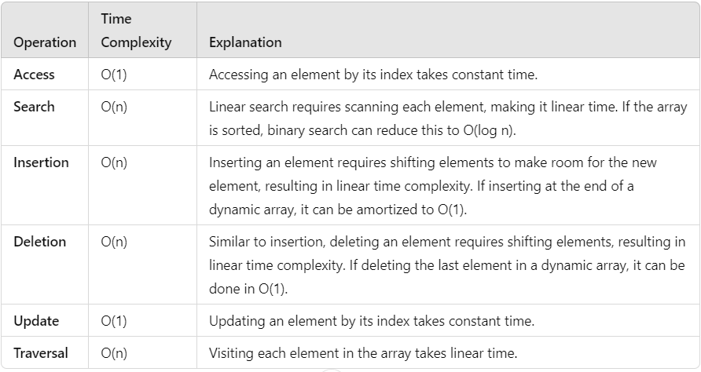

# Data Structures Interview Question

## Table of Contents

### 1. Introduction
1.1. [What are Data Structures?](#11-what-are-data-structures)  
1.2. [Why create Data Structures?](#12-why-create-data-structures)  
1.3. [What are some applications of Data Structures?](#13-what-are-some-applications-of-data-structures)  
1.4. [Explain the process behind storing a variable in memory.](#14-explain-the-process-behind-storing-a-variable-in-memory)  
1.5. [Can you explain the difference between file structure and storage structure?](#15-can-you-explain-the-difference-between-file-structure-and-storage-structure)  
1.6. [Describe the types of Data Structures?](#16-describe-the-types-of-data-structures)

### 2. Basic Data Structures
#### Arrays
2.1. [What is an array data structure? What are the applications of arrays?](#21-what-is-an-array-data-structure-what-are-the-applications-of-arrays)  
2.2. [Elaborate on different types of array data structure.](#22-elaborate-on-different-types-of-array-data-structure)  

#### Linked Lists
2.3. [What is a linked list data structure? What are the applications for the linked list?](#23-what-is-a-linked-list-data-structure-what-are-the-applications-for-the-linked-list)  
2.4. [Elaborate on different types of Linked List data structures.](#24-elaborate-on-different-types-of-linked-list-data-structures)  
2.5. [Difference between Array and Linked List.](#25-difference-between-array-and-linked-list)  

#### Stacks
2.6. [What is a stack data structure? What are the applications of stack?](#26-what-is-a-stack-data-structure-what-are-the-applications-of-stack)  
2.7. [What are different operations available in stack data structure?](#27-what-are-different-operations-available-in-stack-data-structure)  
2.8. [How to implement a queue using stack?](#28-how-to-implement-a-queue-using-stack)  
2.9. [How do you implement stack using queues?](#29-how-do-you-implement-stack-using-queues)  

#### Queues
2.10. [What is a queue data structure? What are the applications of queue?](#210-what-is-a-queue-data-structure-what-are-the-applications-of-queue)  
2.11. [What are different operations available in queue data structure?](#211-what-are-different-operations-available-in-queue-data-structure)  

### 3. Advanced Data Structures
#### Trees
3.1. [What is a binary tree data structure? What are the applications for binary trees?](#31-what-is-a-binary-tree-data-structure-what-are-the-applications-for-binary-trees)  
3.2. [What is binary search tree data structure? What are the applications for binary search trees?](#32-what-is-binary-search-tree-data-structure-what-are-the-applications-for-binary-search-trees)  
3.3. [What are tree traversals?](#33-what-are-tree-traversals)  
3.4. [What is an AVL tree data structure, its operations, and its rotations? What are the applications for AVL trees?](#34-what-is-an-avl-tree-data-structure-its-operations-and-its-rotations-what-are-the-applications-for-avl-trees)  

#### Hash Maps
3.5. [What is hashmap in data structure?](#35-what-is-hashmap-in-data-structure)  
3.6. [What is the requirement for an object to be used as key or value in HashMap?](#36-what-is-the-requirement-for-an-object-to-be-used-as-key-or-value-in-hashmap)  
3.7. [How does HashMap handle collisions in Java?](#37-how-does-hashmap-handle-collisions-in-java)  
3.8. [What is the time complexity of basic operations get() and put() in HashMap class?](#38-what-is-the-time-complexity-of-basic-operations-get-and-put-in-hashmap-class)  

#### Graphs
3.9. [What is graph data structure and its representations? What are the applications for graphs?](#39-what-is-graph-data-structure-and-its-representations-what-are-the-applications-for-graphs)  
3.10. [What is the difference between the Breadth First Search (BFS) and Depth First Search (DFS)?](#310-what-is-the-difference-between-the-breadth-first-search-bfs-and-depth-first-search-dfs)  

### 4. Implementation Questions
#### Array Operations
4.1. [Write a program to remove duplicates from a sorted array in place?](#41-write-a-program-to-remove-duplicates-from-a-sorted-array-in-place)  

#### Binary Tree Operations
4.2. [Write a function for zigzag traversal in a binary tree.](#42-write-a-function-for-zigzag-traversal-in-a-binary-tree)  
4.3. [Write Java code to count the number of nodes in a binary tree.](#43-write-java-code-to-count-the-number-of-nodes-in-a-binary-tree)  
4.4. [Write a function to sort a linked list of 0s, 1s and 2s.](#44-write-a-function-to-sort-a-linked-list-of-0s-1s-and-2s)  
4.5. [Write a function to detect cycle in an undirected graph.](#45-write-a-function-to-detect-cycle-in-an-undirected-graph)  
4.6. [Write a function to convert an infix expression to postfix expression.](#46-write-a-function-to-convert-an-infix-expression-to-postfix-expression)  
4.7. [Write a function to find the maximum for each and every contiguous subarray of size k.](#47-write-a-function-to-find-the-maximum-for-each-and-every-contiguous-subarray-of-size-k)  
4.8. [Write a function to merge two sorted binary search trees.](#48-write-a-function-to-merge-two-sorted-binary-search-trees)  
4.9. [Write a function to print all unique rows of the given matrix.](#49-write-a-function-to-print-all-unique-rows-of-the-given-matrix)  
4.10. [Write a function to find the number of subarrays with product less than K.](#410-write-a-function-to-find-the-number-of-subarrays-with-product-less-than-k)  
4.11. [Find the subsequence of length 3 with the highest product from a sequence of non-negative integers, with the elements in increasing order.](#411-find-the-subsequence-of-length-3-with-the-highest-product-from-a-sequence-of-non-negative-integers-with-the-elements-in-increasing-order)  
4.12. [Write a function to implement Quicksort on Doubly Linked List.](#412-write-a-function-to-implement-quicksort-on-doubly-linked-list)  
4.13. [Write a function to connect nodes at the same level of a binary tree.](#413-write-a-function-to-connect-nodes-at-the-same-level-of-a-binary-tree)  
4.14. [Write a function to find the number of structurally unique binary trees that are possible.](#414-write-a-function-to-find-the-number-of-structurally-unique-binary-trees-that-are-possible)  
4.15. [Implement LRU (Least Recently Used) Cache.](#415-implement-lru-least-recently-used-cache)  
4.16. [Write a function to determine whether duplicate elements in a given array are within a given distance of each other.](#416-write-a-function-to-determine-whether-duplicate-elements-in-a-given-array-are-within-a-given-distance-of-each-other)  
4.17. [Write a recursive function to calculate the height of a binary tree in Java.](#417-write-a-recursive-function-to-calculate-the-height-of-a-binary-tree-in-java)  
4.18. [Print Left view of any binary tree.](#418-print-left-view-of-any-binary-tree)  
4.19. [Given an m x n 2D grid map of '1’s which represents land and '0’s that represents water, return the number of islands (surrounded by water and formed by connecting adjacent lands in 2 directions - vertically or horizontally).](#419-given-an-m-x-n-2d-grid-map-of-1s-which-represents-land-and-0s-that-represents-water-return-the-number-of-islands-surrounded-by-water-and-formed-by-connecting-adjacent-lands-in-2-directions-vertically-or-horizontally)  
4.20. [What is topological sorting in a graph?](#420-what-is-topological-sorting-in-a-graph)

---

## 1. Introduction

### 1.1 What are Data Structures?
A data structure is a mechanical or logical way that data is organized within a program. The organization of data is what determines how a program performs. There are many types of data structures, each with its own uses. When designing code, we need to pay particular attention to the way data is structured. If data isn't stored efficiently or correctly structured, then the overall performance of the code will be reduced.

### 1.2 Why create Data Structures?
Data structures serve a number of important functions in a program. They ensure that each line of code performs its function correctly and efficiently, they help the programmer identify and fix problems with his/her code, and they help to create a clear and organized code base.

### 1.3 What are some applications of Data Structures?
Following are some real-time applications of data structures:


- Decision Making
- Genetics
- Image Processing
- Blockchain
- Numerical and Statistical Analysis
- Compiler Design
- Database Design and many more

### 1.4 Explain the process behind storing a variable in memory.
- A variable is stored in memory based on the amount of memory that is needed. Following are the steps followed to store a variable:
  - The required amount of memory is assigned first.
  - Then, it is stored based on the data structure being used.
- Using concepts like dynamic allocation ensures high efficiency and that the storage units can be accessed based on requirements in real-time.

### 1.5 Can you explain the difference between file structure and storage structure?
- **File Structure:** Representation of data into secondary or auxiliary memory, such as hard disks or pen drives, that stores data which remains intact until manually deleted.

- **Storage Structure:** In this type, data is stored in the main memory (RAM) and is deleted once the function that uses this data is completely executed.

The main difference is that the storage structure has data stored in the memory of the computer system, whereas the file structure has the data stored in auxiliary memory.

### 1.6 Describe the types of Data Structures.
<p align="center">
    
</p><br>

- **Linear Data Structure:** A data structure that includes data elements arranged sequentially or linearly, where each element is connected to its previous and next nearest elements, is referred to as a linear data structure. Arrays and linked lists are two examples of linear data structures.
- **Non-Linear Data Structure:** Non-linear data structures are data structures in which data elements are not arranged linearly or sequentially. We cannot walk through all elements in one pass in a non-linear data structure, as in a linear data structure. Trees and graphs are two examples of non-linear data structures.

---

## 2. Basic Data Structures

### Arrays

### 2.1 What is an array data structure? What are the applications of arrays?

<p align="center">
    
</p><br>

An array data structure is a data structure that is used to store data in a way that is efficient and easy to access. It is similar to a list in that it stores data in a sequence. However, an array data structure differs from a list in that it can hold much more data than a list can. An array data structure is created by combining several arrays together. Each array is then given a unique identifier, and each array’s data is stored in the order in which they are created.

<p align="center">
    
</p><br>

Array data structures are commonly used in databases and other computer systems to store large amounts of data efficiently. They are also useful for storing information that is frequently accessed, such as large amounts of text or images.
### 2.2 Elaborate on different types of array data structure.
There are several different types of arrays:

- **One-dimensional array:** A one-dimensional array stores its elements in contiguous memory locations, accessing them using a single index value. It is a linear data structure holding all the elements in a sequence.

<p align="center">
    
</p><br>

- **Two-dimensional array:** A two-dimensional array is a tabular array that includes rows and columns and stores data. An M × N two-dimensional array is created by grouping M rows and N columns into N columns and rows.

<p align="center">
    
</p><br>

- **Three-dimensional array:** A three-dimensional array is a grid that has rows, columns, and depth as a third dimension. It comprises a cube with rows, columns, and depth as a third dimension. The three-dimensional array has three subscripts for a position in a particular row, column, and depth. Depth (dimension or layer) is the first index, row index is the second index, and column index is the third index.

<p align="center">
    
</p><br>


### Linked Lists

### 2.3 What is a linked list data structure? What are the applications for the linked list?
A linked list can be thought of as a series of linked nodes (or items) that are connected by links (or paths). Each link represents an entry into the linked list, and each entry points to the next node in the sequence. The order in which nodes are added to the list is determined by the order in which they are created.
<p align="center">
    
</p><br>

Following are some applications of linked list data structure:

- Stack, Queue, binary trees, and graphs are implemented using linked lists.
- Dynamic management for Operating System memory.
- Round robin scheduling for operating system tasks.
- Forward and backward operation in the browser.

### 2.4 Elaborate on different types of Linked List data structures.
### 1. Singly Linked Lis:

A singly linked list is a data structure used to store multiple items. Each item is linked together using a key, which typically serves as a unique identifier. In a singly linked list, items are stored in separate nodes, where each node can hold a single item or a collection of items.

- **Adding Items:** When you add an item, a new node is created and added to the end of the list.
- **Removing Items:** When you remove an item, the node containing that item is deleted, and the list is updated accordingly.

<p align="center">
    
</p><br>

The key for a singly linked list can be any data type, such as an integer or a string. Singly linked lists are useful for storing various types of data, including grocery lists, patient records, and time-sensitive data like stock prices or flight schedules.
#### C++ Implementation of Singly Linked List

```cpp
#include <iostream>
using namespace std;

// Node structure
struct Node {
    int data;
    Node* next;

    Node(int value) {
        data = value;
        next = nullptr;
    }
};

// Singly Linked List class
class SinglyLinkedList {
private:
    Node* head;

public:
    SinglyLinkedList() {
        head = nullptr;
    }

    // Function to insert a new node at the end
    void insert(int value) {
        Node* newNode = new Node(value);
        if (!head) {
            head = newNode;
        } else {
            Node* temp = head;
            while (temp->next) {
                temp = temp->next;
            }
            temp->next = newNode;
        }
    }

    // Function to display the list
    void display() {
        Node* temp = head;
        while (temp) {
            cout << temp->data << " -> ";
            temp = temp->next;
        }
        cout << "nullptr" << endl;
    }

    // Function to delete a node by value
    void deleteNode(int value) {
        if (!head) return;

        if (head->data == value) {
            Node* temp = head;
            head = head->next;
            delete temp;
            return;
        }

        Node* current = head;
        while (current->next && current->next->data != value) {
            current = current->next;
        }

        if (current->next) {
            Node* temp = current->next;
            current->next = current->next->next;
            delete temp;
        }
    }

    // Destructor to free memory
    ~SinglyLinkedList() {
        Node* current = head;
        while (current) {
            Node* temp = current;
            current = current->next;
            delete temp;
        }
    }
};

// Example usage
int main() {
    SinglyLinkedList list;
    list.insert(1);
    list.insert(2);
    list.insert(3);
    
    cout << "Singly Linked List: ";
    list.display();
    
    list.deleteNode(2);
    cout << "After deleting 2: ";
    list.display();
    
    return 0;
}
```

#### Singly Linked List Complexity
Time Complexity:

- Access: O(n)
- Search: O(n)
- Insertion:
  - At beginning: O(1)
  - At end: O(n)
  - In middle: O(n)
- Deletion:
  - At beginning: O(1)
  - At end: O(n)
  - In middle: O(n)

Space Complexity: O(n)

### 2. Doubly Linked List:
A doubly linked list is a data structure that allows you to access data in both directions. Each node in the list points to the next node and also back to the previous one. This means you can easily move forward or backward through the list.

<p align="center">
    
</p><br>

You can access each node by its address and its contents by its index. Doubly linked lists are great for applications that require quick access to large amounts of data. However, they can be harder to manage than singly linked lists, making it more challenging to add or remove nodes.

#### Doubly Linked List Complexity
Time Complexity:
- Access: O(n) - You may need to traverse the list to find a specific node.
- Search: O(n) - You need to go through the nodes to find a value.
- Insertion: O(1) - Inserting a node can be done in constant time if you have a reference to the node where you want to insert.
- Deletion: O(1) - Deleting a node is also done in constant time if you have a reference to the node to be deleted.

Space Complexity:
- O(n) - Each node requires extra space for two pointers (one for the next node and one for the previous node), in addition to the space for the data itself.

### 3. Circular Linked List: 
A circular linked list is a unidirectional linked list where each node points to its next node and the last node points back to the first node, which makes it circular.

<p align="center">
    
</p><br>

#### Doubly Linked List Complexity
Time Complexity:

- Access: O(n) - You may need to traverse the list to find a specific node.
- Search: O(n) - Finding a value requires checking each node in the list.
- Insertion: O(1) - Inserting a new node can be done in constant time if you have a reference to a node.
- Deletion: O(1) - Deleting a node is also done in constant time if you have a reference to the node to be deleted.

Space Complexity:

- O(n) - Each node requires space for one pointer (to the next node) along with the space for the data itself.

### 2.5 Difference between Array and Linked List.
- **Memory allocation:** Arrays use contiguous memory locations, while linked lists use scattered memory locations.
- **Size:** Arrays have a fixed size, while linked lists can dynamically grow and shrink.
- **Access time:** Arrays allow O(1) access time, whereas linked lists require O(n) time to access elements.

### Stacks

### 2.6 What is a stack data structure? What are the applications of stack?
A stack is a linear data structure that follows the Last In First Out (LIFO) principle. Applications include function call management, undo mechanisms in applications, and syntax parsing.

### 2.7 What are different operations available in stack data structure?
Operations on stacks include:
- **Push:** Add an item to the top of the stack.
- **Pop:** Remove the item from the top of the stack.
- **Peek:** View the item at the top of the stack without removing it.
- **isEmpty:** Check if the stack is empty.

### 2.8 How to implement a queue using stack?
A queue can be implemented using two stacks. Elements can be enqueued to one stack and dequeued by popping all elements from the first stack to the second stack.

### 2.9 How do you implement stack using queues?
A stack can be implemented using two queues. Elements are enqueued in one queue and when popping, all elements are dequeued to the other queue except the last element.

### Queues

### 2.10 What is a queue data structure? What are the applications of queue?
A queue is a linear data structure that follows the First In First Out (FIFO) principle. Applications include scheduling processes in operating systems, managing requests in servers, and breadth-first search algorithms.

### 2.11 What are different operations available in queue data structure?
Operations on queues include:
- **Enqueue:** Add an item to the back of the queue.
- **Dequeue:** Remove the item from the front of the queue.
- **Front:** View the item at the front of the queue without removing it.
- **isEmpty:** Check if the queue is empty.

---

## 3. Advanced Data Structures

### Trees

### 3.1 What is a binary tree data structure? What are the applications for binary trees?
A binary tree is a tree data structure where each node has at most two children. Applications include expression parsing, binary search trees, and hierarchical data representation.

### 3.2 What is binary search tree data structure? What are the applications for binary search trees?
A binary search tree (BST) is a binary tree where the left child contains nodes with values less than the parent node, and the right child contains nodes with values greater than the parent node. Applications include efficient searching, insertion, and deletion operations.

### 3.3 What are tree traversals?
Tree traversals are methods for visiting all nodes in a tree. Common types include:
- **Inorder:** Left subtree, root, right subtree.
- **Preorder:** Root, left subtree, right subtree.
- **Postorder:** Left subtree, right subtree, root.

### 3.4 What is an AVL tree data structure, its operations, and its rotations? What are the applications for AVL trees?
An AVL tree is a self-balancing binary search tree where the difference in heights between left and right subtrees is at most one. Operations include insertion, deletion, and rotations (single and double) to maintain balance. Applications include databases and memory management.

### Hash Maps

### 3.5 What is hashmap in data structure?
A hashmap is a data structure that stores key-value pairs, allowing for efficient data retrieval based on the key. It uses a hash function to compute the index for each key.

### 3.6 What is the requirement for an object to be used as key or value in HashMap?
Keys in a HashMap must be unique and immutable (e.g., strings, numbers). Values can be mutable or immutable and can be of any data type.

### 3.7 How does HashMap handle collisions in Java?
HashMap handles collisions using two methods:
- **Chaining:** Each index points to a linked list of entries that hash to the same index.
- **Open addressing:** It finds the next available index using probing techniques.

### 3.8 What is the time complexity of basic operations get() and put() in HashMap class?
The average time complexity for `get()` and `put()` operations in a HashMap is O(1), but in the worst case (when many collisions occur), it can degrade to O(n).

### Graphs

### 3.9 What is graph data structure and its representations? What are the applications for graphs?
A graph is a collection of nodes (vertices) connected by edges. It can be represented using adjacency matrices or adjacency lists. Applications include social networks, transportation networks, and network routing.

### 3.10 What is the difference between the Breadth First Search (BFS) and Depth First Search (DFS)?
- **BFS:** Explores nodes layer by layer, uses a queue, and finds the shortest path in unweighted graphs.
- **DFS:** Explores as far as possible along a branch before backtracking, uses a stack or recursion, and can find a path but does not guarantee the shortest.

---

## 4. Implementation Questions

### Array Operations

### 4.1 Write a program to remove duplicates from a sorted array in place.
```java
public static int removeDuplicates(int[] nums) {
    if (nums.length == 0) return 0;
    int j = 0;
    for (int i = 1; i < nums.length; i++) {
        if (nums[i] != nums[j]) {
            j++;
            nums[j] = nums[i];
        }
    }
    return j + 1;
}
```