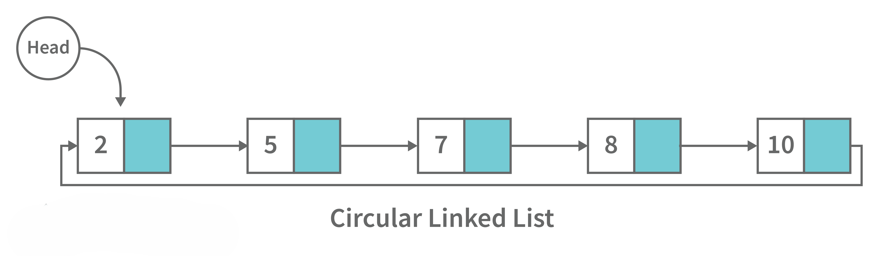

# Data Structures Interview Question

## Table of Contents

### 1. Introduction
1.1. [What are Data Structures?](#11-what-are-data-structures)  
1.2. [Why create Data Structures?](#12-why-create-data-structures)  
1.3. [What are some applications of Data Structures?](#13-what-are-some-applications-of-data-structures)  
1.4. [Explain the process behind storing a variable in memory.](#14-explain-the-process-behind-storing-a-variable-in-memory)  
1.5. [Can you explain the difference between file structure and storage structure?](#15-can-you-explain-the-difference-between-file-structure-and-storage-structure)  
1.6. [Describe the types of Data Structures?](#16-describe-the-types-of-data-structures)

### 2. Basic Data Structures
#### Arrays
2.1. [What is an array data structure? What are the applications of arrays?](#21-what-is-an-array-data-structure-what-are-the-applications-of-arrays)  
2.2. [Elaborate on different types of array data structure.](#22-elaborate-on-different-types-of-array-data-structure)  

#### Linked Lists
2.3. [What is a linked list data structure? What are the applications for the linked list?](#23-what-is-a-linked-list-data-structure-what-are-the-applications-for-the-linked-list)  
2.4. [Elaborate on different types of Linked List data structures.](#24-elaborate-on-different-types-of-linked-list-data-structures)  
2.5. [Difference between Array and Linked List.](#25-difference-between-array-and-linked-list)  

#### Stacks
2.6. [What is a stack data structure? What are the applications of stack?](#26-what-is-a-stack-data-structure-what-are-the-applications-of-stack)  
2.7. [What are different operations available in stack data structure?](#27-what-are-different-operations-available-in-stack-data-structure)  
2.8. [How to implement a queue using stack?](#28-how-to-implement-a-queue-using-stack)  
2.9. [How do you implement stack using queues?](#29-how-do-you-implement-stack-using-queues)  

#### Queues
2.10. [What is a queue data structure? What are the applications of queue?](#210-what-is-a-queue-data-structure-what-are-the-applications-of-queue)  
2.11. [What are different operations available in queue data structure?](#211-what-are-different-operations-available-in-queue-data-structure)  
2.12. [Differentiate between stack and queue data structure](#212-differentiate-between-stack-and-queue-data-structure)  
2.13. [What is a deque data structure and its types? What are the applications for deque?](#213-what-is-a-deque-data-structure-and-its-types-what-are-the-applications-for-deque)  
2.14. [What are some key operations performed on the Deque data structure?](#214-what-are-some-key-operations-performed-on-the-deque-data-structure)  
2.15. [What is a priority queue? What are the applications for priority queue?](#215-what-is-a-priority-queue-what-are-the-applications-for-priority-queue)  
2.16. [Compare different implementations of priority queue.](#216-compare-different-implementations-of-priority-queue)


### 3. Advanced Data Structures
#### Trees
3.1. [What is a binary tree data structure? What are the applications for binary trees?](#31-what-is-a-binary-tree-data-structure-what-are-the-applications-for-binary-trees)  
3.2. [What is binary search tree data structure? What are the applications for binary search trees?](#32-what-is-binary-search-tree-data-structure-what-are-the-applications-for-binary-search-trees)  
3.3. [What are tree traversals?](#33-what-are-tree-traversals)  
3.4. [What is an AVL tree data structure, its operations, and its rotations? What are the applications for AVL trees?](#34-what-is-an-avl-tree-data-structure-its-operations-and-its-rotations-what-are-the-applications-for-avl-trees)  
3.5. [Define Segment Tree data structure and its applications.](#35-define-segment-tree-data-structure-and-its-applications)  
3.6. [Define Trie data structure and its applications.](#36-define-trie-data-structure-and-its-applications)  
3.7. [What is a heap data structure?](#37-what-is-a-heap-data-structure)  
  

#### Hash Maps
3.8. [What is hashmap in data structure?](#38-what-is-hashmap-in-data-structure)  
3.9. [What is the requirement for an object to be used as key or value in HashMap?](#39-what-is-the-requirement-for-an-object-to-be-used-as-key-or-value-in-hashmap)  
3.10. [How does HashMap handle collisions in Java?](#310-how-does-hashmap-handle-collisions-in-java)  
3.11. [What is the time complexity of basic operations get() and put() in HashMap class?](#311-what-is-the-time-complexity-of-basic-operations-get-and-put-in-hashmap-class)  

#### Graphs
3.12. [What is graph data structure and its representations? What are the applications for graphs?](#312-what-is-graph-data-structure-and-its-representations-what-are-the-applications-for-graphs)  
3.13. [What is the difference between the Breadth First Search (BFS) and Depth First Search (DFS)?](#313-what-is-the-difference-between-the-breadth-first-search-bfs-and-depth-first-search-dfs)  

### 4. Implementation Questions
#### Array Operations
4.1. [Write a program to remove duplicates from a sorted array in place?](#41-write-a-program-to-remove-duplicates-from-a-sorted-array-in-place)  

#### Binary Tree Operations
4.2. [Write a function for zigzag traversal in a binary tree.](#42-write-a-function-for-zigzag-traversal-in-a-binary-tree)  
4.3. [Write Java code to count the number of nodes in a binary tree.](#43-write-java-code-to-count-the-number-of-nodes-in-a-binary-tree)  
4.4. [Write a function to sort a linked list of 0s, 1s and 2s.](#44-write-a-function-to-sort-a-linked-list-of-0s-1s-and-2s)  
4.5. [Write a function to detect cycle in an undirected graph.](#45-write-a-function-to-detect-cycle-in-an-undirected-graph)  
4.6. [Write a function to convert an infix expression to postfix expression.](#46-write-a-function-to-convert-an-infix-expression-to-postfix-expression)  
4.7. [Write a function to find the maximum for each and every contiguous subarray of size k.](#47-write-a-function-to-find-the-maximum-for-each-and-every-contiguous-subarray-of-size-k)  
4.8. [Write a function to merge two sorted binary search trees.](#48-write-a-function-to-merge-two-sorted-binary-search-trees)  
4.9. [Write a function to print all unique rows of the given matrix.](#49-write-a-function-to-print-all-unique-rows-of-the-given-matrix)  
4.10. [Write a function to find the number of subarrays with product less than K.](#410-write-a-function-to-find-the-number-of-subarrays-with-product-less-than-k)  
4.11. [Find the subsequence of length 3 with the highest product from a sequence of non-negative integers, with the elements in increasing order.](#411-find-the-subsequence-of-length-3-with-the-highest-product-from-a-sequence-of-non-negative-integers-with-the-elements-in-increasing-order)  
4.12. [Write a function to implement Quicksort on Doubly Linked List.](#412-write-a-function-to-implement-quicksort-on-doubly-linked-list)  
4.13. [Write a function to connect nodes at the same level of a binary tree.](#413-write-a-function-to-connect-nodes-at-the-same-level-of-a-binary-tree)  
4.14. [Write a function to find the number of structurally unique binary trees that are possible.](#414-write-a-function-to-find-the-number-of-structurally-unique-binary-trees-that-are-possible)  
4.15. [Implement LRU (Least Recently Used) Cache.](#415-implement-lru-least-recently-used-cache)  
4.16. [Write a function to determine whether duplicate elements in a given array are within a given distance of each other.](#416-write-a-function-to-determine-whether-duplicate-elements-in-a-given-array-are-within-a-given-distance-of-each-other)  
4.17. [Write a recursive function to calculate the height of a binary tree in Java.](#417-write-a-recursive-function-to-calculate-the-height-of-a-binary-tree-in-java)  
4.18. [Print Left view of any binary tree.](#418-print-left-view-of-any-binary-tree)  
4.19. [Given an m x n 2D grid map of '1’s which represents land and '0’s that represents water, return the number of islands (surrounded by water and formed by connecting adjacent lands in 2 directions - vertically or horizontally).](#419-given-an-m-x-n-2d-grid-map-of-1s-which-represents-land-and-0s-that-represents-water-return-the-number-of-islands-surrounded-by-water-and-formed-by-connecting-adjacent-lands-in-2-directions-vertically-or-horizontally)  
4.20. [What is topological sorting in a graph?](#420-what-is-topological-sorting-in-a-graph)

---

## 1. Introduction

### 1.1 What are Data Structures?
A data structure is a mechanical or logical way that data is organized within a program. The organization of data is what determines how a program performs. There are many types of data structures, each with its own uses. When designing code, we need to pay particular attention to the way data is structured. If data isn't stored efficiently or correctly structured, then the overall performance of the code will be reduced.

### 1.2 Why create Data Structures?
Data structures serve a number of important functions in a program. They ensure that each line of code performs its function correctly and efficiently, they help the programmer identify and fix problems with his/her code, and they help to create a clear and organized code base.

### 1.3 What are some applications of Data Structures?
Following are some real-time applications of data structures:


- Decision Making
- Genetics
- Image Processing
- Blockchain
- Numerical and Statistical Analysis
- Compiler Design
- Database Design and many more

### 1.4 Explain the process behind storing a variable in memory.
- A variable is stored in memory based on the amount of memory that is needed. Following are the steps followed to store a variable:
  - The required amount of memory is assigned first.
  - Then, it is stored based on the data structure being used.
- Using concepts like dynamic allocation ensures high efficiency and that the storage units can be accessed based on requirements in real-time.

### 1.5 Can you explain the difference between file structure and storage structure?
- **File Structure:** Representation of data into secondary or auxiliary memory, such as hard disks or pen drives, that stores data which remains intact until manually deleted.

- **Storage Structure:** In this type, data is stored in the main memory (RAM) and is deleted once the function that uses this data is completely executed.

The main difference is that the storage structure has data stored in the memory of the computer system, whereas the file structure has the data stored in auxiliary memory.

### 1.6 Describe the types of Data Structures.
<p align="center">
    
</p><br>

- **Linear Data Structure:** A data structure that includes data elements arranged sequentially or linearly, where each element is connected to its previous and next nearest elements, is referred to as a linear data structure. Arrays and linked lists are two examples of linear data structures.
- **Non-Linear Data Structure:** Non-linear data structures are data structures in which data elements are not arranged linearly or sequentially. We cannot walk through all elements in one pass in a non-linear data structure, as in a linear data structure. Trees and graphs are two examples of non-linear data structures.

---

## 2. Basic Data Structures

### Arrays

### 2.1 What is an array data structure? What are the applications of arrays?

<p align="center">
    
</p><br>

An array data structure is a data structure that is used to store data in a way that is efficient and easy to access. It is similar to a list in that it stores data in a sequence. However, an array data structure differs from a list in that it can hold much more data than a list can. An array data structure is created by combining several arrays together. Each array is then given a unique identifier, and each array’s data is stored in the order in which they are created.

<p align="center">
    
</p><br>

Array data structures are commonly used in databases and other computer systems to store large amounts of data efficiently. They are also useful for storing information that is frequently accessed, such as large amounts of text or images.
### 2.2 Elaborate on different types of array data structure.
There are several different types of arrays:

- **One-dimensional array:** A one-dimensional array stores its elements in contiguous memory locations, accessing them using a single index value. It is a linear data structure holding all the elements in a sequence.

<p align="center">
    
</p><br>

- **Two-dimensional array:** A two-dimensional array is a tabular array that includes rows and columns and stores data. An M × N two-dimensional array is created by grouping M rows and N columns into N columns and rows.

<p align="center">
    
</p><br>

- **Three-dimensional array:** A three-dimensional array is a grid that has rows, columns, and depth as a third dimension. It comprises a cube with rows, columns, and depth as a third dimension. The three-dimensional array has three subscripts for a position in a particular row, column, and depth. Depth (dimension or layer) is the first index, row index is the second index, and column index is the third index.

<p align="center">
    
</p><br>

---

### Linked Lists

### 2.3 What is a linked list data structure? What are the applications for the linked list?
A linked list can be thought of as a series of linked nodes (or items) that are connected by links (or paths). Each link represents an entry into the linked list, and each entry points to the next node in the sequence. The order in which nodes are added to the list is determined by the order in which they are created.
<p align="center">
    
</p><br>

Following are some applications of linked list data structure:

- Stack, Queue, binary trees, and graphs are implemented using linked lists.
- Dynamic management for Operating System memory.
- Round robin scheduling for operating system tasks.
- Forward and backward operation in the browser.

### 2.4 Elaborate on different types of Linked List data structures.
### 1. Singly Linked Lis:

A singly linked list is a data structure used to store multiple items. Each item is linked together using a key, which typically serves as a unique identifier. In a singly linked list, items are stored in separate nodes, where each node can hold a single item or a collection of items.

- **Adding Items:** When you add an item, a new node is created and added to the end of the list.
- **Removing Items:** When you remove an item, the node containing that item is deleted, and the list is updated accordingly.

<p align="center">
    
</p><br>

The key for a singly linked list can be any data type, such as an integer or a string. Singly linked lists are useful for storing various types of data, including grocery lists, patient records, and time-sensitive data like stock prices or flight schedules.
#### C++ Implementation of Singly Linked List

```cpp
#include <iostream>
using namespace std;

// Node structure
struct Node {
    int data;
    Node* next;

    Node(int value) {
        data = value;
        next = nullptr;
    }
};

// Singly Linked List class
class SinglyLinkedList {
private:
    Node* head;

public:
    SinglyLinkedList() {
        head = nullptr;
    }

    // Function to insert a new node at the end
    void insert(int value) {
        Node* newNode = new Node(value);
        if (!head) {
            head = newNode;
        } else {
            Node* temp = head;
            while (temp->next) {
                temp = temp->next;
            }
            temp->next = newNode;
        }
    }

    // Function to display the list
    void display() {
        Node* temp = head;
        while (temp) {
            cout << temp->data << " -> ";
            temp = temp->next;
        }
        cout << "nullptr" << endl;
    }

    // Function to delete a node by value
    void deleteNode(int value) {
        if (!head) return;

        if (head->data == value) {
            Node* temp = head;
            head = head->next;
            delete temp;
            return;
        }

        Node* current = head;
        while (current->next && current->next->data != value) {
            current = current->next;
        }

        if (current->next) {
            Node* temp = current->next;
            current->next = current->next->next;
            delete temp;
        }
    }

    // Destructor to free memory
    ~SinglyLinkedList() {
        Node* current = head;
        while (current) {
            Node* temp = current;
            current = current->next;
            delete temp;
        }
    }
};

// Example usage
int main() {
    SinglyLinkedList list;
    list.insert(1);
    list.insert(2);
    list.insert(3);
    
    cout << "Singly Linked List: ";
    list.display();
    
    list.deleteNode(2);
    cout << "After deleting 2: ";
    list.display();
    
    return 0;
}
```

#### Singly Linked List Complexity
Time Complexity:

- Access: O(n)
- Search: O(n)
- Insertion:
  - At beginning: O(1)
  - At end: O(n)
  - In middle: O(n)
- Deletion:
  - At beginning: O(1)
  - At end: O(n)
  - In middle: O(n)

Space Complexity: O(n)

### 2. Doubly Linked List:
A doubly linked list is a data structure that allows you to access data in both directions. Each node in the list points to the next node and also back to the previous one. This means you can easily move forward or backward through the list.

<p align="center">
    
</p><br>

You can access each node by its address and its contents by its index. Doubly linked lists are great for applications that require quick access to large amounts of data. However, they can be harder to manage than singly linked lists, making it more challenging to add or remove nodes.

#### Doubly Linked List Complexity
Time Complexity:
- Access: O(n) - You may need to traverse the list to find a specific node.
- Search: O(n) - You need to go through the nodes to find a value.
- Insertion: O(1) - Inserting a node can be done in constant time if you have a reference to the node where you want to insert.
- Deletion: O(1) - Deleting a node is also done in constant time if you have a reference to the node to be deleted.

Space Complexity:
- O(n) - Each node requires extra space for two pointers (one for the next node and one for the previous node), in addition to the space for the data itself.

### 3. Circular Linked List: 
A circular linked list is a unidirectional linked list where each node points to its next node and the last node points back to the first node, which makes it circular.

<p align="center">
    
</p><br>

#### Doubly Linked List Complexity
Time Complexity:

- Access: O(n) - You may need to traverse the list to find a specific node.
- Search: O(n) - Finding a value requires checking each node in the list.
- Insertion: O(1) - Inserting a new node can be done in constant time if you have a reference to a node.
- Deletion: O(1) - Deleting a node is also done in constant time if you have a reference to the node to be deleted.

Space Complexity:

- O(n) - Each node requires space for one pointer (to the next node) along with the space for the data itself.

### 2.5 Difference between Array and Linked List.
<p align="center">
    
</p><br>

### Arrays vs Linked Lists:

| **Arrays** | **Linked Lists** |
|------------|------------------|
| An array is a collection of data elements of the same type. | A linked list is a collection of entities known as nodes. The node is divided into two sections: data and address. |
| It keeps the data elements in a single memory block. | It stores elements at random, or anywhere in memory. |
| The memory size of an array is fixed and cannot be changed during runtime. | The memory size of a linked list is allocated during runtime. |
| An array's elements are not dependent on one another. | Linked List elements are dependent on one another. |
| It is easier and faster to access an element in an array. | In a linked list, it takes time to access an element. |
| Memory utilization is inefficient in the case of an array. | Memory utilization is more efficient in the case of linked lists. |
| Operations like insertion and deletion take longer in an array. | Operations like insertion and deletion are faster in a linked list. |

---

### Stacks

### 2.6 What is a stack data structure? What are the applications of stack?
A stack is a data structure that is used to represent the state of an application at a particular point in time. The stack consists of a series of items that are added to the top of the stack and then removed from the top. It is a linear data structure that follows a particular order in which operations are performed. LIFO (Last In First Out) or FILO (First In Last Out) are two possible orders. A stack consists of a sequence of items. The element that's added last will come out first, a real-life example might be a stack of clothes on top of each other. When we remove the cloth that was previously on top, we can say that the cloth that was added last comes out first.

<p align="center">
    
</p><br>

Following are some applications for stack data structure:

- It acts as temporary storage during recursive operations
- Redo and Undo operations in doc editors
- Reversing a string
- Parenthesis matching
- Postfix to Infix Expressions
- Function calls order

### 2.7 What are different operations available in stack data structure?
Some of the main operations provided in the stack data structure are: 

- **push:** This adds an item to the top of the stack. The overflow condition occurs if the stack is full.
- **pop:** This removes the top item of the stack. Underflow condition occurs if the stack is empty.
- **top:** This returns the top item from the stack.
- **isEmpty:** This returns true if the stack is empty else false.
- **size:**  This returns the size of the stack.

### 2.8 How to implement a queue using stack?
To implement a queue using two stacks, follow this approach:

1. **Enqueue Operation**: Simply push elements into the first stack.
2. **Dequeue Operation**: If the second stack is empty, pop all elements from the first stack and push them into the second stack, then pop the top of the second stack. If the second stack is not empty, just pop the top of the second stack.

#### C++ Implementation:

```cpp
#include <iostream>
#include <stack>
using namespace std;

class QueueUsingStacks {
private:
    stack<int> s1, s2;

public:
    // Enqueue operation
    void enqueue(int x) {
        s1.push(x);
    }

    // Dequeue operation
    int dequeue() {
        if (s2.empty()) {
            if (s1.empty()) {
                cout << "Queue is empty!" << endl;
                return -1;
            }
            while (!s1.empty()) {
                s2.push(s1.top());
                s1.pop();
            }
        }
        int topVal = s2.top();
        s2.pop();
        return topVal;
    }

    // Function to display the front element
    int front() {
        if (s2.empty()) {
            if (s1.empty()) {
                cout << "Queue is empty!" << endl;
                return -1;
            }
            while (!s1.empty()) {
                s2.push(s1.top());
                s1.pop();
            }
        }
        return s2.top();
    }
};

int main() {
    QueueUsingStacks q;
    q.enqueue(1);
    q.enqueue(2);
    q.enqueue(3);
    
    cout << "Front element: " << q.front() << endl; // Output: 1
    cout << "Dequeue: " << q.dequeue() << endl;     // Output: 1
    cout << "Dequeue: " << q.dequeue() << endl;     // Output: 2
    
    q.enqueue(4);
    
    cout << "Dequeue: " << q.dequeue() << endl;     // Output: 3
    cout << "Front element: " << q.front() << endl; // Output: 4
    
    return 0;
}
```
**Explanation:**
- Enqueue: All elements are pushed onto the first stack s1.
- Dequeue: If s2 is empty, elements from s1 are popped and pushed into s2. Then, the top of s2 is popped to simulate the queue's dequeue operation.

### 2.9 How do you implement stack using queues?

To implement a stack using two queues, you can follow these steps:

1. **Push Operation**: Push the element into the first queue.
2. **Pop Operation**: Transfer all elements except the last one from the first queue to the second queue. Then, pop the last element from the first queue. Swap the names of the two queues so that the first queue always contains the most recent elements.

#### C++ Code:

```cpp
#include <iostream>
#include <queue>
using namespace std;

class StackUsingQueues {
private:
    queue<int> q1, q2;

public:
    // Push operation
    void push(int x) {
        q1.push(x);
    }

    // Pop operation
    void pop() {
        if (q1.empty()) {
            cout << "Stack is empty!" << endl;
            return;
        }

        // Move all elements except the last one from q1 to q2
        while (q1.size() > 1) {
            q2.push(q1.front());
            q1.pop();
        }

        // Pop the last element
        q1.pop();

        // Swap q1 and q2
        swap(q1, q2);
    }

    // Top operation
    int top() {
        if (q1.empty()) {
            cout << "Stack is empty!" << endl;
            return -1;
        }

        // Move all elements except the last one from q1 to q2
        while (q1.size() > 1) {
            q2.push(q1.front());
            q1.pop();
        }

        // Get the last element
        int topElement = q1.front();
        q2.push(topElement);  // Also push it to q2
        q1.pop();

        // Swap q1 and q2
        swap(q1, q2);

        return topElement;
    }

    // Check if the stack is empty
    bool empty() {
        return q1.empty();
    }
};

int main() {
    StackUsingQueues s;
    s.push(1);
    s.push(2);
    s.push(3);

    cout << "Top element: " << s.top() << endl; // Output: 3
    s.pop();
    cout << "Top element after pop: " << s.top() << endl; // Output: 2

    return 0;
}
```
**Explanation:**
- Push: Add the element to the first queue (q1).
- Pop: Transfer all elements except the last one from q1 to q2, then pop the last element from q1. Swap the two queues (q1 becomes q2 and vice versa).
- Top: Same as pop, but instead of removing the last element, we retrieve it.

---
### Queues

### 2.10 What is a queue data structure? What are the applications of queue?

A queue is a linear data structure that allows users to store items in a list in a systematic manner. The items are added to the queue at the rear end until they are full, at which point they are removed from the queue from the front. Queues are commonly used in situations where the users want to hold items for a long period of time, such as during a checkout process. A good example of a queue is any queue of customers for a resource where the first consumer is served first.

<p align="center">
    
</p><br>

Following are some applications of queue data structure:

- Breadth-first search algorithm in graphs
- **Operating system:** job scheduling operations, Disk scheduling, CPU scheduling etc.
- Call management in call centres

### 2.11 What are different operations available in queue data structure?

- **enqueue:** This adds an element to the rear end of the queue.  Overflow conditions occur if the queue is full.
- **dequeue:** This removes an element from the front end of the queue. Underflow conditions occur if the queue is empty.
- **isEmpty:** This returns true if the queue is empty or else false.
- **rear:** This returns the rear end element without removing it.
- **front:** This returns the front-end element without removing it.
- **size:** This returns the size of the queue.

### 2.12 Differentiate between stack and queue data structure

<p align="center">
    
</p><br>

| **Stack**                                                         | **Queue**                                                          |
|--------------------------------------------------------------------|---------------------------------------------------------------------|
| Stack is a linear data structure where data is added and removed from the top. | Queue is a linear data structure where data is ended at the rear end and removed from the front. |
| Stack is based on LIFO (Last In First Out) principle.              | Queue is based on FIFO (First In First Out) principle.               |
| Insertion operation in Stack is known as push.                     | Insertion operation in Queue is known as enqueue.                    |
| Delete operation in Stack is known as pop.                         | Delete operation in Queue is known as dequeue.                       |
| Only one pointer is available for both addition and deletion: `top()` | Two pointers are available for addition and deletion: `front()` and `rear()` |
| Used in solving recursion problems.                                | Used in solving sequential processing problems.                      |


### 2.13 What is a deque data structure and its types? What are the applications for deque?
A deque can be thought of as an array of items, but with one important difference: Instead of pushing and popping items off the end to make room, deques are designed to allow items to be inserted at either end. This property makes deques well-suited for performing tasks such as keeping track of inventory, scheduling tasks, or handling large amounts of data.

<p align="center">
    
</p><br>

There are two types of deque:

- **Input Restricted Deque:** Insertion operations are performed at only one end while deletion is performed at both ends in the input restricted queue.

<p align="center">
    
</p><br>

- **Output Restricted Deque:** Deletion operations are performed at only one end while insertion is performed at both ends in the output restricted queue.

<p align="center">
    
</p><br>

Following are some real-time applications for deque data structure: 

- It can be used as both stack and queue, as it supports all the operations for both data structures.
- Web browser’s history can be stored in a deque.
- Operating systems job scheduling algorithm.

### 2.14 What are some key operations performed on the Deque data structure?
Following are the key operations available in a deque:

- **insertFront()**: This adds an element to the front of the deque.
- **insertLast()**: This adds an element to the rear of the deque.
- **deleteFront()**: This deletes an element from the front of the deque.
- **deleteLast()**: This deletes an element from the rear of the deque.
- **getFront()**: This retrieves an element from the front of the deque.
- **getRear()**: This retrieves an element from the rear of the deque.
- **isEmpty()**: This checks whether the deque is empty or not.
- **isFull()**: This checks whether the deque is full or not.

### 2.15 What is a priority queue? What are the applications for priority queue?
Priority Queue is an abstract data type that is similar to a queue in that each element is assigned a priority value. The order in which elements in a priority queue are served is determined by their priority (i.e., the order in which they are removed). If the elements have the same priority, they are served in the order they appear in the queue.

<p align="center">
    
</p><br>

Following are some real-time applications for priority queue:

- Used in graph algorithms like Dijkstra, Prim’s Minimum spanning tree etc.
- Huffman code for data compression
- Finding Kth Largest/Smallest element

### 2.16 Compare different implementations of priority queue.
The following table contains an asymptotic analysis of different implementations of a priority queue:

<div align="center">

| Operations               | Peek    | Insert    | Delete    |
|-------------------------|---------|-----------|-----------|
| Linked List             | O(1)    | O(n)      | O(1)      |
| Binary Heap             | O(1)    | O(log n)  | O(log n)  |
| Binary Search Tree      | O(1)    | O(log n)  | O(log n)  |

</div>

---

## 3. Advanced Data Structures

### Trees

### 3.1 What is a binary tree data structure? What are the applications for binary trees?

A binary tree is a data structure that is used to organize data in a way that allows for efficient retrieval and manipulation. It is a data structure that uses two nodes, called leaves and nodes, to represent the data. The leaves represent the data and the nodes represent the relationships between the leaves. Each node has two children, called siblings, and each child has one parent. The parent is the node that is closest to the root of the tree. When a node is deleted from the tree, it is deleted from both its child and its parent.

Following are some applications for binary tree data structure:

<p align="center">
    
</p><br>

- It's widely used in computer networks for storing routing table information.
- Decision Trees.
- Expression Evaluation.
- Database indices.

### 3.2 What is binary search tree data structure? What are the applications for binary search trees?
A binary search tree is a data structure that stores items in sorted order. In a binary search tree, each node stores a key and a value. The key is used to access the item and the value is used to determine whether the item is present or not. The key can be any type of value such as an integer, floating point number, character string, or even a combination of these types. The value can be any type of items such as an integer, floating point number, character string, or even a combination of these types. When a node is added to the tree, its key is used to access the item stored at that node. When a node is removed from the tree, its key is used to access the item stored at that node.

A binary search tree is a special type of binary tree that has a specific order of elements in it. It has three basic qualities:

- All elements in the left subtree of a node should have a value less than or equal to the parent node's value, and
- All elements in the right subtree of a node should have a value greater than or equal to the parent node's value.
- Both the left and right subtrees must be binary search trees too.

<p align="center">
    
</p><br>

Following are some applications for binary tree data structure:

- It is used for indexing and multi-level indexing.
- It is used for implementing various search algorithms.
- It is helpful in organizing a sorted stream of data.

### 3.3 What are tree traversals?

Tree traversals are methods for visiting all the nodes in a tree data structure in a specific order. They are essential for performing operations like searching, inserting, and deleting nodes. The main types of tree traversals include:

<p align="center">
    
</p><br>

#### In-Order Traversal:
- **Definition**: In this method, the nodes are visited in the order of left subtree, root node, and then right subtree.
- **Result**: For binary search trees, this traversal results in the nodes being visited in ascending order.
- **Example Order**: Left, Root, Right.

#### Pre-Order Traversal:
- **Definition**: Nodes are visited in the order of root node, left subtree, and then right subtree.
- **Result**: This traversal is often used to create a copy of the tree or to get a prefix expression (Polish notation).
- **Example Order**: Root, Left, Right.

#### Post-Order Traversal:
- **Definition**: In this traversal, nodes are visited in the order of left subtree, right subtree, and then root node.
- **Result**: This is useful for deleting a tree or for obtaining a postfix expression (Reverse Polish notation).
- **Example Order**: Left, Right, Root.

#### Level-Order Traversal:
- **Definition**: This method visits all the nodes at the present depth level before moving on to nodes at the next depth level. It is typically implemented using a queue.
- **Result**: This traversal processes nodes level by level, which can be useful for certain applications.
- **Example Order**: Level by level from top to bottom.

### Summary Table

| Traversal Type | Order of Visit         | Common Use Cases                         |
|----------------|------------------------|-----------------------------------------|
| In-Order       | Left, Root, Right      | Retrieve elements in ascending order (BST) |
| Pre-Order      | Root, Left, Right      | Copying tree, prefix expression         |
| Post-Order     | Left, Right, Root      | Deleting tree, postfix expression       |
| Level-Order    | Level by level         | Level order printing                    |

Tree traversals are fundamental to various tree-related algorithms and applications, making them a crucial concept in data structures.

#### C++ Code Example for Tree Traversals

```cpp
#include <iostream>
#include <queue>
using namespace std;

struct Node {
    int data;
    Node* left;
    Node* right;
    
    Node(int value) : data(value), left(nullptr), right(nullptr) {}
};

// Inorder Traversal
void inorder(Node* root) {
    if (root != nullptr) {
        inorder(root->left);
        cout << root->data << " ";
        inorder(root->right);
    }
}

// Preorder Traversal
void preorder(Node* root) {
    if (root != nullptr) {
        cout << root->data << " ";
        preorder(root->left);
        preorder(root->right);
    }
}

// Postorder Traversal
void postorder(Node* root) {
    if (root != nullptr) {
        postorder(root->left);
        postorder(root->right);
        cout << root->data << " ";
    }
}

// Level Order Traversal
void levelOrder(Node* root) {
    if (root == nullptr) return;
    
    queue<Node*> q;
    q.push(root);
    
    while (!q.empty()) {
        Node* current = q.front();
        cout << current->data << " ";
        q.pop();
        
        if (current->left) q.push(current->left);
        if (current->right) q.push(current->right);
    }
}

int main() {
    // Create a simple tree
    Node* root = new Node(1);
    root->left = new Node(2);
    root->right = new Node(3);
    root->left->left = new Node(4);
    root->left->right = new Node(5);
    
    cout << "Inorder Traversal: ";
    inorder(root);
    cout << endl;

    cout << "Preorder Traversal: ";
    preorder(root);
    cout << endl;

    cout << "Postorder Traversal: ";
    postorder(root);
    cout << endl;

    cout << "Level Order Traversal: ";
    levelOrder(root);
    cout << endl;

    return 0;
}

output:
Inorder Traversal: 4 2 5 1 3 
Preorder Traversal: 1 2 4 5 3 
Postorder Traversal: 4 5 2 3 1 
Level Order Traversal: 1 2 3 4 5 
```

### 3.4 What is an AVL tree data structure, its operations, and its rotations? What are the applications for AVL trees?
AVL trees are height-balancing binary search trees named after their inventors Adelson, Velski, and Landis. The AVL tree compares the heights of the left and right subtrees and ensures that the difference is less than one. This distinction is known as the Balance Factor.

**BalanceFactor = height(left-subtree) - height(right-subtree)**

<p align="center">
    
</p><br>

#### Operations on AVL Trees

We can perform the following two operations on an AVL tree:

1. **Insertion:**  
   Insertion in an AVL tree is done in the same way as in a binary search tree. However, it may cause a violation of the AVL tree property, requiring the tree to be balanced. Rotations can be used to balance the tree.

2. **Deletion:**  
   Deletion can also be performed in the same manner as in a binary search tree. Because deletion can disrupt the tree's balance, various types of rotations are used to rebalance it.

#### Rotations in AVL Trees

An AVL tree can balance itself by performing the following four rotations:

- **Left Rotation:**  
  When a node is inserted into the right subtree of the right subtree and the tree becomes unbalanced, we perform a single left rotation.

- **Right Rotation:**  
  If a node is inserted in the left subtree of the left subtree, the AVL tree may become unbalanced. The tree then requires right rotation.

- **Left-Right Rotation:**  
  The RR rotation is performed first on the subtree, followed by the LL rotation on the entire tree.

- **Right-Left Rotation:**  
  The LL rotation is performed first on the subtree, followed by the RR rotation on the entire tree.

#### Applications of AVL Trees

Following are some real-time applications for AVL tree data structures:

- AVL trees are typically used for in-memory sets and dictionaries.
- AVL trees are widely used in database applications where there are fewer insertions and deletions but frequent data lookups are required.
- Apart from database applications, they are used in applications that require improved searching.

### 3.5 Define Segment Tree data structure and its applications.
A segment Tree is a binary tree that is used to store intervals or segments. The Segment Tree is made up of nodes that represent intervals. Segment Tree is used when there are multiple range queries on an array and changes to array elements.

The segment tree of array A[7] will look like this:

<p align="center">
    
</p><br>


Following are key operations performed on the Segment tree data structure:

- Building Tree: In this step, we create the structure and initialize the segment tree variable.
- Updating the Tree: In this step, we change the tree by updating the array value at a point or over an interval.
- Querying Tree: This operation can be used to run a range query on the array.

Following are real-time applications for Segment Tree:

- Used to efficiently list all pairs of intersecting rectangles from a list of rectangles in the plane.
- The segment tree has become popular for use in pattern recognition and image processing.
- Finding range sum/product, range max/min, prefix sum/product, etc
Computational geometry
- Geographic information systems
- Static and Dynamic RMQ (Range Minimum Query)
- Storing segments in an arbitrary manner

### 3.6 Define Trie data structure and its applications.
### Trie Data Structure

The word "Trie" is an abbreviation for "retrieval." Trie is a data structure that stores a set of strings as a sorted tree. Each node has the same number of pointers as the number of alphabet characters. It can look up a word in the dictionary by using its prefix. Assuming that all strings are formed from the letters 'a' to 'z' in the English alphabet, each trie node can have a maximum of 26 pointers.

Trie is also referred to as the digital tree or the prefix tree. The key to which a node is connected is determined by its position in the Trie. Trie allows us to insert and find strings in O(L) time, where L is the length of a single word. This is clearly faster than BST. Because of how it is implemented, this is also faster than hashing. There is no need to compute a hash function, and there is no need to handle collisions (like we do in open addressing and separate chaining).

<p align="center">
    
</p><br>

Another benefit of Trie is that we can easily print all words in alphabetical order, which is not easy with hashing. Trie can also perform prefix search (or auto-complete) efficiently.

#### Advantages of Trie
- **Fast Lookups**: Allows insertion and search operations in O(L) time.
- **Alphabetical Order**: Easily print all words in alphabetical order.
- **Prefix Search**: Efficiently performs prefix search (auto-complete).

#### Disadvantages of Trie
- **Memory Usage**: Requires a large amount of memory to store the strings due to excessive node pointers for each node.

#### Real-Time Applications of Trie
- **Auto-Complete and Search for Search Engines**
- **Genome Analysis**
- **Data Analytics**
- **Browser History**
- **Spell Checker**


### 3.7 What is a heap data structure?
Heap is a special tree-based non-linear data structure in which the tree is a complete binary tree. A binary tree is said to be complete if all levels are completely filled except possibly the last level and the last level has all elements as left as possible. Heaps are of two types:

<p align="center">
    
</p><br>

- **Max-Heap:**
  - In a Max-Heap the data element present at the root node must be the greatest among all the data elements present in the tree.
  - This property should be recursively true for all sub-trees of that binary tree.

- **Min-Heap:**
  - In a Min-Heap the data element present at the root node must be the smallest (or minimum) among all the data elements present in the tree.
  - This property should be recursively true for all sub-trees of that binary tree.

---
### Hash Maps

### 3.8 What is hashmap in data structure?
For an object to be used as a key or value in a HashMap, it must meet a few important requirements:

A **HashMap** in data structures is a data storage method that provides an efficient way to store and retrieve key-value pairs. It is a part of the **hash table** family, where the main feature is fast access to data by using a hash function to compute an index (or hash code) into an array of buckets or slots.

#### Key Concepts:

- **Key-Value Pair**: Each entry in the HashMap is stored as a key-value pair, where the key is unique, and the value is associated with that key.
- **Hash Function**: A function that takes the key as input and generates a unique hash code (index) to store the value in an array or bucket.
- **Collision Handling**: Sometimes, different keys can produce the same hash code (collision). Techniques like **chaining** (storing multiple entries in the same bucket) or **open addressing** (finding another available slot) are used to handle collisions.

#### Operations:
- **Insertion**: Adds a key-value pair to the map.
- **Lookup**: Retrieves the value associated with a given key.
- **Deletion**: Removes the key-value pair from the map.

#### Time Complexity:
- **Average Case**: O(1) for insertion, lookup, and deletion.
- **Worst Case**: O(n) in the case of many collisions.

### 3.9 What is the requirement for an object to be used as key or value in HashMap?

#### Requirements for **Key**:
1. **Unique**: Each key must be distinct; no duplicates allowed.
2. **Immutable**: Keys should not change after being added to the HashMap.
3. **`equals()` Method**: Must have a properly defined method to check if two keys are equal.
4. **`hashCode()` Method**: Should implement a method to generate a unique integer code for the key.

#### Requirements for **Value**:
1. **Any Object**: Values can be of any type, including duplicates.
2. **No Special Requirements**: Values don’t need unique identifiers or special methods.

#### Example:
- **Key**: Think of it like a person’s unique ID number.
- **Value**: This can be the person’s name or address, which may change or be the same for different people.

### 3.10 How does HashMap handle collisions in Java?
The `java.util.HashMap` class in Java uses the **chaining** method to handle collisions. 

#### Chaining:
- When a new value with an existing key is added, it is stored in a **linked list** (or chain) at the corresponding bucket for that key.
- This linked list contains the new value along with the existing values.

#### Worst-Case Scenario:
- In the worst case, all keys might generate the same hash code, causing the hash table to effectively behave like a linked list.
- **Performance Impact**: 
  - In this scenario, searching for a value will take **O(n)** time instead of the expected **O(1)** time due to the linear nature of linked lists.
  
#### Importance of Hashing Algorithm:
- It is crucial to carefully select a good hashing algorithm to minimize the risk of collisions and maintain efficient performance.

### 3.11 What is the time complexity of basic operations get() and put() in HashMap class?
The average time complexity for `get()` and `put()` operations in a HashMap is O(1), but in the worst case (when many collisions occur), it can degrade to O(n).

---

### Graphs

### 3.12 What is graph data structure and its representations? What are the applications for graphs?
A graph is a type of non-linear data structure made up of nodes and edges. The nodes are also known as vertices, and edges are lines or arcs that connect any two nodes in the graph.

<p align="center">
    
</p><br>

The following are the two most common graph representations:

1. **Adjacency Matrix**: 
   - An adjacency matrix is a two-dimensional array with dimensions \( V \times V \), where \( V \) is the number of vertices in a graph.
   - This representation is simple to implement and easy to understand.
   - It takes **O(1)** time to remove an edge.
   - Queries to check whether there is an edge from vertex 'u' to vertex 'v' are efficient and can be completed in **O(1)** time.

<p align="center">
    
</p><br>

 - **Cons**:
     - Even if the graph is sparse (has fewer edges), it still occupies the same amount of space.
     - Adding a vertex takes **O(V²)** time.
     - It takes **O(V)** time to compute all of a vertex's neighbors, which is not very efficient.

2. **Adjacency List**:
   - In this method, each node holds a list of nodes that are directly connected to that vertex.
   - Each node at the end of the list is connected with null values to indicate that it is the last node in the list.
   - This representation saves space, using **O(|V| + |E|)**, where \(|V|\) is the number of vertices and \(|E|\) is the number of edges.
   - In the worst-case scenario, a graph can have \( C(V, 2) \) edges, which consumes **O(V²)** space.
   - It is simpler to add a vertex, and it takes the least amount of time to compute all of a vertex's neighbors.     

   
<p align="center">
    
</p><br>

One of the cons of this representation is that queries such as "Is there an edge from vertex u to vertex v?" are inefficient and take **O(V)** time in the worst case.


### 3.13 What is the difference between the Breadth First Search (BFS) and Depth First Search (DFS)?

<p align="center">
    
</p><br>


| Breadth First Search (BFS) | Depth First Search (DFS) |
|-----------------------------|---------------------------|
| It stands for “Breadth First Search.” | It stands for “Depth First Search.” |
| BFS finds the shortest path using the Queue data structure. | DFS finds the shortest path using the Stack data structure. |
| We walk through all nodes on the same level before moving to the next level in BFS. | DFS begins at the root node and proceeds as far as possible through the nodes until reaching a node with no unvisited nearby nodes. |
| When compared to DFS, BFS is slower. | When compared to BFS, DFS is faster. |
| BFS performs better when the target is close to the source. | DFS performs better when the target is far from the source. |
| BFS requires more memory. | DFS requires less memory. |
| Nodes that have been traversed multiple times are removed from the queue. | When there are no more nodes to visit, the visited nodes are added to the stack and then removed. |
| Backtracking is not an option in BFS. | The DFS algorithm is a recursive algorithm that employs the concept of backtracking. |
| It is based on the FIFO principle (First In First Out). | It is based on the LIFO principle (Last In First Out). |


---

## 4. Implementation Questions

### Array Operations

### 4.1 Write a program to remove duplicates from a sorted array in place.
```java
public static int removeDuplicates(int[] nums) {
    if (nums.length == 0) return 0;
    int j = 0;
    for (int i = 1; i < nums.length; i++) {
        if (nums[i] != nums[j]) {
            j++;
            nums[j] = nums[i];
        }
    }
    return j + 1;
}
```