# Introduction to SQL

- SQL stands for Structured Query Language
- SQL lets you access and manipulate databases

## RDBMS

- RDBMS stands for Relational Database Management System.
- The data in RDBMS is stored in database objects called tables. A table is a collection of related data entries and it consists of columns and rows.
- A relational database defines database relationships in the form of tables. The tables are related to each other - based on data common to each.

## SQL commands

- SELECT - extracts data from a database
- UPDATE - updates data in a database
- DELETE - deletes data from a database
- INSERT INTO - inserts new data into a database
- CREATE DATABASE - creates a new database
- ALTER DATABASE - modifies a database
- CREATE TABLE - creates a new table
- ALTER TABLE - modifies a table
- DROP TABLE - deletes a table
- CREATE INDEX - creates an index (search key)
- DROP INDEX - deletes an index

### SELECT

Create example table

~~~~sql
-- Create a table
CREATE TABLE example (
    id INT PRIMARY KEY,
    name VARCHAR(50),
    age INT
);

-- Insert data into the table
INSERT INTO example (id, name, age)
VALUES
    (1, 'John Doe', 25),
    (2, 'Jane Smith', 30),
    (3, 'Bob Johnson', 22),
    (4, 'Top Kohnson', 22);

INSERT into example (id, name , age) values (5,"tushar",24);
~~~~

Table look like this.
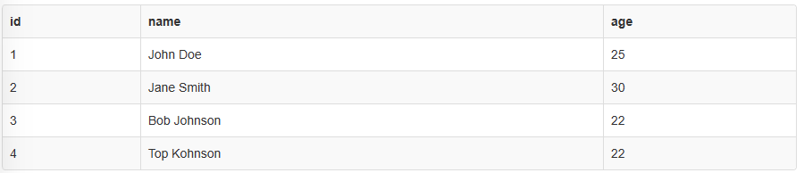

1. ```select * from example;```\
Full table will show.
2. ```select name,id from example;```\
Only name and id will show. **Note** that here first name then id. It's maintain the order of query.
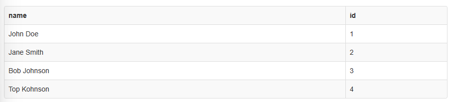
3. ```select distinct * from example;```\
Does not take duplicate rows. Each copy only one piece.
4. ```select distinct age from example;```\
First Select selected colume(age) then remove duplicate rows.
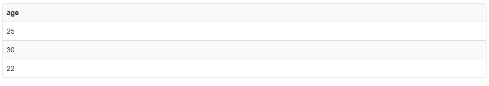
5. ```select count(distinct age) from example;```\
Return the number of distinct row with coloum=age
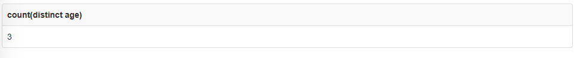
6. ```select count(distinct age,name) from example;```\
Return the number of distinct row with coloum=age,name
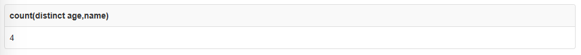

## WHERE

Table same as older one.
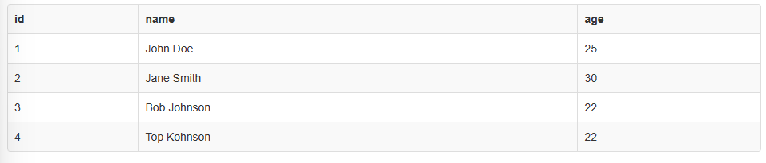

1. ```select * from example where age>=25;```\
   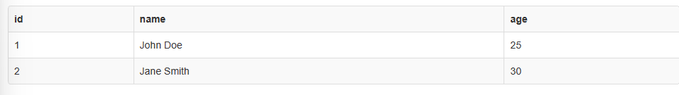
2. ```select name,id from example where age>=25 and id=2;```
   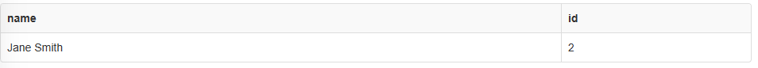
3. BETWEEN\
   ```select name,age from example where age between 20 and 25;```
   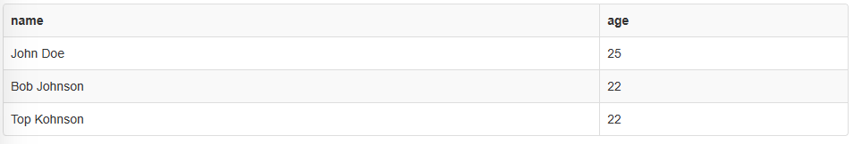
4. LIKE (Search for a pattern)\
   ```select name,age from example where name like "j%";```
   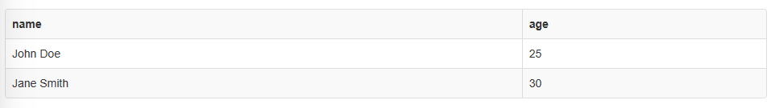
5. IN\
   ```select name from example where name in ("John Doe","Bob Johnson");```
   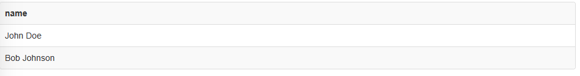

- We can also use **distinct** and **count** here if we need.
- Alse we can use And,or not(!) operation same as c++.

## ORDER BY ( ASC | DESC )

```sql
SELECT column1, column2, ...
FROM table_name
ORDER BY column1, column2, ... ASC|DESC;
```

Table
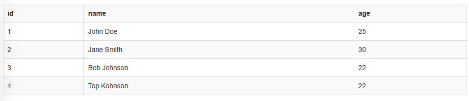

```select * from example order by name;```
```select * from example order by name asc;```
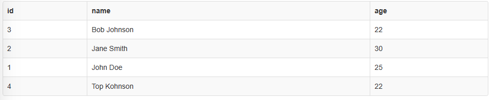
```select name, id from example order by name ASC;```
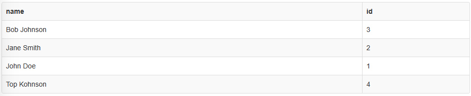
```select * from example order by age ASC,id DESC;```
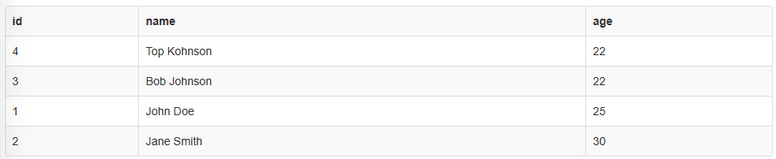

## INSERT INTO

1. Adding value to the all columns

```sql
INSERT INTO table_name (column1, column2, column3, ...)
VALUES (value1, value2, value3, ...);
```

2. Adding value to the specify columns

```sql
INSERT INTO table_name VALUES (value1, value2, value3, ...);
```

Table same as older one.


```insert into example (id,name,age) values (5,"Imran",26);```
```insert into example values (5,"Imran",26);```
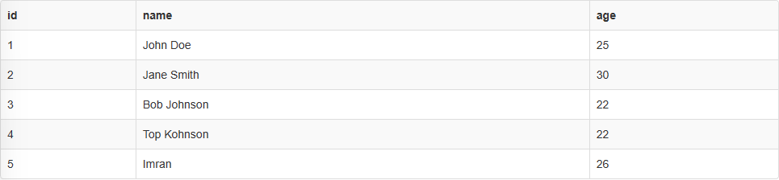
```insert into example (id,name) values (5,"Imran");```
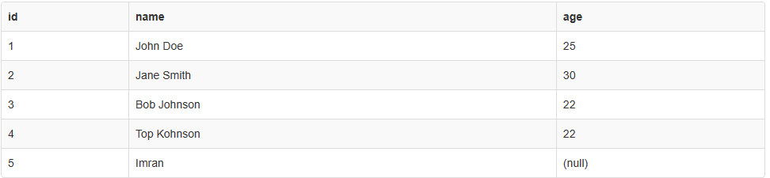

## NULL VALUE

A NULL value is different from a zero value or a field that contains spaces. A field with a NULL value is one that has been left blank during record creation!

```sql
SELECT column_names
FROM table_name
WHERE column_name IS NULL;
```

```sql
SELECT CustomerName, ContactName, Address
FROM Customers
WHERE Address IS NULL;
```

```sql
select * from example where age is null;
```

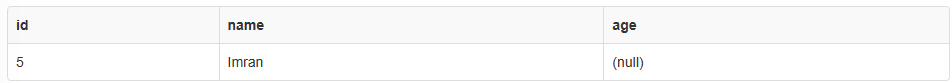

## UPDATE Syntax

```sql
UPDATE table_name
SET column1 = value1, column2 = value2, ...
WHERE condition;
```


```update example set name='test',age=30 where id=3;```
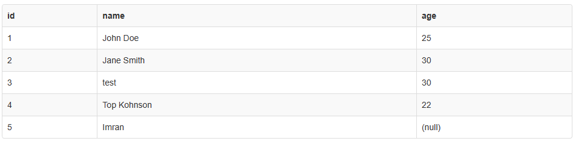
```update example set age=30 ;```
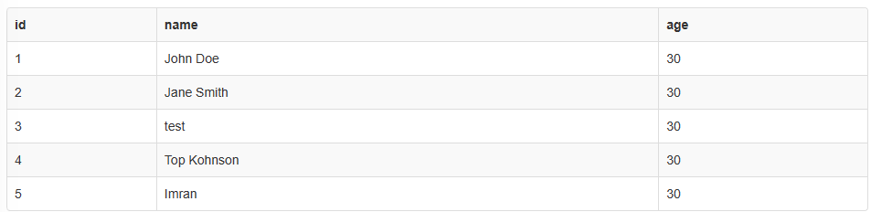

## DELETE Syntax

Table
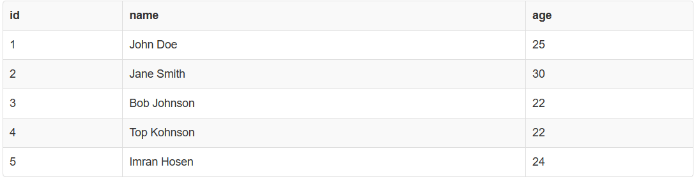

```sql
delete from example where id=4;
```

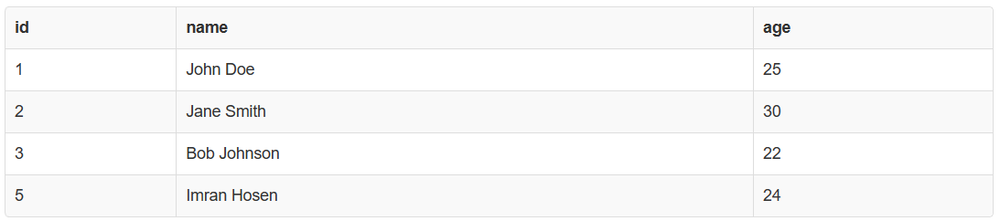

- Delete All Records

```sql
delete from example ;
```

Here all record will be deleted.

## LIMIT Syntax

```sql
SELECT column_name(s)
FROM table_name
WHERE condition
LIMIT number;
```

Table


- Select first 3 rows.

```sql
select * from example limit 3;
```

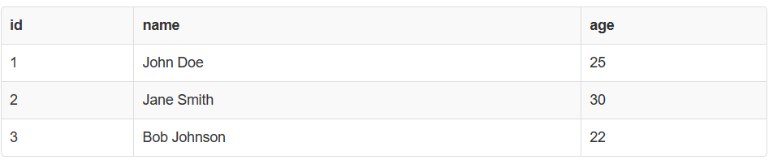

- From index(offset) i to limit x

```sql
select * from example LIMIT 3 OFFSET 1;
-- Here start from index 1+ and take 3 element.
```

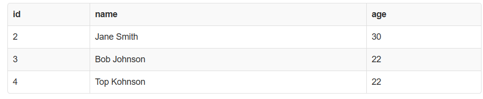

## Min() Max()

Table


```sql
select max(age) from example ;
```

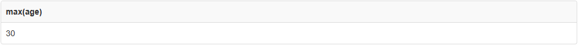

```sql
select min(age) from example;
```

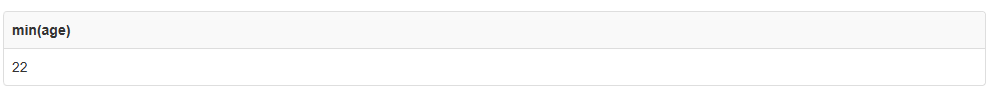

## COUNT(), AVG() and SUM()

- count

```sql()
SELECT COUNT(column_name)
FROM table_name
WHERE condition;
```

- avg()

```sql
SELECT AVG(column_name)
FROM table_name
WHERE condition;
```

- sum()

```sql
SELECT SUM(column_name)
FROM table_name
WHERE condition;
```

Table


Operation

```sql
select count(age) from example;
select avg(age) from example;
select sum(age) from example;
```

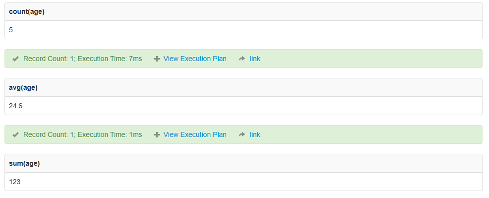

## Wildcard Characters

- (%) represent zero or more characters (bl%-> black,blue)
- (_) represent a single character h_t-> hot, hat, hit

## Like syntax

```sql
SELECT column1, column2, ...
FROM table_name
WHERE columnN LIKE pattern;
```

Table


```sql
select * from example where name like '%n';
select * from example where name like '%so_%';
```

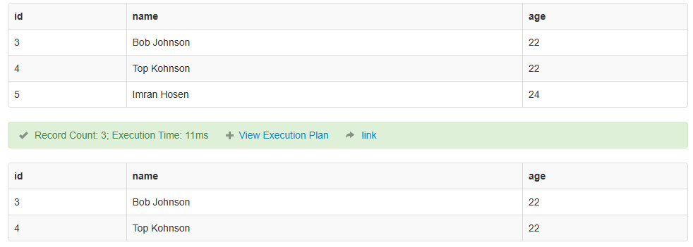

## IN Syntax

```sql
SELECT column_name(s)
FROM table_name
WHERE column_name IN (value1, value2, ...);
```

```sql
SELECT column_name(s)
FROM table_name
WHERE column_name IN (SELECT STATEMENT);
```

Table
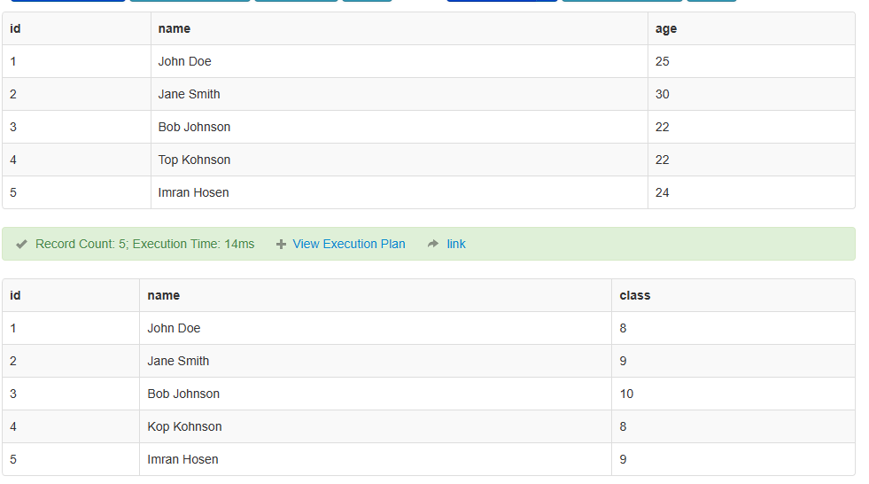

```sql
select * from example where age in (22,30);
select * from example where name in (select name from student);
```

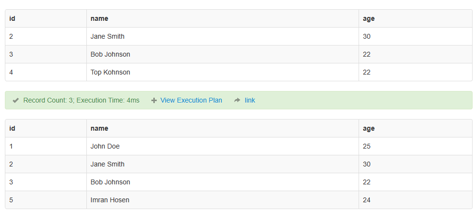
1st table is example and second one is student.

## Between syntax

```sql
SELECT column_name(s)
FROM table_name
WHERE column_name BETWEEN value1 AND value2;
```

Table
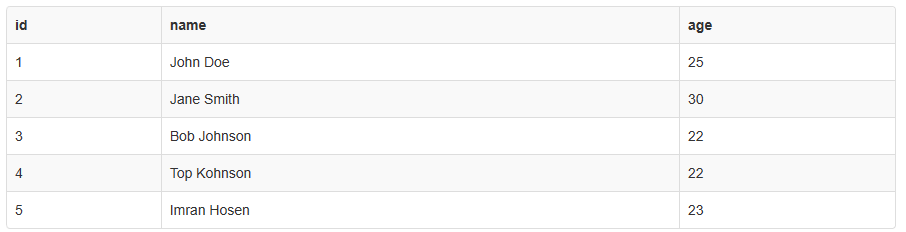

```sql
select * from example where age between 23 and 30 order by name;
```
After query
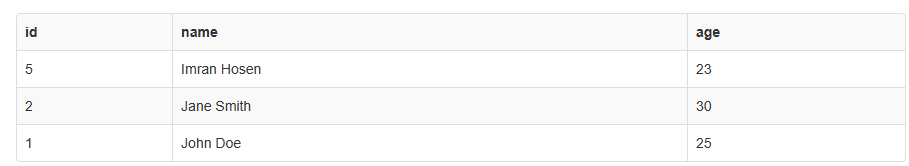

```sql
SELECT *FROM example  WHERE age BETWEEN 24 AND 30  AND id NOT IN (1,4) ORDER BY name ;
```
Table
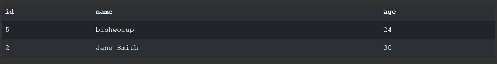


## Alias( AS ) Column Syntax

```sql
SELECT column_name AS alias_name
FROM table_name;
```

Table


```sql
select id as e_id , name as e_name from example;
```

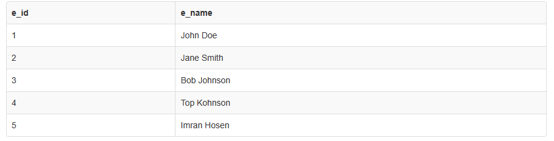

Another example:

```sql
SELECT o.OrderID, o.OrderDate, c.CustomerName
FROM Customers AS c, Orders AS o
WHERE c.CustomerName='Around the Horn' AND c.CustomerID=o.CustomerID;
```

## Joining Tables

This table I will use in this joining section.

```sql
-- Create a table
CREATE TABLE A (
    id INT PRIMARY KEY,
    name VARCHAR(50),
    age INT
);

-- Insert data into the table
INSERT INTO A (id, name, age)
VALUES
(1, 'John Doe', 25),
(2, 'Jane Smith', 30),
(3, 'Bob Johnson', 22),
(4, 'Top Kohnson', 22),
(5, 'Imran Hosen', 23);

-- Create table B with a similar structure
CREATE TABLE B (
    id INT PRIMARY KEY,
    name VARCHAR(50),
    age INT
);

-- Insert different data into the table B
INSERT INTO B (id, name, age)
VALUES
(6, 'Alice Brown', 28),
(7, 'Charlie Miller', 30),
(8, 'David Wilson', 29),
(9, 'Eva Davis', 22),
(10, 'Frank White', 25);

```

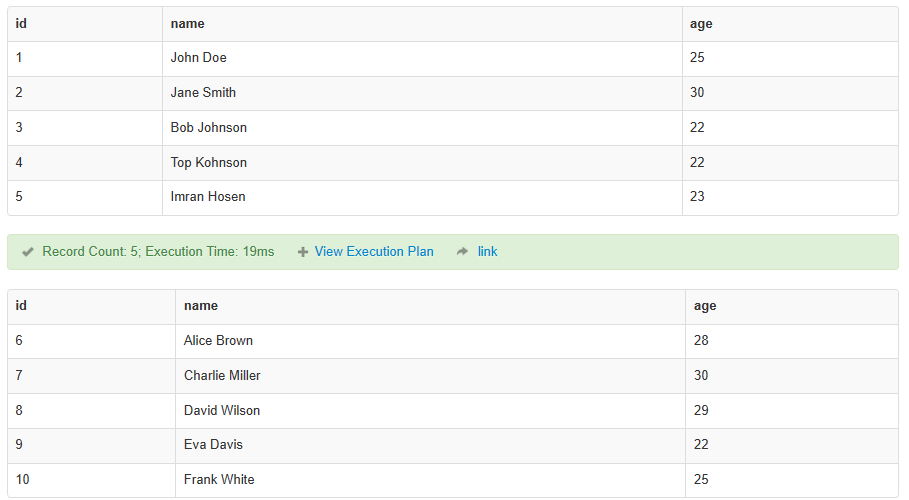

Lets see an example

```sql
select A.name as A_name ,A.id as A_id, B.name as B_name,B.id as B_id from A inner join B on A.age=B.age;
```

Output
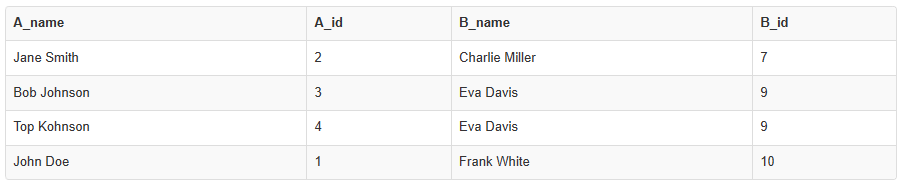

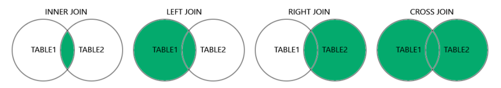

- **INNER JOIN:** Returns records that have matching values in both tables
- **LEFT JOIN:** Returns all records from the left table, and the matched records from the right table
- **RIGHT JOIN:** Returns all records from the right table, and the matched records from the left table
- **CROSS JOIN:** Returns all records from both tables

### Inner join

In upper we already see an example of inner join.\
Lets see two code

```sql
select A.name as A_name ,A.id as A_id, B.name as B_name,B.id as B_id from A inner join B on A.age=B.age;
```

JOIN Three Tables

```sql
SELECT Orders.OrderID, Customers.CustomerName, Shippers.ShipperName
FROM ((Orders
INNER JOIN Customers ON Orders.CustomerID = Customers.CustomerID)
INNER JOIN Shippers ON Orders.ShipperID = Shippers.ShipperID);
```

## Left join

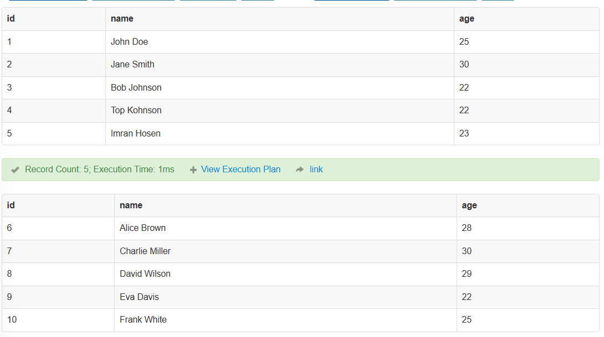

```sql
select A.name as A_name ,A.id as A_id, B.name as B_name,B.id as B_id from A left join B on A.age=B.age;
```

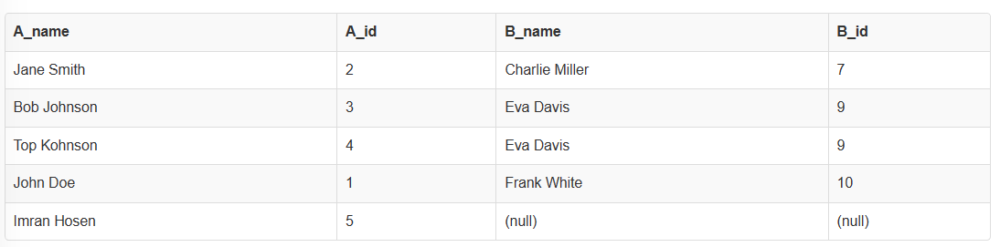

### Right join

```sql
SELECT column_name(s)
FROM table1
RIGHT JOIN table2
ON table1.column_name = table2.column_name;

```

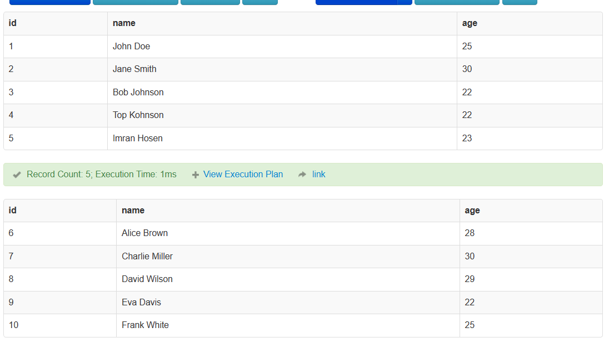

```sql
select A.name as A_name ,A.id as A_id, B.name as B_name,B.id as B_id from A  right join B on A.age=B.age;
```

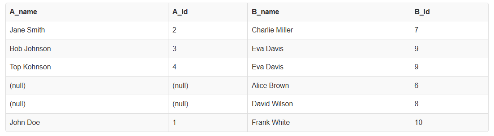

## CROSS JOIN

```sql
SELECT column_name(s)
FROM table1
CROSS JOIN table2;
```

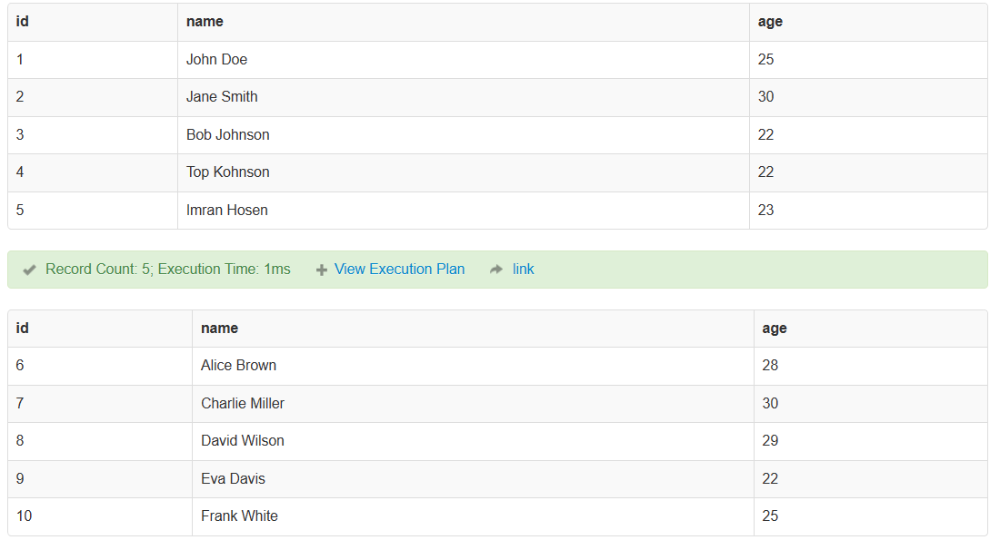

```sql
select A.name as A_name ,A.id as A_id, B.name as B_name,B.id as B_id from A  cross join B on A.age=B.age;
```

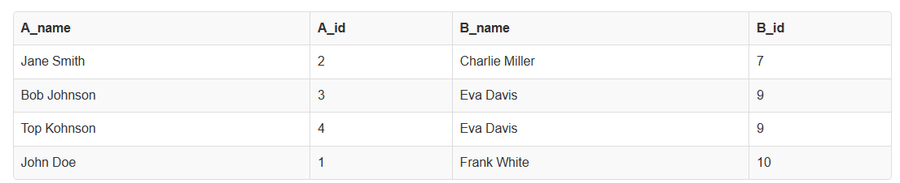

```sql
select A.name as A_name ,A.id as A_id, B.name as B_name,B.id as B_id from A  cross join B ;
```

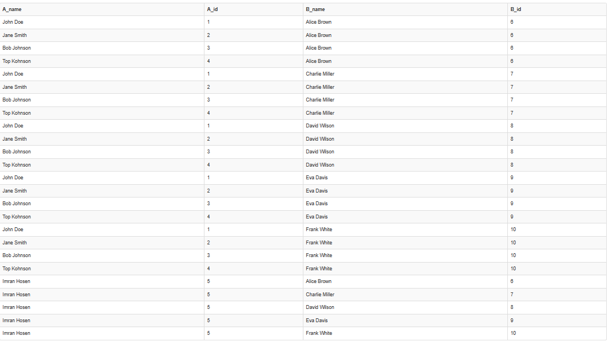

## Self join

A self join is a regular join, but the table is joined with itself.

```sql
SELECT column_name(s)
FROM table1 T1, table1 T2
WHERE condition;
```

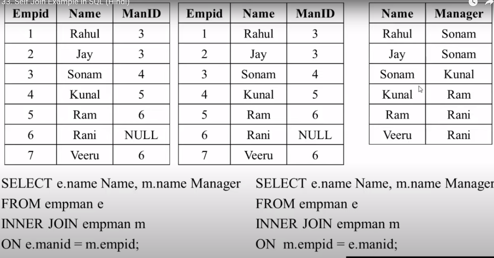

## Union

```sql
SELECT column_name(s) FROM table1
UNION
SELECT column_name(s) FROM table2;
```

- Every SELECT statement within UNION must have the same number of columns
- The columns must also have similar data types
- The columns in every SELECT statement must also be in the same order

> The **UNION** operator selects only distinct values by default. To allow duplicate values, use **UNION ALL**:
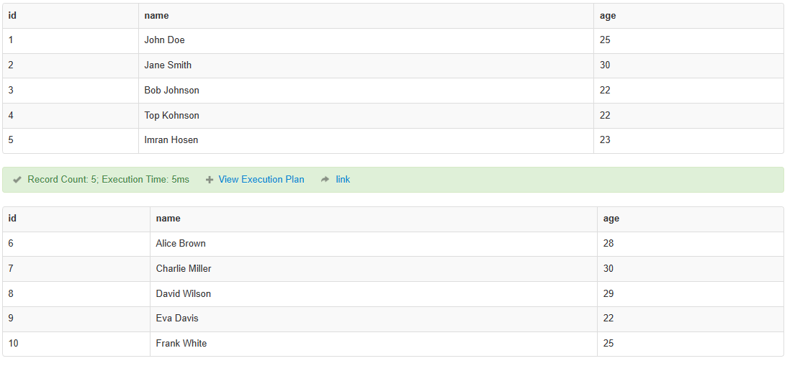

```sql
select A.name,A.id from A union select B.name,B.id from B;
```

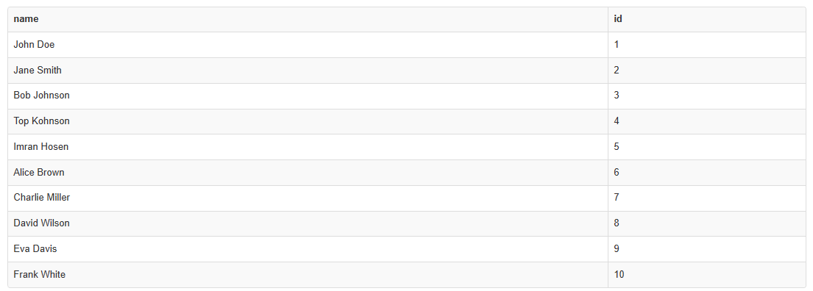

```sql
SELECT City, Country FROM Customers
WHERE Country='Germany'
UNION
SELECT City, Country FROM Suppliers
WHERE Country='Germany'
ORDER BY City;
```

## GROUP BY

Group by the simillar value

```sql
SELECT column_name(s)
FROM table_name
WHERE condition
GROUP BY column_name(s)
ORDER BY column_name(s);
```

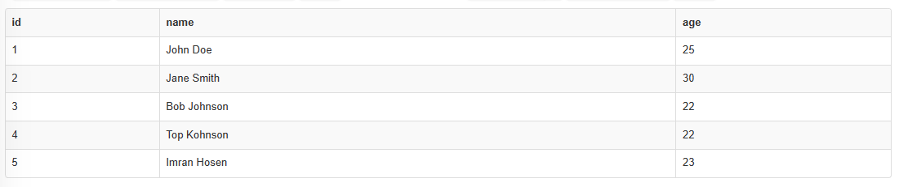

```sql
select count(age) ,age from A group by age;
```

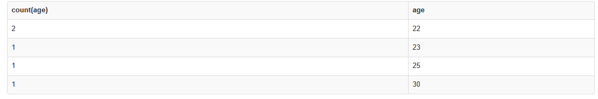

```sql
select count(age) ,age from A group by age order by count(age);
```

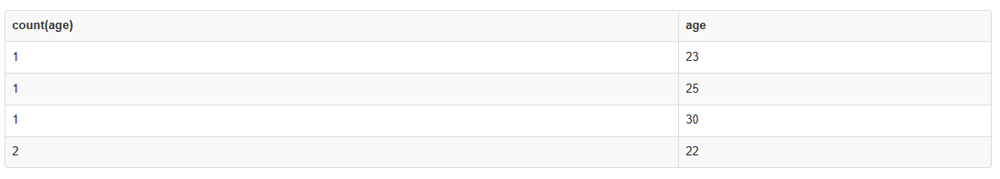

## Having

```sql
SELECT COUNT(CustomerID), Country
FROM Customers
GROUP BY Country
HAVING COUNT(CustomerID) > 5;
```

```sql
select count(age) ,age from A group by age having count(age)>=2;
```

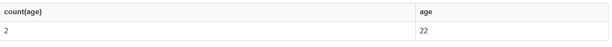

## EXISTS

- The EXISTS operator is used to test for the existence of any record in a subquery.

- The EXISTS operator returns TRUE if the subquery returns one or more records.

```sql
SELECT column_name(s)
FROM table_name
WHERE EXISTS
(SELECT column_name FROM table_name WHERE condition);
```

## ANY and ALL

### ANY Operator

- returns a boolean value as a result
- returns TRUE if ANY of the subquery values meet the condition

```sql
SELECT column_name(s)
FROM table_name
WHERE column_name operator ANY
  (SELECT column_name
  FROM table_name
  WHERE condition);
```

### ALL Operator

- returns a boolean value as a result
- returns TRUE if ALL of the subquery values meet the condition
- is used with SELECT, WHERE and HAVING statements

```sql
-- All with select
SELECT ALL column_name(s)
FROM table_name
WHERE condition;
```

```sql
-- all with wherer/having
SELECT column_name(s)
FROM table_name
WHERE column_name operator ALL
  (SELECT column_name
  FROM table_name
  WHERE condition);
```

Table

```sql
CREATE TABLE OrderDetails (
    OrderDetailID INT PRIMARY KEY,
    OrderID INT,
    ProductID INT,
    Quantity INT
);

-- Insert data into the table
INSERT INTO OrderDetails (OrderDetailID, OrderID, ProductID, Quantity)
VALUES
(1, 10248, 11, 12),
(2, 10248, 42, 10),
(3, 10248, 72, 5),
(4, 10249, 14, 9),
(5, 10249, 51, 40),
(6, 10250, 41, 10),
(7, 10250, 51, 35),
(8, 10250, 65, 15),
(9, 10251, 22, 6),
(10, 10251, 57, 15);
```

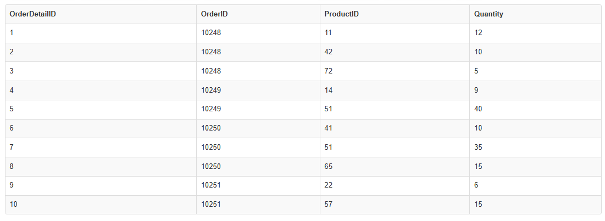

- lets assume Order list another table.

```sql
SELECT ProductName
FROM Products
WHERE ProductID = ANY
  (SELECT ProductID
  FROM OrderDetails
  WHERE Quantity = 10);
```

```sql
SELECT ProductName
FROM Products
WHERE ProductID = ALL
  (SELECT ProductID
  FROM OrderDetails
  WHERE Quantity = 10);
```

## INSERT INTO

```sql
INSERT INTO Customers (CustomerName, City, Country)
SELECT SupplierName, City, Country FROM Suppliers;
```

```sql
INSERT INTO Customers (CustomerName, ContactName, Address, City, PostalCode, Country)
SELECT SupplierName, ContactName, Address, City, PostalCode, Country FROM Suppliers;
```

```sql
INSERT INTO Customers (CustomerName, City, Country)
SELECT SupplierName, City, Country FROM Suppliers
WHERE Country='Germany';
```

## CASE Syntax

```sql
CASE
    WHEN condition1 THEN result1
    WHEN condition2 THEN result2
    WHEN conditionN THEN resultN
    ELSE result
END;
```

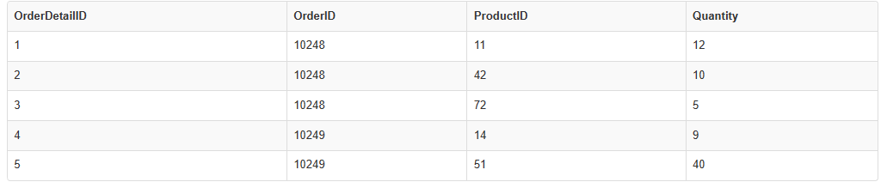

```sql
select OrderId,Quantity,
case 
    WHEN Quantity > 30 THEN 'The quantity is greater than 30'
    WHEN Quantity = 30 THEN 'The quantity is 30'
    ELSE 'The quantity is under 30'
end as QuantityText from OrderDetails;
```

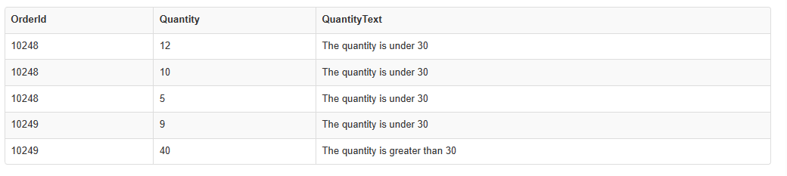

## IFNULL() and COALESCE()

- IFNULL() function lets you return an alternative value if an expression is NULL.

```sql
SELECT IFNULL(NULL, 500);
-- output 500
```

```sql
SELECT ProductName, UnitPrice * (UnitsInStock + IFNULL(UnitsOnOrder, 0))
FROM Products;
```

- The COALESCE() function returns the first non-null value in a list.

```sql
SELECT COALESCE(NULL, NULL, NULL, 'W3Schools.com', NULL, 'Example.com');
--output W3Schools.com
```

# Section two

## Create database

```sql
CREATE DATABASE databasename;
```

## Drop database

```sql
DROP DATABASE databasename;
```

## CREATE TABLE

```sql
CREATE TABLE table_name (
    column1 datatype,
    column2 datatype,
    column3 datatype,
   ....
);
```

```sql
CREATE TABLE Persons (
    PersonID int,
    LastName varchar(255),
    FirstName varchar(255),
    Address varchar(255),
    City varchar(255)
);
```

#### Create Table Using Another Table

```sql
CREATE TABLE new_table_name AS
    SELECT column1, column2,...
    FROM existing_table_name
    WHERE ....;
  -- Another example
CREATE TABLE TestTable AS
SELECT customername, contactname
FROM customers;
```

## Drop table

```sql
DROP TABLE table_name;
```

## After Table

- add
- delete
- modify
- drop
  
1. Add

```sql
ALTER TABLE table_name
ADD column_name datatype;

-- example
ALTER TABLE Customers
ADD Email varchar(255);
```

2. DROP COLUMN

```sql
ALTER TABLE table_name
DROP COLUMN column_name;

-- example
ALTER TABLE Customers
DROP COLUMN Email;
```

3. MODIFY COLUMN

```sql
ALTER TABLE table_name
MODIFY COLUMN column_name datatype;
```

## Create Constraints

```sql
CREATE TABLE table_name (
    column1 datatype constraint,
    column2 datatype constraint,
    column3 datatype constraint,
    ....
);
```

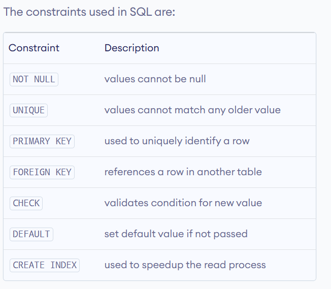

- if a column has NOT NULL constraint, it means the column cannot store NULL values.

## NOT NULL

```sql
CREATE TABLE Persons (
    ID int NOT NULL,
    LastName varchar(255) NOT NULL,
    FirstName varchar(255) NOT NULL,
    Age int
);
```

```sql
-- Create the table
CREATE TABLE person (
    id INT NOT NULL,
    firstName VARCHAR(255) NOT NULL,
    age INT
);

-- Insert data into the table
INSERT INTO person (id, firstName, age) VALUES
(1, 'John', 22),
(2, 'Jane', 25),
(3, 'Bob', 30),
(4, 'Alice', 28);

-- Modify the age column to be NOT NULL
ALTER TABLE person MODIFY age INT NOT NULL;
ALTER TABLE person ADD class INT NOT NULL;
```

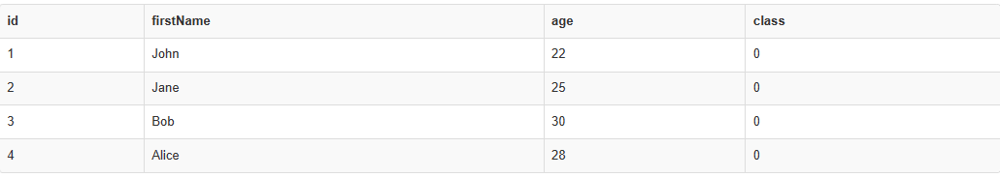

## UNIQUE Constraint

- The UNIQUE constraint ensures that all values in a column are different.
- A PRIMARY KEY constraint automatically has a UNIQUE constraint.

```sql
CREATE TABLE Persons (
    ID int NOT NULL,
    LastName varchar(255) NOT NULL,
    FirstName varchar(255),
    Age int,
    UNIQUE (ID)
);
```

```sql
CREATE TABLE Persons (
    ID int NOT NULL,
    LastName varchar(255) NOT NULL,
    FirstName varchar(255),
    Age int,
    CONSTRAINT UC_Person UNIQUE (ID,LastName)
);
```

```sql
ALTER TABLE Persons
ADD UNIQUE (ID);
```

## Primary key

- The PRIMARY KEY constraint uniquely identifies each record in a table.

```sql
CREATE TABLE Persons (
    ID int NOT NULL,
    LastName varchar(255) NOT NULL,
    FirstName varchar(255),
    Age int,
    PRIMARY KEY (ID)
);
```

- PRIMARY KEY constraint on multiple columns,

```sql
CREATE TABLE Persons (
    ID int NOT NULL,
    LastName varchar(255) NOT NULL,
    FirstName varchar(255),
    Age int,
    CONSTRAINT PK_Person PRIMARY KEY (ID,LastName)
);
```

In after table

```sql
ALTER TABLE Persons
ADD PRIMARY KEY (ID);

ALTER TABLE Persons
ADD CONSTRAINT PK_Person PRIMARY KEY (ID,LastName);
-- drop primary key
ALTER TABLE Persons
DROP PRIMARY KEY;
```

## FOREIGN KEY

- The FOREIGN KEY constraint is used to prevent actions that would destroy links between tables.
- A FOREIGN KEY is a field (or collection of fields) in one table, that refers to the PRIMARY KEY in another table.

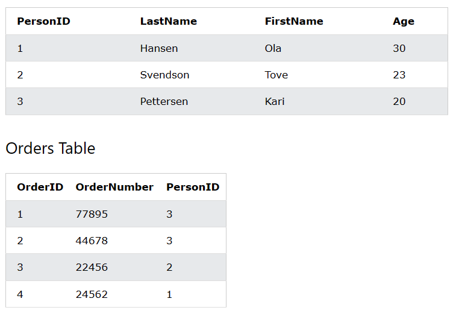

```sql
CREATE TABLE Orders (
    OrderID int NOT NULL,
    OrderNumber int NOT NULL,
    PersonID int,
    PRIMARY KEY (OrderID),
    FOREIGN KEY (PersonID) REFERENCES Persons(PersonID)
);
```

- using after table

```sql
ALTER TABLE Orders
ADD FOREIGN KEY (PersonID) REFERENCES Persons(PersonID);
```

Drop foreign key

```sql
ALTER TABLE Orders
DROP FOREIGN KEY FK_PersonOrder;
```

## CHECK Constraint

- The CHECK constraint is used to limit the value range that can be placed in a column.

```sql
CREATE TABLE Persons (
    ID int NOT NULL,
    LastName varchar(255) NOT NULL,
    FirstName varchar(255),
    Age int,
    CHECK (Age>=18)
);
```

using after table

```sql
ALTER TABLE Persons
ADD CONSTRAINT CHK_PersonAge CHECK (Age>=18 AND City='Sandnes');
```

## Default

--- The DEFAULT constraint is used to set a default value for a column.

```sql
CREATE TABLE Persons (
    ID int NOT NULL,
    LastName varchar(255) NOT NULL,
    FirstName varchar(255),
    Age int,
    City varchar(255) DEFAULT 'Sandnes'
);
```

After table

```sql
ALTER TABLE Persons
ALTER City SET DEFAULT 'Sandnes';
-- drop
ALTER TABLE Persons
ALTER City DROP DEFAULT;
```

## Create Index

- The CREATE INDEX statement is used to create indexes in tables.

Indexes are used to retrieve data from the database more quickly than otherwise. The users cannot see the indexes, they are just used to speed up searches/queries.

-**Note:** Updating a table with indexes takes more time than updating a table without (because the indexes also need an update). So, only create indexes on columns that will be frequently searched against.

```sql
CREATE INDEX index_name
ON table_name (column1, column2, ...);

CREATE UNIQUE INDEX index_name
ON table_name (column1, column2, ...);
-- example
CREATE INDEX idx_pname
ON Persons (LastName, FirstName);

-- drop 
ALTER TABLE table_name
DROP INDEX index_name;
```

## AUTO_INCREMENT

-MySQL uses the AUTO_INCREMENT keyword to perform an auto-increment feature.

```sql
CREATE TABLE Persons (
    Personid int NOT NULL AUTO_INCREMENT,
    LastName varchar(255) NOT NULL,
    FirstName varchar(255),
    Age int,
    PRIMARY KEY (Personid)
);
```

To let the AUTO_INCREMENT sequence start with another value, use the following SQL statement:

```sql
ALTER TABLE Persons AUTO_INCREMENT=100;
```

## Date Data Types

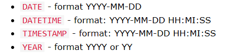

## create view

- A view contains rows and columns, just like a real table. The fields in a view are fields from one or more real tables in the database.

- You can add SQL statements and functions to a view and present the data as if the data were coming from one single table.

```sql
CREATE VIEW view_name AS
SELECT column1, column2, ...
FROM table_name
WHERE condition;
```

```sql
CREATE OR REPLACE VIEW view_name AS
SELECT column1, column2, ...
FROM table_name
WHERE condition;
```

example

```sql
CREATE VIEW [Products Above Average Price] AS
SELECT ProductName, Price
FROM Products
WHERE Price > (SELECT AVG(Price) FROM Products);
```