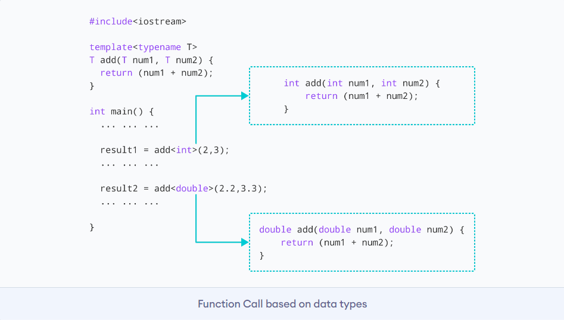
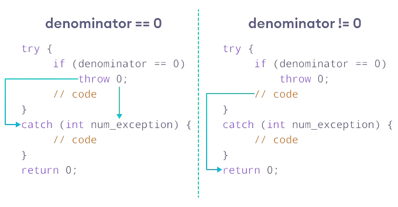

# oops-interview-question
Soon you guys will find all the important oops interview questions
<span id="top1"></span>
1. <a href="#1">What is the difference between C and C++?</a>
2. <a href="#2">What are the key features of C++?</a>
3. <a href="#3">Explain object-oriented programming (OOP) concepts in C++.</a>
4. <a href="#4">What is the difference between a class and an object?</a>
5. <a href="#5">What is a constructor? How is it different from a regular member function?</a>
6. <a href="#6">What is the destructor? When is it called?</a>
7. <a href="#7">What is the difference between private, protected, and public access specifiers?</a>
8. <a href="#8">Explain the concept of inheritance in C++.</a>
9. <a href="#9">What are virtual functions? Why are they used?</a>
10. <a href="#10">Real life example of object oriented programming?</a>
11. <a href="#11">What is function overloading? How is it different from function overriding?</a>
12. <a href="#12">What is a template in C++? How are templates used?</a>
13. <a href="#13">What are the differences between pass-by-value and pass-by-reference?</a>
14. <a href="#14">What is an inline function? When should it be used?</a>
15. <a href="#15">What is the difference between new and malloc in C++?</a>
16. <a href="#16">What are the differences between a shallow copy and a deep copy? When would you use each?</a>
17. <a href="#17">Explain the concept of exception handling in C++.</a>
18. <a href="#18">What is a namespace? How is it used?</a>
19. <a href="#19">What are the differences between static and dynamic memory allocation?</a>
20. <a href="#20">How does C++ support multiple inheritance?</a>
21. <a href="#21">What are smart pointers? Explain their types and usage.</a>
22. <a href="#22">What is the Standard Template Library (STL) in C++?</a>
23. <a href="#23">Explain the differences between vectors, lists, and arrays in STL.</a>
24. <a href="#24">What is a lambda function in C++? How is it used?</a>
25. <a href="#25">What is a reference variable in C++?</a>
26. <a href="#26">What are pure virtual functions? How are they used?</a>
27. <a href="#27">What is a virtual destructor? Why is it necessary in C++?</a>
28. <a href="#28">What is a friend function in C++? How is it different from a member function?</a>
29. <a href="#29">What are the differences between a struct and a class in C++?</a>
30. <a href="#30">How does C++ support operator overloading? Give an example.</a>
31. <a href="#31">Explain the concept of dynamic binding in C++.</a>
32. <a href="#32">What is the difference between a stack and a heap in memory allocation?</a>
33. <a href="#33">How do you handle memory leaks in C++?</a>
34. <a href="#34">Explain the use of the auto keyword in C++11.</a>
35. <a href="#35">What are the differences between a pointer and a reference in C++?</a>
36. <a href="#36">What is the purpose of the explicit keyword in C++?</a>
37. <a href="#37">How do you implement a copy constructor in C++?</a>
38. <a href="#38">Explain the concept of const member functions in C++.</a>
39. <a href="#39">What is the difference between virtual functions and pure virtual functions?</a>
40. <a href="#40">What is the role of the preprocessor in C++?</a>
41. <a href="#41">How do you handle multiple exceptions in C++?</a>
42. <a href="#42">Explain the concept of function pointers in C++.</a>
43. <a href="#43">What is the difference between new and delete operators in C++?</a>
44. <a href="#44">How does C++ support multithreading? Explain the concept of thread synchronization.</a>
45. <a href="#45">What is the difference between a shallow copy and a deep copy? When would you use each?</a>
46. <a href="#46">Explain the concept of move semantics in C++11. How does it improve performance?</a>
47. <a href="#47">What is the role of the virtual keyword in C++?</a>
48. <a href="#48">How does C++ support exception safety? Explain the concept of RAII.</a>
49. <a href="#49">What are the differences between static binding and dynamic binding in C++?</a>
50. <a href="#50">Explain the concept of a const pointer versus a pointer to const in C++.</a>
51. <a href="#51">How do you implement operator overloading for a custom class in C++?</a>
52. <a href="#52">What is the purpose of the override keyword in C++11?</a>
53. <a href="#53">Explain the concept of typecasting in C++. What are the different types of typecasting?</a>
54. <a href="#54">What is the difference between a function object and a lambda function in C++?</a>
55. <a href="#55">Explain the role of the typeid operator in C++.</a>
56. <a href="#56">How does C++ handle multiple inheritance? What are the challenges and solutions?</a>
57. <a href="#57">What is the purpose of the volatile keyword in C++?</a>
58. <a href="#58">Explain the difference between the pre-increment and post-increment operators in C++.</a>
59. <a href="#59">What is the role of the explicit keyword in a constructor in C++?</a>
60. <a href="#60">Explain the concept of the ternary operator in C++.</a>
61. <a href="#61">What is the difference between the new operator and the new[] operator in C++?</a>
62. <a href="#62">Explain the usage and benefits of the constexpr keyword in C++11.</a>
63. <a href="#63">Explain the concept of the Rule of Three/Five/Zero in C++.</a>
64. <a href="#64">How do you handle circular dependencies in C++?</a>
65. <a href="#65">What is the difference between static polymorphism and dynamic polymorphism?</a>
66. <a href="#66">Explain the concept of the noexcept specifier in C++.</a>
67. <a href="#67">How does C++ support multithreading? What are some threading libraries in C++?</a>
68. <a href="#68">What is the role of the mutable keyword in C++?</a>
69. <a href="#69">Explain the concept of the nullptr keyword in C++.</a>
70. <a href="#70">What is the purpose of the std::move function in C++11?</a>
71. <a href="#71">How do you handle resource acquisition and release in C++? Explain the concept of Resource Acquisition Is Initialization (RAII).</a>
72. <a href="#72">What is the difference between a constant pointer and a pointer to a constant in C++?</a>
73. <a href="#73">Explain the concept of the Standard Template Library (STL) in C++.</a>
74. <a href="#74">What are the differences between std::vector and std::array in C++?</a>
75. <a href="#75">What is the difference between std::unique_ptr and std::shared_ptr in C++?</a>
76. <a href="#76">Explain the concept of consteval in C++20 and its usage.</a>
77. <a href="#77">What is the purpose of the using keyword in C++?</a>
78. <a href="#78">How do you implement a thread-safe singleton in C++?</a>
79. <a href="#79">Explain the concept of the ternary operator in C++ and its usage.</a>
80. <a href="#80">What is the role of the constexpr specifier in C++?</a>
81. <a href="#81">Explain the concept of the final specifier in C++.</a>
82. <a href="#82">What is the difference between a raw pointer and a smart pointer in C++?</a>
83. <a href="#83">Explain the concept of the auto keyword in C++14 and its usage.</a>
84. <a href="#84">What are the differences between std::function and function pointers in C++?</a>
85. <a href="#85">How do you handle memory management in C++ without using smart pointers?</a>
86. <a href="#86">Explain the concept of the volatile keyword in C++ and its usage.</a>
87. <a href="#87">What is the difference between the struct padding and struct packing in C++?</a>
88. <a href="#88">How does C++ support reflection? Are there any reflection mechanisms available?</a>
89. <a href="#89">Explain the concept of the unnamed namespace in C++.</a>
90. <a href="#90">What is the difference between a template class and a template specialization in C++?</a>
91. <a href="#91">Explain the concept of SFINAE (Substitution Failure Is Not An Error) in C++.</a>
92. <a href="#92">How do you handle file I/O in C++?</a>
93. <a href="#93">Explain the concept of const correctness in C++.</a>


## 1. <a id="1">What is the difference between C and C++?</a>
**Answer:-** C and C++ are both popular programming languages, but they have some key differences. Here are the main distinctions between the two:

1. **Programming Paradigm:** C is a procedural programming language, meaning it follows a top-down approach where the program is divided into functions or procedures. C++ extends C and adds support for object-oriented programming (OOP), which allows you to create classes and objects to encapsulate data and behavior.

2. **OOP Support:** C++ has built-in support for OOP, while C does not. In C++, you can use classes, objects, inheritance, polymorphism, and other OOP concepts to create more modular and reusable code. C, on the other hand, relies on procedural programming techniques and does not have native OOP constructs.

3. **Features and Abstractions:**  C++ offers several additional features and abstractions compared to C. It includes features like classes, templates, exceptions, namespaces, function overloading, operator overloading, and more. These features provide higher-level abstractions and make it easier to write complex programs compared to C.

4. **Compatibility:** C++ is generally considered a superset of C. This means that most valid C programs can be compiled and run as C++ programs with few or no modifications. However, C++ introduces some changes and enhancements to the C language, so not all C code is valid in C++ without modifications.

5. **Standard Libraries:** C++ includes the Standard Template Library (STL), which provides a collection of template classes and functions for common data structures and algorithms. The STL offers containers (like vectors, lists, and maps), algorithms (such as sorting and searching), and other utilities. C does not have a standard library as feature-rich as the C++ STL, but it does include the C Standard Library with functions for input/output, string manipulation, memory management, and other basic operations.

6. **Use Cases:** C is often used for low-level programming, system-level programming, embedded systems, and building efficient and lightweight applications. It's popular in operating system development and writing device drivers. C++ is used in a wide range of applications, including game development, graphical user interfaces (GUIs), complex software systems, and large-scale projects that benefit from OOP concepts.

In summary, C and C++ differ in terms of programming paradigms, OOP support, language features, standard libraries, and use cases. C++ builds upon C and provides additional capabilities for object-oriented programming, but C remains a powerful language for lower-level programming tasks.

<a href="#top1">Go to top &#8593;</a>

## 2. <a id="2">What are the key features of C++?</a>
**Answer:-** C++ is a powerful and versatile programming language that offers a range of key features. Here are some of the key features of C++:

1. **Object-Oriented Programming (OOP):**
   C++ supports object-oriented programming, allowing you to create classes and objects to encapsulate data and behavior. This feature enables concepts like inheritance, polymorphism, and encapsulation, making code organization and reusability easier.

2. **Classes and Objects:**
   C++ allows you to define classes to represent objects and define their properties (data members) and behavior (member functions). Objects are instances of classes that can be created and manipulated in code.

3. **Templates:**
   C++ supports templates, which allow you to write generic code that can work with different types. Templates facilitate the creation of functions and classes that can operate on various data types, providing flexibility and code reusability.

4. **Standard Template Library (STL):**
   The STL is a collection of template classes and functions that provide commonly used data structures (like vectors, lists, and maps) and algorithms (such as sorting and searching). The STL simplifies the implementation of complex data structures and algorithms in C++.

5. **Exception Handling:**
   C++ supports exception handling mechanisms, allowing you to catch and handle runtime errors and exceptions. It provides constructs like `try`, `catch`, and `throw` to manage exceptional conditions and perform error handling gracefully.

6. **Operator Overloading:**
   C++ allows you to overload operators, enabling you to define custom behaviors for operators when applied to objects of user-defined classes. This feature provides a natural and intuitive way to work with objects, making code more expressive and readable.

7. **Standard Library:**
   C++ comes with a rich standard library that provides various pre-defined functions and classes for performing common tasks. It includes functionality for input/output operations, string manipulation, mathematical operations, memory management, and more.

8. **Performance:**
   C++ allows fine-grained control over memory management and low-level programming, making it suitable for performance-critical applications. It supports features like pointers and direct memory manipulation, enabling developers to optimize code execution and memory usage.

9. **Interoperability:**
   C++ is compatible with C, allowing C code to be easily integrated into C++ programs. It provides the ability to call C functions from C++ code and vice versa, making it easy to leverage existing C libraries and codebases.

10. **Portability:**
    C++ is a standardized language, and compilers are available for various platforms and operating systems. This portability allows C++ programs to be developed and executed across different environments.

These key features make C++ a popular choice for a wide range of applications, including system programming, game development, GUI applications, scientific computing, and more.

<a href="#top1">Go to top &#8593;</a>

## 3. <a id="3">Explain object-oriented programming (OOP) concepts in C++.</a>
**Answer:-** Object-oriented programming (OOP) is a programming paradigm that revolves around the concept of objects, which are instances of classes. C++ supports OOP and provides several features to implement OOP concepts. Here are the key OOP concepts in C++:

1. **Classes and Objects:**
   A class is a blueprint or a template that defines the structure and behavior of objects. It encapsulates data (in the form of member variables) and operations (in the form of member functions). An object is an instance of a class, created from the class blueprint. Objects have their own state (values of member variables) and behavior (invoking member functions).

   Example:
   ```cpp
   class Rectangle {
   private:
       int width;
       int height;

   public:
       Rectangle(int w, int h) : width(w), height(h) {}

       int getArea() {
           return width * height;
       }
   };

   int main() {
       Rectangle rect(5, 3);
       int area = rect.getArea();
       cout << "Area: " << area << endl;
       return 0;
   }
   ```
   In this example, `Rectangle` is a class with private member variables `width` and `height`, a constructor, and a member function `getArea()`. An object `rect` is created using the `Rectangle` class, and its `getArea()` function is called.

2. **Encapsulation:**
   Encapsulation is the principle of bundling data and methods together within a class, hiding the internal implementation details from the outside world. It provides data abstraction and protection, allowing controlled access to the internal state of an object through public interfaces (public member functions).

3. **Inheritance:**
   Inheritance allows a class to inherit the properties (member variables and member functions) of another class, known as the base class or superclass. The derived class or subclass inherits and extends the functionality of the base class. This concept promotes code reuse and facilitates the creation of class hierarchies.

4. **Polymorphism:**
   Polymorphism allows objects of different classes to be treated as objects of a common base class. It enables objects to be processed in a generic way, regardless of their specific types. Polymorphism is achieved through virtual functions and function overriding.

5. **Abstraction:**
   Abstraction is the process of simplifying complex systems by focusing on essential features and hiding unnecessary details. In C++, abstraction is achieved through classes and their public interfaces. Users of a class need not know the internal implementation details; they can work with the class through its abstracted interface.

6. **Message Passing:**
   Objects communicate with each other by sending messages. Message passing involves invoking member functions on objects to perform actions or access data. Objects interact and collaborate by exchanging messages to achieve the desired behavior.

These OOP concepts in C++ promote modularity, code organization, reusability, and maintainability. They enable the creation of robust and scalable software systems by modeling real-world entities as objects and defining their behavior through classes and their relationships.

<a href="#top1">Go to top &#8593;</a>

## 4. <a id="4">What is the difference between a class and an object?</a>
**Answer:-** To understand the difference between a class and an object, let's consider a real-world example: the concept of a "Car."

**Class:**
In the context of programming, a class is like a blueprint or a template that defines the properties and behaviors that objects of that class will have. In our example, a class called "Car" would define what properties and behaviors a car should have. The class defines common characteristics shared by all cars.

```cpp
class Car {
private:
    string brand;
    string model;
    int year;

public:
    void startEngine() {
        // Code to start the car's engine
    }

    void accelerate() {
        // Code to accelerate the car
    }

    void brake() {
        // Code to apply brakes to the car
    }
};
```

In this example, the "Car" class specifies properties like "brand," "model," and "year," and behaviors like "startEngine," "accelerate," and "brake." It provides a blueprint for creating car objects.

**Object:**
An object is an instance or occurrence of a class. It represents a specific car with its own unique characteristics and behaviors. When we create an object from the "Car" class, we can set specific values for its properties and utilize its behaviors.

```cpp
Car myCar;
myCar.brand = "Toyota";
myCar.model = "Camry";
myCar.year = 2021;

myCar.startEngine();
myCar.accelerate();
myCar.brake();
```

In this code, we create an object named "myCar" based on the "Car" class. We set specific values for its properties like "brand," "model," and "year." We can then call its behaviors such as "startEngine," "accelerate," and "brake" to perform actions specific to that car object.

In summary, the class represents a blueprint that defines the properties and behaviors of a car, while an object is a specific instance of that class with its own unique state and behavior. The class acts as a template, and objects are created based on that template, representing individual instances in the real world.

## 5. <a id="5">What is a constructor? How is it different from a regular member function?</a>
**Answer:-** A constructor is a special member function in a class that is responsible for initializing the object of that class. It is called automatically when an object is created and is used to set initial values to the object's data members or perform any necessary setup.

Here are some key points about constructors and how they differ from regular member functions:

1. **Initialization:** The primary purpose of a constructor is to initialize the object's data members to a valid state. It ensures that the object is ready to be used after it is created. Regular member functions, on the other hand, perform operations and computations on already initialized objects.

2. **Name and Return Type:** Constructors have the same name as the class and do not have an explicit return type, not even `void`. This is different from regular member functions, which have unique names and may have different return types.

3. **Implicit Invocation:** Constructors are implicitly called when an object is created, without the need for explicit invocation. Regular member functions, on the other hand, need to be explicitly called to execute their code.

4. **Multiple Constructors:** A class can have multiple constructors, each with different parameter lists. This allows different ways of creating objects with different initializations. Regular member functions, however, are not tied to object creation and can be called multiple times after object creation.

5. **Destructor:** Constructors have a counterpart called destructors, which are responsible for cleaning up resources and performing necessary cleanup tasks when an object is destroyed. Regular member functions do not have a specific counterpart for this purpose.

Here's an example to illustrate the concept of constructors:

```cpp
class Rectangle {
private:
    int width;
    int height;

public:
    // Constructor
    Rectangle(int w, int h) : width(w), height(h) {
        cout << "Constructor called!" << endl;
    }

    // Regular member function
    int calculateArea() {
        return width * height;
    }
};

int main() {
    Rectangle rect(5, 3);  // Constructor is implicitly called

    int area = rect.calculateArea();  // Regular member function called
    cout << "Area: " << area << endl;

    return 0;
}
```

In this example, the `Rectangle` class has a constructor that takes `width` and `height` as parameters and initializes the object's `width` and `height` data members. The constructor is automatically called when the `Rectangle` object `rect` is created. The `calculateArea()` function is a regular member function that performs a computation on the initialized object.

In summary, constructors are special member functions used for initializing objects, while regular member functions perform operations on already initialized objects. Constructors are implicitly called during object creation and have the same name as the class, while regular member functions need explicit invocation.

<a href="#top1">Go to top &#8593;</a>

## 6. <a id="6">What is the destructor? When is it called?</a>
**Answer:-**A destructor is a special member function in a class that is responsible for cleaning up resources and performing necessary cleanup tasks when an object is destroyed or goes out of scope. It is called automatically when the lifetime of an object ends, either when it goes out of scope or when it is explicitly deleted.

Here are some key points about destructors:

1. **Syntax:** A destructor is identified by the same name as the class, preceded by a tilde (~), and does not take any parameters. It is defined with the same syntax as a regular member function but without any return type.

2. **Automatic Invocation:** Destructors are automatically called when an object's lifetime ends. For objects created on the stack, the destructor is called when the object goes out of scope. For objects created on the heap using dynamic memory allocation, the destructor is called explicitly using the `delete` operator.

3. **Cleanup Tasks:** Destructors are primarily used to release resources acquired by the object during its lifetime. This can include deallocating dynamically allocated memory, closing files, releasing locks, or performing any other necessary cleanup operations.

4. **No Explicit Invocation:** Destructors cannot be called explicitly in code. They are invoked automatically by the system when the object's lifetime ends.

Here's an example to illustrate the concept of destructors:

```cpp
#include <iostream>

class Resource {
private:
    int* data;

public:
    Resource() {
        data = new int[100];  // Allocate dynamic memory
        std::cout << "Resource created." << std::endl;
    }

    ~Resource() {
        delete[] data;  // Deallocate dynamic memory
        std::cout << "Resource destroyed." << std::endl;
    }
};

int main() {
    {
        Resource obj;  // Object created
        // Code block where obj is in scope
    }  // Object goes out of scope, destructor is called

    std::cout << "End of program." << std::endl;

    return 0;
}
```

In this example, the `Resource` class represents a resource that acquires memory dynamically using the `new` operator. The destructor `~Resource()` is responsible for releasing the dynamically allocated memory using the `delete[]` operator. When the object `obj` goes out of scope at the end of the code block, the destructor is automatically called, printing "Resource destroyed."

The output of this program will be:

```
Resource created.
Resource destroyed.
End of program.
```

The destructor is invoked automatically as soon as the object's lifetime ends, ensuring that the necessary cleanup tasks are performed. This is particularly useful for managing resources and preventing memory leaks or other resource-related issues.

In summary, destructors are special member functions used to clean up resources and perform necessary cleanup tasks when an object's lifetime ends. They are automatically called when the object goes out of scope or is explicitly deleted.

<a href="#top1">Go to top &#8593;</a>

## 7. <a id="7">What is the difference between private, protected, and public access specifiers?</a>
**Answer:-** In C++, access specifiers are used to control the accessibility of class members (data members and member functions) from outside the class. The three access specifiers are: `private`, `protected`, and `public`. Here's an explanation of each specifier and its significance:

1. Private:
   - Members declared as `private` are accessible only within the class where they are declared. They are not accessible from outside the class, including derived classes.
   - `private` members are used to encapsulate and hide internal implementation details, providing data abstraction and encapsulation.
   - Private members can be accessed indirectly through public member functions, known as "getters" and "setters," which provide controlled access to the private members.

   Example:
   ```cpp
   class MyClass {
   private:
       int privateData;

   public:
       void setPrivateData(int value) {
           privateData = value;
       }

       int getPrivateData() {
           return privateData;
       }
   };
   ```

2. Protected:
   - Members declared as `protected` have the same accessibility as `private` members within the class, but they are also accessible to derived classes.
   - `protected` members are used to provide access to derived classes for inheritance and to establish a hierarchy of class relationships.
   - Protected members are not directly accessible from outside the class or unrelated classes.

   Example:
   ```cpp
   class BaseClass {
   protected:
       int protectedData;
   };

   class DerivedClass : public BaseClass {
   public:
       void setProtectedData(int value) {
           protectedData = value;
       }

       int getProtectedData() {
           return protectedData;
       }
   };
   ```

3. Public:
   - Members declared as `public` are accessible from anywhere, including outside the class and its derived classes.
   - `public` members represent the interface of the class, providing access to the desired functionality from external code.
   - Public members can be accessed directly without the need for any intermediary functions.

   Example:
   ```cpp
   class MyClass {
   public:
       int publicData;

       void publicFunction() {
           // Code accessible from anywhere
       }
   };
   ```

In summary, the access specifiers in C++ control the accessibility of class members. `private` members are accessible only within the class, `protected` members are accessible within the class and its derived classes, and `public` members are accessible from anywhere. These access specifiers allow for encapsulation, data hiding, and defining the interface of a class, enabling proper access control and data abstraction.

<a href="#top1">Go to top &#8593;</a>

## 8. <a id="8">Explain the concept of inheritance in C++.</a>
**Answer:-** Inheritance is a fundamental concept in object-oriented programming (OOP) that allows a class to inherit properties and behaviors from another class. In C++, inheritance enables the creation of new classes (derived classes) based on existing classes (base or parent classes). The derived class inherits the members (data members and member functions) of the base class and can add its own members or modify the inherited ones.

Inheritance provides several benefits, including code reuse, extensibility, and the ability to create class hierarchies. There are different types of inheritance, including single inheritance, multiple inheritance, and multilevel inheritance.

Here's an example to illustrate the concept of inheritance:

```cpp
// Base class
class Animal {
protected:
    string name;

public:
    Animal(string name) : name(name) {}

    void eat() {
        cout << name << " is eating." << endl;
    }
};

// Derived class inheriting from Animal
class Dog : public Animal {
public:
    Dog(string name) : Animal(name) {}

    void bark() {
        cout << name << " is barking." << endl;
    }
};

int main() {
    Dog dog("Buddy");
    dog.eat();  // Inherited member function from Animal
    dog.bark(); // Member function specific to Dog

    return 0;
}
```

In this example, we have a base class `Animal` that has a member variable `name` and a member function `eat()`. The derived class `Dog` is created by inheriting from `Animal` using the `public` access specifier (`: public Animal`). The derived class adds its own member function `bark()`.

When we create an object of the `Dog` class, such as `dog`, it inherits the `name` member variable and the `eat()` member function from the `Animal` base class. We can use these inherited members directly. Additionally, we can access the `bark()` member function specific to the `Dog` class.

The output of the program will be:
```
Buddy is eating.
Buddy is barking.
```

In summary, inheritance in C++ allows classes to derive properties and behaviors from existing classes, promoting code reuse and extensibility. It facilitates the creation of class hierarchies and enables the specialization of classes based on their specific characteristics or functionalities.

<a href="#top1">Go to top &#8593;</a>

## 9. <a id="9">What are virtual functions? Why are they used?</a>
**Answer:-** Virtual functions are member functions in C++ that are declared in a base class and overridden in derived classes. They enable dynamic polymorphism, allowing the appropriate function implementation to be determined at runtime based on the actual type of the object being referred to. Virtual functions are used to achieve runtime polymorphism and enable the implementation of the concept known as "function overriding."

Here's an example to illustrate the concept of virtual functions:

```cpp
#include <iostream>
using namespace std;

// Base class
class Shape {
public:
    virtual void draw() {
        cout << "Drawing a shape." << endl;
    }
};

// Derived class
class Circle : public Shape {
public:
    void draw() override {
        cout << "Drawing a circle." << endl;
    }
};

// Derived class
class Rectangle : public Shape {
public:
    void draw() override {
        cout << "Drawing a rectangle." << endl;
    }
};

int main() {
    Shape* shapePtr;

    Circle circle;
    Rectangle rectangle;

    shapePtr = &circle;
    shapePtr->draw();  // Calls the overridden draw() function in Circle

    shapePtr = &rectangle;
    shapePtr->draw();  // Calls the overridden draw() function in Rectangle

    return 0;
}
```

In this example, we have a base class called "Shape" with a virtual member function called `draw()`. This function is declared as `virtual` in the base class to indicate that it can be overridden in derived classes.

We create two derived classes, "Circle" and "Rectangle," that inherit from the base class "Shape." Each derived class overrides the `draw()` function with its own implementation.

In the `main()` function, we declare a pointer of type "Shape" called `shapePtr`. We assign the address of a "Circle" object to `shapePtr` and then call the `draw()` function through the pointer. Since the `draw()` function is declared as `virtual`, the actual implementation called depends on the type of the object being referred to. In this case, it calls the overridden `draw()` function in the "Circle" class, printing "Drawing a circle."

Next, we assign the address of a "Rectangle" object to `shapePtr` and call the `draw()` function again. This time, it calls the overridden `draw()` function in the "Rectangle" class, printing "Drawing a rectangle."

The usage of virtual functions allows us to treat objects of different derived classes as objects of the base class, providing a way to achieve polymorphism. It enables more flexibility and extensibility in handling objects through base class pointers or references, allowing the appropriate derived class implementation to be invoked based on the actual object type at runtime.

Without virtual functions, calling a member function through a base class pointer or reference would always invoke the base class's implementation, regardless of the actual object type. However, by declaring a function as `virtual` in the base class, we enable the dynamic binding mechanism to determine the correct derived class implementation to be called based on the object's type.

In summary, virtual functions are used to achieve runtime polymorphism by allowing derived classes to override base class member functions. They enable the appropriate function implementation to be determined at runtime based on the actual object type, providing flexibility and extensibility in object-oriented programming.

<a href="#top1">Go to top &#8593;</a>

## 10. <a id="10">Real life example of object oriented programming?</a>
**Answer:-**
https://www.c-sharpcorner.com/blogs/real-life-examples-of-object-oriented-programming1

**read the above URL blog for better understanding**
<a href="#top1">Go to top &#8593;</a>

## 11. <a id="11">What is function overloading? How is it different from function overriding?</a>

**Answer:-** Function overloading and function overriding are two different concepts in C++ that involve the declaration and use of multiple functions with the same name. Let's explore each concept and understand their differences:

1. **Function Overloading:**
Function overloading refers to the ability to define multiple functions with the same name but different parameters in a single scope. These functions can have the same name but must have different parameter lists (number, type, or order of parameters). The compiler determines which function to call based on the arguments provided during the function call.

Example of function overloading:

```cpp
#include <iostream>
using namespace std;

void display(int num) {
    cout << "Integer: " << num << endl;
}

void display(double num) {
    cout << "Double: " << num << endl;
}

int main() {
    display(5);        // Calls the display(int) function
    display(3.14);     // Calls the display(double) function

    return 0;
}
```

In the above example, we have two overloaded functions named `display`. One takes an `int` parameter and the other takes a `double` parameter. Depending on the type of argument provided during the function call, the appropriate overloaded function is called. This allows for flexibility and code reusability when working with different data types.

2. **Function Overriding:**
Function overriding occurs in inheritance when a derived class provides its own implementation of a function that is already defined in its base class. The function in the base class must be declared as `virtual` or be a part of an interface (pure virtual function). The derived class provides a specific implementation of the function, and when called through a base class pointer or reference, the overridden function in the derived class is executed.

Example of function overriding:

```cpp
#include <iostream>
using namespace std;

// Base class
class Animal {
public:
    virtual void makeSound() {
        cout << "Animal makes a sound." << endl;
    }
};

// Derived class
class Dog : public Animal {
public:
    void makeSound() override {
        cout << "Dog barks." << endl;
    }
};

int main() {
    Animal* animalPtr = new Dog;
    animalPtr->makeSound();   // Calls the makeSound() function in Dog

    return 0;
}
```

In the above example, we have a base class `Animal` with a virtual function `makeSound()`. The derived class `Dog` overrides this function with its own implementation. When we create an object of the `Dog` class and assign its address to a base class pointer `animalPtr`, calling the `makeSound()` function through the pointer invokes the overridden function in the `Dog` class.

The key differences between function overloading and function overriding are as follows:

- Function overloading involves multiple functions with the same name but different parameters in a single scope, allowing for different behaviors based on parameter types. Function overriding occurs in inheritance and involves a base class and derived class, where the derived class provides its own implementation of a function already defined in the base class.

- Function overloading is determined by the number, type, or order of parameters, whereas function overriding is determined by the type of the object being referred to at runtime.

- Function overloading is resolved at compile-time, based on the arguments provided during the function call. Function overriding is resolved at runtime through the dynamic dispatch mechanism, based on the actual object type.

Both function overloading and function overriding are powerful features of C++ that enhance code flexibility, reusability, and readability. They serve different purposes and can be used in different scenarios based on the requirements of the program.

<a href="#top1">Go to top &#8593;</a>

## 12. <a id="12">What is a template in C++? How are templates used?</a>

Templates are powerful features of C++ that allow us to write generic programs. We can create a single function that works with different data types by using a template.

#### 1. Defining a Function Template

A function template starts with the keyword `template` followed by template parameter(s) inside `<>`, which is followed by the function definition.

```cpp
template <typename T>
T functionName(T parameter1, T parameter2, ...) {
    // code
}
```
In the above code, `T` is a template argument that accepts different data types (e.g., `int`, `float`, etc.), and `typename` is a keyword.

When an argument of a specific data type is passed to `functionName()`, the compiler generates a new version of `functionName()` for the given data type.

### Calling a Function Template
Once we've declared and defined a function template, we can call it in other functions or templates (such as the main() function) using the following syntax:

```cpp
functionName<dataType>(parameter1, parameter2,...);
```

#### Example: Adding Two Numbers Using Function Templates
```cpp
#include <iostream>
using namespace std;

template <typename T>
T add(T num1, T num2) {
    return (num1 + num2);
}

int main() {
    int result1;
    double result2;

    // calling with int parameters
    result1 = add<int>(2, 3);
    cout << "2 + 3 = " << result1 << endl;

    // calling with double parameters
    result2 = add<double>(2.2, 3.3);
    cout << "2.2 + 3.3 = " << result2 << endl;

    return 0;
}
```

#### Output
```
2 + 3 = 5
2.2 + 3.3 = 5.5
```

<p align="center">
    
</p><br>

### 2. Class Template Declaration

A class template starts with the keyword template followed by template parameter(s) inside `<>` which is followed by the class declaration.

```cpp
template <class T>
class className {
  private:
    T var;
    ... .. ...
  public:
    T functionName(T arg);
    ... .. ...
};
```

In the above declaration, `T` is the template argument which is a placeholder for the data type used, and `class` is a `keyword`.

Inside the class body, a member variable `var` and a member function `functionName()` are both of type `T`.

#### Creating a Class Template Object

Once we've declared and defined a class template, we can create its objects in other classes or functions (such as the main() function) with the following syntax:

```cpp
className<dataType> classObject;
```
For example,
```cpp
className<int> classObject;
className<float> classObject;
className<string> classObject;
```

#### Example 1: 
C++ program to demonstrate the use of class templates

```cpp
#include <iostream>
using namespace std;

// Class template
template <class T>
class Number {
   private:
    // Variable of type T
    T num;

   public:
    Number(T n) : num(n) {}   // constructor

    T getNum() {
        return num;
    }
};

int main() {

    // create object with int type
    Number<int> numberInt(7);

    // create object with double type
    Number<double> numberDouble(7.7);

    cout << "int Number = " << numberInt.getNum() << endl;
    cout << "double Number = " << numberDouble.getNum() << endl;

    return 0;
}
```
#### Output
```plaintext
int Number = 7
double Number = 7.7
```
<a href="#top1">Go to top &#8593;</a>

## 13. <a id="13">What are the differences between pass-by-value and pass-by-reference?</a>
### Differences between Pass-by-Value and Pass-by-Reference

| **Feature**             | **Pass-by-Value**                                              | **Pass-by-Reference**                                             |
|-------------------------|---------------------------------------------------------------|-------------------------------------------------------------------|
| **Definition**           | A copy of the argument's value is passed to the function.      | The actual memory address (reference) of the argument is passed.  |
| **Effect on Original Data** | The original data remains unchanged.                         | Changes made in the function affect the original data.            |
| **Memory Usage**         | Requires more memory as a copy of the data is made.           | Requires less memory as no copy is made, only the reference is passed. |
| **Safety**               | Safer since the original data cannot be accidentally modified. | Less safe because the original data can be modified unintentionally. |
| **Performance**          | Slower for large data types (e.g., arrays, objects) due to copying overhead. | Faster for large data types as no copying occurs.                 |
| **Syntax**               | No special syntax; values are passed directly.                | Uses the `&` operator in function parameters to pass references.  |

#### Example of Pass-by-Value:

```cpp
void modifyValue(int x) {
    x = 10; // Changes only the local copy
}

int main() {
    int num = 5;
    modifyValue(num);
    cout << num; // Output: 5 (unchanged)
    return 0;
}
```

#### Example of Pass-by-Reference:
```cpp
void modifyValue(int &x) {
    x = 10; // Modifies the original variable
}

int main() {
    int num = 5;
    modifyValue(num);
    cout << num; // Output: 10 (changed)
    return 0;
}
```
<a href="#top1">Go to top &#8593;</a>

## 14. <a id="14">What is an inline function? When should it be used?</a>

An **inline function** in C++ is a function that is expanded in line when it is called, meaning the compiler replaces the function call with the actual code of the function. This eliminates the overhead of function calls, such as stack maintenance and jumping to a different memory location. 

To define an inline function, you use the `inline` keyword before the function definition.

Syntax:
```cpp
inline return_type function_name(parameters) {
    // function code
}
```

Example:
```cpp
inline int add(int a, int b) {
    return a + b;
}

int main() {
    int result = add(5, 3); // The function is expanded here
    cout << result; // Output: 8
    return 0;
}
```
### When Should Inline Functions Be Used?
#### Use Inline Functions When:
- **Performance Optimization:** If the function is short and frequently used, inlining can reduce the overhead of function calls.
- **Small Functions:** Inline functions are ideal for simple functions with a few lines of code, like getters, setters, or basic mathematical operations.
- **Frequently Called Functions:** Inlining frequently called functions can improve performance by reducing the time spent in function calls.

#### Avoid Inline Functions When:
- **Large Functions:** Inlining large functions can increase the size of the binary (code bloat) and reduce performance.
- **Recursive Functions:** Inline functions are not suitable for recursive functions since it could lead to infinite inlining.
- **Complex Logic:** Functions with loops, heavy calculations, or complex logic should not be inlined as they could negatively affect performance.

<a href="#top1">Go to top &#8593;</a>

## 15. <a id="15">What is the difference between new and malloc in C++?</a>
### Difference Between `malloc` and `new` in C++

In C++, both `malloc` and `new` are used to get memory while the program is running, but they have key differences.

### 1. **Basic Usage**
- **`malloc`:**
  - A function that gives memory but doesn’t set any value.
  - Syntax: `void* malloc(size_t size);`
  - Example:
    ```cpp
    int* ptr = (int*)malloc(sizeof(int));
    ```
- **`new`:**
  - An operator that gives memory and can set a starting value.
  - Syntax: `new type;`
  - Example:
    ```cpp
    int* ptr = new int;
    ```

### 2. **Initialization**
- **`malloc`:**  
  - Gives memory with random data (uninitialized).
  - Example:
    ```cpp
    int* ptr = (int*)malloc(sizeof(int)); // random value
    ```
- **`new`:**  
  - Can give memory with a starting value.
  - Example:
    ```cpp
    int* ptr = new int(0); // value set to 0
    ```

### 3. **Type Safety**
- **`malloc`:**  
  - Returns `void*`, which means you have to convert it to the right type.
  - Example:
    ```cpp
    int* ptr = (int*)malloc(sizeof(int)); // need to cast
    ```
- **`new`:**  
  - Directly gives memory of the correct type.
  - Example:
    ```cpp
    int* ptr = new int; // no need to cast
    ```

### 4. **Object Construction**
- **`malloc`:**  
  - Does not call the constructor (doesn't set up objects).
  - Example:
    ```cpp
    MyClass* obj = (MyClass*)malloc(sizeof(MyClass)); // no setup
    ```
- **`new`:**  
  - Calls the constructor to set up objects.
  - Example:
    ```cpp
    MyClass* obj = new MyClass(); // setup complete
    ```

### 5. **Freeing Memory**
- **`malloc`:**  
  - Use `free()` to release the memory.
  - Example:
    ```cpp
    free(ptr);
    ```
- **`new`:**  
  - Use `delete` to release the memory.
  - Example:
    ```cpp
    delete ptr;
    ```

### 6. **Error Handling**
- **`malloc`:**  
  - Returns `NULL` if it fails to give memory.
  - Example:
    ```cpp
    int* ptr = (int*)malloc(sizeof(int));
    if (ptr == NULL) {
        // handle error
    }
    ```
- **`new`:**  
  - Throws an error if it fails (unless `nothrow` is used).
  - Example:
    ```cpp
    try {
        int* ptr = new int;
    } catch (std::bad_alloc& e) {
        // handle error
    }
    ```

### Summary

| Feature                 | `malloc`                      | `new`                          |
|-------------------------|-------------------------------|--------------------------------|
| Usage                   | Function                      | Operator                       |
| Initialization          | Uninitialized                 | Can be initialized             |
| Type Casting            | Yes                           | No                             |
| Calls Constructor       | No                            | Yes                            |
| Free Memory             | `free(ptr);`                  | `delete ptr;`                  |
| Error Handling          | Returns `NULL`                | Throws an error                |

<a href="#top1">Go to top &#8593;</a>

# 16. <a id="16">What are the differences between a shallow copy and a deep copy? When would you use each? </a>

| Feature        | Shallow Copy                                                   | Deep Copy                                                      |
|----------------|--------------------------------------------------------------|---------------------------------------------------------------|
| **Definition**  | Creates a new object, but copies references to the original object's data. | Creates a new object and recursively copies all objects referenced by the original. |
| **Memory Usage**| Uses less memory since it only copies references.            | Uses more memory due to copying all data.                     |
| **Changes Impact**| Changes to the copied object can affect the original object. | Changes to the copied object do not affect the original object. |
| **Performance** | Faster as it involves copying references only.               | Slower due to copying entire data.                             |
| **Example**     | If the original object contains a pointer, the shallow copy will point to the same memory location. | A deep copy will create a new memory location and copy the data from the original. |

### C++ Examples:

#### Shallow Copy
```cpp
#include <iostream>
using namespace std;

class Shallow {
public:
    int* data;

    Shallow(int value) {
        data = new int(value);
    }

    // Shallow copy constructor
    Shallow(const Shallow& other) {
        data = other.data;  // Copies the reference
    }

    ~Shallow() {
        delete data;  // May cause double deletion
    }
};

int main() {
    Shallow obj1(42);
    Shallow obj2 = obj1;  // Shallow copy
    *obj2.data = 100;      // Changes data in obj2

    cout << "obj1 data: " << *obj1.data << endl;  // Outputs: 100
    cout << "obj2 data: " << *obj2.data << endl;  // Outputs: 100
    return 0;
}
```
#### Deep Copy
```cpp
#include <iostream>
using namespace std;

class Deep {
public:
    int* data;

    Deep(int value) {
        data = new int(value);
    }

    // Deep copy constructor
    Deep(const Deep& other) {
        data = new int(*other.data);  // Creates a new copy
    }

    ~Deep() {
        delete data;  // Safe deletion
    }
};

int main() {
    Deep obj1(42);
    Deep obj2 = obj1;  // Deep copy
    *obj2.data = 100;   // Changes data in obj2

    cout << "obj1 data: " << *obj1.data << endl;  // Outputs: 42
    cout << "obj2 data: " << *obj2.data << endl;  // Outputs: 100
    return 0;
}
```

### When to Use Each
- **Shallow Copy:**

    - Use when the object is simple and contains only primitive data types (like integers, floats, etc.).
    - Suitable when you want multiple objects to share the same resources (e.g., for caching or shared state).

- **Deep Copy:**

    - Use when the object contains pointers or references to dynamically allocated memory or other objects.
    - Necessary when you need to ensure that modifications to one object do not affect the other, maintaining independent states.

<a href="#top1">Go to top &#8593;</a>


## 17. <a id="17">Explain the concept of exception handling in C++.</a>
An exception is an unexpected event that occurs during program execution. For example,
```plaintext
divide_by_zero = 7 / 0;
```
The above code causes an exception as it is not possible to divide a number by 0. The process of handling these types of errors in C++ is known as exception handling. In C++, we handle exceptions with the help of the `try` and `catch` blocks, along with the `throw` keyword.

- `try` - code that may raise an exception
- `throw` - throws an exception when an error is detected
- `catch` - code that handles the exception thrown by the throw keyword

Syntax for Exception Handling in C++
The basic syntax for exception handling in C++ is given below:

try {

    // code that may raise an exception
    throw argument;
}

catch (exception) {
    // code to handle exception
} 
Here, we have placed the code that might generate an exception inside the try block. Every try block is followed by the catch block.

When an exception occurs, the throw statement throws an exception, which is caught by the catch block.

The catch block cannot be used without the try block.

**Example:** C++ Exception Handling
// program to divide two numbers
// throws an exception when the divisor is 0
```cpp
#include <iostream>
using namespace std;

int main() {

    double numerator, denominator, divide;

    cout << "Enter numerator: ";
    cin >> numerator;

    cout << "Enter denominator: ";
    cin >> denominator;

    try {

        // throw an exception if denominator is 0
        if (denominator == 0)
            throw 0;

        // not executed if denominator is 0
        divide = numerator / denominator;
        cout << numerator << " / " << denominator << " = " << divide << endl;
    } 

    catch (int num_exception) {
        cout << "Error: Cannot divide by " << num_exception << endl;
    }

    return 0;
}
```
Output 1
```
Enter numerator: 72
Enter denominator: 0
Error: Cannot divide by 0
```
Output 2
```
Enter numerator: 72
Enter denominator: 3
72 / 3 = 24
```

The above program divides two numbers and displays the result. But an exception occurs if the denominator is 0.

To handle the exception, we have put the code `divide = numerator / denominator`; inside the `try` block. Now, when an exception occurs, the rest of the code inside the try block is skipped.

The `catch` block catches the thrown`` exception and executes the statements inside it.

If none of the statements in the `try` block generates an exception, the catch `block` is skipped.


<p align="center">
    
</p><br>

Notice that we have thrown the `int` literal 0 with the code `throw 0`;.

We can throw any literal or variable or class, depending on the situation and depending on what we want to execute inside the `catch` block.

The `catch` parameter int `num_exception` takes the value passed by the `throw` statement i.e. the literal 0.

<a href="#top1">Go to top &#8593;</a>


## 18. <a id="18">What is a namespace? How is it used?</a>
A namespace in C++ is a way to group related code, like variables, functions, and classes, under a specific name to avoid naming conflicts. This is especially useful when different parts of a program or libraries use the same names for variables or functions. By using namespaces, you can ensure that these names don’t collide and cause errors.

#### Key Features of Namespaces:
- **Avoid Name Conflicts:** Namespaces prevent naming conflicts by grouping similar code. For example, two libraries might have a function with the same name, and namespaces help to distinguish between them.
- **Organize Code:** Namespaces help organize large projects, making it easier to manage and read the code.
- **Nested Namespaces:** You can have namespaces inside other namespaces to further organize your code.

#### How to Define and Use a Namespace:
You can define a namespace using the namespace keyword.

```cpp
#include <iostream>
using namespace std;

// Defining a namespace
namespace MyNamespace {
    void displayMessage() {
        cout << "Hello from MyNamespace!" << endl;
    }
}

// Using the namespace
int main() {
    MyNamespace::displayMessage();  // Call the function from MyNamespace
    return 0;
}
```
### Explanation:
- **Namespace Definition:** The MyNamespace is defined, and it contains a function displayMessage().
- **Function Call:** Inside the main() function, MyNamespace::displayMessage() calls the function using the scope resolution operator :: to specify it belongs to MyNamespace.
Namespaces help keep your code organized and avoid potential issues with name collisions in larger projects or when using multiple libraries.

<a href="#top1">Go to top &#8593;</a>

## 19. <a id="19">What are the differences between static and dynamic memory allocation?</a>
Memory allocation is the process by which computer programs are assigned physical or virtual memory space. It can happen either before or during program execution. There are two main types of memory allocations:

- **Static Memory Allocation (Compile-time)**
- **Dynamic Memory Allocation (Run-time)**

### 1. Static Memory Allocation:
In **static memory allocation**, memory is assigned for declared variables by the compiler at compile time. The memory remains allocated for the entire lifetime of the program or until the function call finishes. You can find the address of a statically allocated variable using the address-of operator (`&`).

#### Key Characteristics:
- Memory allocated **before program execution**.
- Managed by the **stack**.
- Memory size **cannot be changed** once allocated.
- Execution is **faster**.
- Does not allow memory re-usability.

### 2. Dynamic Memory Allocation:
In **dynamic memory allocation**, memory is allocated during the execution (run-time) of the program. The functions `malloc()`, `calloc()`, and `realloc()` are commonly used for dynamic memory allocation. The memory is controlled by the programmer and can be released using `free()`.

#### Key Characteristics:
- Memory allocated **during program execution**.
- Managed by the **heap**.
- Memory size **can be changed** during execution.
- Allows **memory re-usability**.
- Execution is **slower** compared to static allocation.

### Tabular Difference Between Static and Dynamic Memory Allocation

| S.No | Static Memory Allocation | Dynamic Memory Allocation |
|------|--------------------------|---------------------------|
| 1    | Memory is allocated **permanently** until the program or function call finishes. | Memory is **controlled by the programmer** and can be allocated and deallocated anytime. |
| 2    | Allocation occurs **before program execution**. | Allocation occurs **during program execution**. |
| 3    | Uses the **stack** for managing memory. | Uses the **heap** for managing memory. |
| 4    | **Less efficient** in terms of memory management. | **More efficient** due to flexibility. |
| 5    | No memory re-usability. | Supports memory re-usability. |
| 6    | Memory size **cannot be changed** after allocation. | Memory size **can be changed** using functions like `realloc()`. |
| 7    | Does not allow reusing unused memory. | Allows reusing memory and freeing it when not required. |
| 8    | Execution is **faster** compared to dynamic memory allocation. | Execution is **slower** due to overhead of allocation and deallocation. |
| 9    | Memory is allocated at **compile time**. | Memory is allocated at **run time**. |
| 10   | Allocated memory **remains** from start to end of the program. | Allocated memory can be **released** anytime during the program. |
| 11   | Example: Commonly used for **arrays**. | Example: Commonly used for **linked lists**. |

<a href="#top1">Go to top &#8593;</a>


## 20. <a id="20">How does C++ support multiple inheritance?</a>
C++ supports multiple inheritance, allowing a class to inherit from more than one base class. This lets the derived class access features from all its parent classes.

Example:
```cpp
#include <iostream>
using namespace std;

class Vehicle {
public:
    void showVehicle() {
        cout << "This is a vehicle." << endl;
    }
};

class Engine {
public:
    void showEngine() {
        cout << "This vehicle has an engine." << endl;
    }
};

class Car : public Vehicle, public Engine {
public:
    void showCar() {
        cout << "This is a car." << endl;
    }
};

int main() {
    Car myCar;
    myCar.showVehicle();  // From Vehicle class
    myCar.showEngine();   // From Engine class
    myCar.showCar();      // From Car class
    return 0;
}
```
In this example, the `Car` class inherits from both `Vehicle` and `Engine`, allowing it to access methods from both base classes.

<a href="#top1">Go to top &#8593;</a>


## 21. <a id="21">What are smart pointers? Explain their types and usage.</a>

Smart pointers in C++ are objects that manage the lifetime of dynamically allocated memory. They provide automatic memory management, helping to prevent memory leaks and dangling pointers. Smart pointers are part of the C++ Standard Library and offer a safer alternative to raw pointers.

### Types of Smart Pointers

#### 1. `std::unique_ptr`
- **Description**: Represents exclusive ownership of an object. Only one `unique_ptr` can point to a given object at a time.
- **Usage**:
  - Automatically deletes the associated object when the `unique_ptr` goes out of scope.
  - Cannot be copied, but can be moved using `std::move()`.
- **Example**:
  ```cpp
  #include <iostream>
  #include <memory>

  int main() {
      std::unique_ptr<int> ptr(new int(5));
      std::cout << *ptr << std::endl; // Output: 5
      // No need to manually delete ptr; it will be deleted automatically.
  }
  ```

#### 2 `std::shared_ptr`
- **Description:** Allows multiple `shared_ptr` instances to share ownership of an object. The object is deleted when the last `shared_ptr` pointing to it is destroyed.
- **Usage:** Useful in scenarios where you want to share ownership among multiple parts of a program.
- **Example:**
    ```cpp
    #include <iostream>
    #include <memory>

    int main() {
        std::shared_ptr<int> ptr1(new int(10));
        std::shared_ptr<int> ptr2 = ptr1; // Shared ownership
        std::cout << *ptr1 << " " << *ptr2 << std::endl; // Output: 10 10
        // Both ptr1 and ptr2 will be deleted when they go out of scope.
    }
    ```
#### 3. `std::weak_ptr`
- **Description:** A non-owning pointer that can observe an object managed by `shared_ptr` without affecting its reference count. It is used to prevent circular references.
- **Usage:** To break circular dependencies between `shared_ptr` instances.
- **Example:**
    ```cpp
    #include <iostream>
    #include <memory>

    class Node {
    public:
        std::shared_ptr<Node> next;
        // other members...
    };

    int main() {
        std::shared_ptr<Node> node1(new Node);
        std::weak_ptr<Node> node2 = node1; // Observes node1 but does not own it
        std::cout << node2.use_count() << std::endl; // Output: 1
    }
    ```
### Summary of Usage:
- `std::unique_ptr:` Use when you want a single ownership model.
- `std::shared_ptr:` Use when you need shared ownership of an object.
- `std::weak_ptr:` Use to avoid strong ownership cycles when working with shared_ptr.

Smart pointers simplify memory management in C++, enhancing safety and reducing the likelihood of errors related to manual memory management.

<a href="#top1">Go to top &#8593;</a>


## 22. <a id="22">What is the Standard Template Library (STL) in C++?</a>
The Standard Template Library (STL) is a powerful library in C++ that provides a collection of template classes and functions for common data structures and algorithms. It is designed to enhance productivity by providing reusable components and reducing the amount of code that developers need to write.

### Key Components of STL

1. **Containers**: These are data structures that store objects and data. Common types of containers include:
   - **Vector**: Dynamic array that can grow in size.
   - **List**: Doubly linked list allowing fast insertion and deletion.
   - **Deque**: Double-ended queue that allows insertion and deletion from both ends.
   - **Set**: Collection of unique elements, automatically sorted.
   - **Map**: Collection of key-value pairs, where each key is unique.

2. **Algorithms**: STL provides a rich set of algorithms that operate on containers. Examples include:
   - **Sorting**: `std::sort()`, `std::stable_sort()`
   - **Searching**: `std::binary_search()`, `std::find()`
   - **Manipulation**: `std::copy()`, `std::transform()`

3. **Iterators**: These are objects that allow traversal through container elements. They provide a uniform way to access elements in different containers. Types of iterators include:
   - **Input Iterators**: Read data from a container.
   - **Output Iterators**: Write data to a container.
   - **Forward Iterators**: Read/write data, move only forward.
   - **Bidirectional Iterators**: Move both forward and backward.
   - **Random Access Iterators**: Access any element in constant time.

### Advantages of Using STL

- **Reusability**: STL components are generic and can be used with different data types.
- **Efficiency**: STL algorithms are optimized and provide high performance.
- **Flexibility**: Easily switch between different container types and algorithms.
- **Maintainability**: Reduces code complexity and improves readability.

### Example Usage

Here’s a simple example demonstrating the use of a vector and an algorithm from STL:

```cpp
#include <iostream>
#include <vector>
#include <algorithm>

int main() {
    std::vector<int> numbers = {5, 3, 8, 1, 4};

    // Sort the vector
    std::sort(numbers.begin(), numbers.end());

    // Print sorted numbers
    for (int num : numbers) {
        std::cout << num << " ";
    }
    return 0;
}
```
<a href="#top1">Go to top &#8593;</a>


## 23. <a id="23">Explain the differences between vectors, lists, and arrays in STL.</a>
In C++, vectors, lists, and arrays are three different types of data structures provided by the Standard Template Library (STL). Each has its own characteristics, advantages, and disadvantages. Here’s a comparison:

| Feature                     | Vectors                         | Lists                           | Arrays                       |
|-----------------------------|---------------------------------|---------------------------------|------------------------------|
| **Definition**              | Dynamic array that can grow in size. | Doubly linked list allowing fast insertion and deletion. | Fixed-size collection of elements. |
| **Memory Allocation**       | Allocated on the heap and can resize dynamically. | Allocated on the heap, each element is stored separately. | Allocated on the stack (for static arrays) or heap (for dynamic arrays). |
| **Access Time**             | Constant time (O(1)) for accessing elements using an index. | Linear time (O(n)) for accessing elements; must traverse the list. | Constant time (O(1)) for accessing elements using an index. |
| **Insertion/Deletion Time** | Linear time (O(n)) for inserting or deleting elements in the middle. Fast at the end (amortized O(1)). | Constant time (O(1)) for inserting or deleting elements at any position (given iterator). | Linear time (O(n)) for inserting or deleting elements, as all elements need to be shifted. |
| **Size Management**         | Automatically resizes when elements are added or removed. | No need to resize; can grow and shrink dynamically. | Fixed size; cannot change after declaration. |
| **Memory Overhead**         | Requires extra memory for maintaining capacity and size. | Requires extra memory for pointers to next/previous nodes. | Minimal overhead, only stores elements. |
| **Use Cases**               | Good for scenarios where random access and dynamic resizing are needed. | Suitable for applications requiring frequent insertions/deletions. | Ideal for fixed-size collections with predictable sizes. |

### Summary:
- **Vectors** are ideal for dynamic arrays where random access and automatic resizing are important.
- **Lists** are preferable when frequent insertions and deletions from any position in the container are required.
- **Arrays** are best for fixed-size collections where memory overhead and dynamic resizing are not needed.

By understanding these differences, you can choose the appropriate data structure based on the requirements of your C++ program.

<a href="#top1">Go to top &#8593;</a>


## 24. <a id="24">What is a lambda function in C++? How is it used?</a>
A **lambda function** in C++ is a type of anonymous function that can be defined directly within the code. It allows you to create small, inline functions without needing to formally declare them. Lambda functions are particularly useful for situations where you need a short function for a specific purpose, such as passing a function as an argument to algorithms or threading.

### Syntax:
The general syntax of a lambda function is as follows:

```cpp
[capture](parameters) -> return_type {
    // function body
}
```

### Components:
- **Capture:** This part allows you to specify which variables from the surrounding scope are accessible inside the lambda. It can capture by value or by reference.
- **Parameters:** These are the input parameters for the lambda, similar to a regular function.
Return Type: You can specify the return type using the `->` notation, but it can often be omitted if it can be inferred.
- **Function Body:** This is where the logic of the lambda function is defined.
E
#### Example
Here’s a simple example of a lambda function used to sort a vector of integers:

```cpp
#include <iostream>
#include <vector>
#include <algorithm>

int main() {
    std::vector<int> numbers = {5, 3, 8, 1, 2};

    // Lambda function to sort in descending order
    std::sort(numbers.begin(), numbers.end(), [](int a, int b) {
        return a > b;
    });

    // Display sorted numbers
    for (int num : numbers) {
        std::cout << num << " ";
    }

    return 0;
}
```
### Explanation of the Example
- In the example, a lambda function is used as a custom comparator for the `std::sort()` algorithm to sort the numbers vector in descending order.
- The lambda `[ ](int a, int b) { return a > b; }` takes two integers as parameters and returns `true` if the first integer is greater than the second.

### Use Cases
- **Short-lived functions:** Useful for functions that are only needed temporarily.
- **Callbacks:** Can be used as callbacks for event handling.
Functional programming: Provides a functional style of programming by enabling inline functions.
- **Standard algorithms:** Can be passed as arguments to STL algorithms for custom behavior.
By using lambda functions, you can write cleaner and more expressive code, especially when working with standard library algorithms and complex data structures.

<a href="#top1">Go to top &#8593;</a>


## 25. <a id="25">What is a reference variable in C++?</a>

A **reference variable** is an alternate name for an already existing variable. It cannot be changed to refer to another variable, must be initialized at the time of declaration, and cannot be NULL. The operator `&` is used to declare a reference variable.

#### Syntax
```cpp
datatype variable_name;      // Variable declaration
datatype& refer_var = variable_name; // Reference variable
```
- **datatype:** The datatype of the variable (e.g., int, char, float).
- **variable_name:** The name of the existing variable.
- **refer_var:** The name of the reference variable.

Example
```cpp
#include <iostream>
using namespace std;

int main() {
    int a = 8;                  // Declare and initialize variable a
    int& b = a;                // Declare reference variable b referring to a
    
    cout << "The variable a : " << a;   // Output the value of a
    cout << "\nThe reference variable b : " << b; // Output the value of b
    
    return 0;
}
```

Output
```
The variable a : 8
The reference variable b : 8
```
In the above program, the variable a is declared and initialized with a value of 8. The variable b is declared as a reference variable referring to a.

<a href="#top1">Go to top &#8593;</a>


## 26. <a id="26">What are pure virtual functions? How are they used?</a>
A pure **virtual function** in C++ is a function that has no implementation in the base class and must be overridden by derived classes. It is declared by assigning 0 to the function declaration in the base class. This makes the class **abstract**, meaning that objects of this class cannot be instantiated directly; they can only be instantiated from derived classes that implement all the pure virtual functions.

Syntax:
```cpp
class Base {
public:
    virtual void show() = 0; // Pure virtual function
};
```
In this example, `show()` is a pure virtual function.

Example:
```cpp
#include <iostream>
using namespace std;

class Shape {
public:
    // Pure virtual function providing interface framework
    virtual void draw() = 0;
};

class Circle : public Shape {
public:
    void draw() override {
        cout << "Drawing Circle" << endl;
    }
};

class Rectangle : public Shape {
public:
    void draw() override {
        cout << "Drawing Rectangle" << endl;
    }
};

int main() {
    Shape* shape1 = new Circle();
    Shape* shape2 = new Rectangle();
    
    shape1->draw();  // Outputs: Drawing Circle
    shape2->draw();  // Outputs: Drawing Rectangle
    
    delete shape1;
    delete shape2;
    
    return 0;
}
```
### Virtual Functions are used:
Pure virtual functions are used to create a **polymorphic interface** in object-oriented programming. This allows you to define a common interface in the base class while ensuring that derived classes provide specific implementations. The primary use cases for pure virtual functions include:

#### 1. Defining Interfaces in Abstract Classes:
Pure virtual functions are often used to define abstract classes, which serve as a blueprint for derived classes. The abstract class defines the interface (or contract) but does not provide concrete implementations. Derived classes must override and implement the pure virtual functions to provide specific functionality.

For example, in a GUI framework, you might have an abstract `Widget` class with pure virtual functions for actions like `draw()` and `handleEvent()`. Different widgets (e.g., `Button`, `TextBox`) will implement these functions based on their specific behavior.

Example:
```cpp
class Widget {
public:
    virtual void draw() = 0;          // Pure virtual function
    virtual void handleEvent() = 0;   // Another pure virtual function
};

class Button : public Widget {
public:
    void draw() override {
        cout << "Drawing a button." << endl;
    }
    
    void handleEvent() override {
        cout << "Button clicked!" << endl;
    }
};

class TextBox : public Widget {
public:
    void draw() override {
        cout << "Drawing a text box." << endl;
    }
    
    void handleEvent() override {
        cout << "Text box focused!" << endl;
    }
};
```

#### 2. Enforcing Implementation in Derived Classes:
When a base class contains pure virtual functions, any derived class must provide an implementation for those functions. This enforces a specific structure across all derived classes, ensuring that they adhere to the base class's interface. If a derived class does not implement all pure virtual functions, it remains abstract itself and cannot be instantiated.

Example:
```cpp
class Animal {
public:
    virtual void sound() = 0;  // Pure virtual function
};

class Dog : public Animal {
public:
    void sound() override {
        cout << "Woof!" << endl;
    }
};

class Cat : public Animal {
public:
    void sound() override {
        cout << "Meow!" << endl;
    }
};

int main() {
    Animal* dog = new Dog();
    Animal* cat = new Cat();
    
    dog->sound();  // Outputs: Woof!
    cat->sound();  // Outputs: Meow!
    
    delete dog;
    delete cat;
    
    return 0;
}
```

#### 3. Enabling Polymorphism:
By using pointers or references to the base class (with pure virtual functions), you can achieve polymorphism. This allows you to treat objects of different derived classes uniformly while invoking their specific implementations of pure virtual functions.

For example, you can have a collection of `Animal` pointers and call `sound()` on each of them, even though the actual behavior will differ depending on whether the object is a `Dog`, `Cat`, or another derived class.

Example:
```cpp
vector<Animal*> animals;
animals.push_back(new Dog());
animals.push_back(new Cat());

for (Animal* animal : animals) {
    animal->sound();  // Polymorphically calls the appropriate function
}
// Output:
// Woof!
// Meow!
```

#### 4. Establishing Frameworks and Design Patterns:
Pure virtual functions are integral to many design patterns, such as the Strategy pattern, where different algorithms or behaviors are encapsulated in derived classes. They also help build frameworks where the base class provides common structure and behavior, but specific actions are delegated to subclasses.

Summary:
- **Pure virtual functions** are used to define abstract classes with enforced interfaces.
- **Derived** classes must implement these functions, providing specific behavior.
- **Polymorphism** is enabled by allowing base class pointers or references to call functions that behave differently depending on the derived class.
- They are commonly used in **frameworks** and **design patterns** to establish flexible, reusable, and extensible code structures.


<a href="#top1">Go to top &#8593;</a>


## 27. <a id="27">What is a virtual destructor? Why is it necessary in C++?</a>
A **virtual destructor** is a destructor that can be overridden in a derived class. It ensures that the correct destructor is called when an object is deleted through a pointer to a base class. This is particularly important when you are dealing with polymorphism, as it prevents potential memory leaks or undefined behavior by ensuring proper cleanup of resources.

### Why Use a Virtual Destructor?
In a polymorphic base class, if you delete an object through a pointer to the base class, and the destructor is not virtual, only the base class destructor will be called. This can lead to incomplete destruction, especially if the derived class has allocated resources that need to be released.

### Syntax:
```cpp
class Base {
public:
    virtual ~Base() {
        // Base class destructor
    }
};

class Derived : public Base {
public:
    ~Derived() {
        // Derived class destructor
    }
};
```
#### Example Without a Virtual Destructor (Problem):

```cpp
class Base {
public:
    ~Base() {
        cout << "Base destructor called" << endl;
    }
};

class Derived : public Base {
public:
    ~Derived() {
        cout << "Derived destructor called" << endl;
    }
};

int main() {
    Base* obj = new Derived();
    delete obj;  // Only Base destructor is called, Derived destructor is not
    return 0;
}
```
#### Example With a Virtual Destructor (Solution):
```cpp
class Base {
public:
    virtual ~Base() {
        cout << "Base destructor called" << endl;
    }
};

class Derived : public Base {
public:
    ~Derived() {
        cout << "Derived destructor called" << endl;
    }
};

int main() {
    Base* obj = new Derived();
    delete obj;  // Both Derived and Base destructors are called
    return 0;
}
```
### Key Points:
- **Virtual Destructors** ensure that destructors of derived classes are properly called when using base class pointers.
- **Prevents Memory Leaks:** Without a virtual destructor, derived class destructors might not be called, potentially causing memory/resource leaks.
- **Polymorphism:** Virtual destructors are necessary when a class has virtual functions and is meant to be used polymorphically.

In summary, if your class has virtual functions, you should almost always have a virtual destructor to ensure proper destruction of derived objects.

<a href="#top1">Go to top &#8593;</a>


## 28. <a id="28">What is a friend function in C++? How is it different from a member function?</a>
A **friend function** in C++ is a non-member function that has access to a class's private and protected members. It is declared using the friend keyword inside the class but defined like a regular function. `Friend` functions are often used for operator overloading or when multiple classes need to share access to each other's private data.

#### Example
```cpp
#include <iostream>
using namespace std;

class Box {
private:
    double width;

public:
    // Constructor to initialize the width
    Box(double w) : width(w) {}

    // Friend function declaration
    friend void printWidth(const Box& box);
};

// Friend function definition
void printWidth(const Box& box) {
    // Accessing private member 'width' directly
    cout << "Width of box: " << box.width << endl;
}

int main() {
    // Creating an object of Box class
    Box box(10.5);

    // Calling the friend function to print the width
    printWidth(box);

    return 0;
}
```

Explanation:
- **Class** `Box`: Contains a private member `width` and a friend function declaration `printWidth`.
- **Friend Function** `printWidth`: This function is not a member of the `Box` class, but it can access its private members because it's declared as a friend.
- **Constructor**: Initializes the `width` of the `Box` object.
- **Main Function**: An instance of the `Box` class is created with a width of `10.5`, and the `printWidth` function is called to print the value of `width`.


### A friend function differs from a member function in the following key ways:

#### 1. Not a Member of the Class:
- Friend Function: It is declared inside a class but is not actually a member of the class. It's defined outside the class and can access private and protected members of the class.
- Member Function: It is a function that belongs to the class and can directly access all members (public, protected, and private) of the class.
#### 2. Invocation:
- Friend Function: Called like a regular function and not through an object of the class. For example:
    ```cpp
    Box box;
    printWidth(box);  // Called like a non-member function
    ```
- Member Function: Called using an object of the class. For example:
    ```cpp
    box.getWidth();  // Called using the class object
    ```
#### 3. Access to Private/Protected Members:
- Friend Function: Has access to private and protected members of the class because it is explicitly given permission via the friend keyword.
- Member Function: Automatically has access to all members (public, protected, and private) of the class.

#### 4. Scope Resolution:
- Friend Function: Defined outside the class with the scope resolution operator (::).
- Member Function: Typically defined inside or outside the class, but still associated with the class's scope.

    Example:
    ```cpp
    class Box {
    private:
        int width;
    public:
        int getWidth() const { return width; }  // Member function
        friend void printWidth(const Box& box); // Friend function
    };
    ```
    In this example, `getWidth` is a member function, while `printWidth` is a friend function.

<a href="#top1">Go to top &#8593;</a>


## 29. <a id="29">What are the differences between a struct and a class in C++?</a>
| Feature                    | `struct`                          | `class`                           |
|----------------------------|-----------------------------------|-----------------------------------|
| **Default Access Modifier** | Public                            | Private                           |
| **Inheritance Modifier**    | Public by default                 | Private by default                |
| **Use Case**                | Traditionally for simple data structures | For encapsulating data and behavior |
| **Syntax**                  | `struct MyStruct { ... };`        | `class MyClass { ... };`          |

### Code Example: Demonstrating Differences

Here's a simple code example that demonstrates the differences between a `struct` and a `class`:

```cpp
#include <iostream>
using namespace std;

// Define a struct
struct MyStruct {
    int publicData;   // Public by default

    // Constructor
    MyStruct(int val) : publicData(val) {}

    // Method to set data (public by default)
    void setData(int val) {
        publicData = val;
    }
};

// Define a class
class MyClass {
private:
    int privateData;  // Private by default

public:
    // Constructor
    MyClass(int val) : privateData(val) {}

    // Public method to access private data
    void setData(int val) {
        privateData = val;
    }

    // Public method to print the private data
    void printData() const {
        cout << "Private Data: " << privateData << endl;
    }
};

int main() {
    // Using struct
    MyStruct structObj(10);
    cout << "Struct Public Data: " << structObj.publicData << endl;  // Can access directly
    structObj.setData(20);
    cout << "Updated Struct Public Data: " << structObj.publicData << endl;  // Direct access

    // Using class
    MyClass classObj(30);
    // classObj.privateData = 40;  // Error: Can't access private data directly
    classObj.setData(40);  // Must use public method to set data
    classObj.printData();  // Must use public method to print data

    return 0;
}
```
Output 
```cpp
Struct Public Data: 10
Updated Struct Public Data: 20
Private Data: 40
```
<a href="#top1">Go to top &#8593;</a>


## 30. <a id="30">How does C++ support operator overloading? Give an example.</a>

C++ allows operator overloading, enabling custom behavior for operators with user-defined types (e.g., classes). Below is an explanation of an example that overloads the `+` operator for a class representing complex numbers.

### Class Complex

- **Represents a complex number** with real and imaginary parts.
- **Constructor**: Initializes the real and imaginary parts of the complex number.

### Overloading the `+` Operator

- The operator overload function `operator+` is defined **inside the class**.
- It takes a reference to another `Complex` object and **returns a new `Complex` object** representing the sum of the two complex numbers.
- The function directly adds the `real` and `imag` parts of the two complex numbers.

### Using the Overloaded Operator

- In the `main()` function, two `Complex` objects `c1` and `c2` are created and **initialized with values**.
- The `+` operator is used to add `c1` and `c2`, and the result is stored in `c3`.
- The result is printed using the `display()` function.

#### Example Code

```cpp
#include <iostream>
using namespace std;

class Complex {
private:
    double real, imag;

public:
    // Constructor to initialize real and imaginary parts
    Complex(double r = 0, double i = 0) : real(r), imag(i) {}

    // Overloading the + operator
    Complex operator+(const Complex& other) {
        return Complex(real + other.real, imag + other.imag);
    }

    // Function to display complex numbers
    void display() const {
        cout << real << " + " << imag << "i" << endl;
    }
};

int main() {
    Complex c1(3.0, 4.0);  // c1 represents 3 + 4i
    Complex c2(1.5, 2.5);  // c2 represents 1.5 + 2.5i

    // Using the overloaded + operator
    Complex c3 = c1 + c2;

    // Display the result
    cout << "Result of addition: ";
    c3.display();  // Should display 4.5 + 6.5i

    return 0;
}

Output : 
Result of addition: 4.5 + 6.5i
```

<a href="#top1">Go to top &#8593;</a>


## 31. <a id="31">Explain the concept of dynamic binding in C++.</a>

- **Dynamic Binding** (or **late binding**) refers to resolving the function to be invoked at runtime instead of compile-time.
- It enables **runtime polymorphism** by allowing the program to determine which method to call based on the actual object type at runtime.
- Achieved using **virtual functions** in C++.

### Key Concepts:
- **Virtual Functions**: Declaring a function as `virtual` in the base class allows it to be overridden by derived classes.
- **Base Class Pointer/Reference**: A base class pointer or reference can point to derived class objects. Dynamic binding ensures the correct overridden method is called at runtime.

### Example Code:

```cpp
#include <iostream>
using namespace std;

class Animal {
public:
    virtual void sound() { cout << "Animal sound" << endl; }
};

class Dog : public Animal {
public:
    void sound() override { cout << "Dog barks" << endl; }
};

int main() {
    Animal* animalPtr = new Dog();  // Base class pointer pointing to a Dog object
    animalPtr->sound();  // Calls Dog's sound() at runtime
    return 0;
}

Output: Dog barks
```
<a href="#top1">Go to top &#8593;</a>


## 32. <a id="32">What is the difference between a stack and a heap in memory allocation?</a>

| Feature             | **Stack**                                      | **Heap**                                  |
|---------------------|------------------------------------------------|-------------------------------------------|
| **Memory Type**     | Fixed memory; automatically managed by the system | Flexible memory; manually managed by the programmer |
| **Lifespan**        | Memory is cleared when a function or block ends | Memory stays until the programmer clears it |
| **Size Limit**      | Smaller, with limited space                    | Larger, with more space available         |
| **Speed**           | Very fast, because it is managed automatically | Slower, because it is managed by the programmer |
| **Growth Direction**| Grows downward (in memory)                     | Grows upward (in memory)                  |
| **Allocation**      | Automatic when functions/blocks are entered    | Programmer allocates with `new` or `malloc()` |
| **Usage**           | Local variables, function arguments            | Large data or objects that last longer than a function |
| **Fragmentation**   | No fragmentation, memory is one block          | Can get fragmented over time              |
| **Error Handling**  | Stack overflow (if it runs out of space)       | Memory leaks (if not properly cleared)    |

### Examples:

- **Stack Example:**
    ```cpp
    void function() {
        int x = 10;  // Memory on the stack
    }
    ```
- **Heap Example:**
    ```cpp
    void function() {
        int* p = new int;  // Memory on the heap
        *p = 10;
        delete p;  // Free memory manually
    }
    ```
#### Summary:

- **Stack:** Fast, small, automatically managed, for local variables.
- **Heap:** Flexible, large, manually managed, for dynamic memory (like objects that last longer).

<a href="#top1">Go to top &#8593;</a>


## 33. <a id="33">How do you handle memory leaks in C++?</a>
A **memory leak** occurs when a program allocates memory dynamically (on the heap) but fails to release it after use, leading to wasted memory that can no longer be accessed or reused. This can cause the program to consume more memory over time, potentially leading to crashes or performance degradation.

**1. Manual Deallocation:**
- Always pair `new` with `delete` and `malloc()` with `free()`.
- If you forget to free the memory, it leads to a memory leak.
    ```cpp
    int* ptr = new int(10);  // Allocate memory
    delete ptr;  // Free memory
    ```
**2.Smart Pointers:**

- Use smart pointers like `std::unique_ptr` or `std::shared_ptr` from the C++ Standard Library.
- They automatically free memory when it's no longer needed.
    ```cpp
    #include <memory>
    std::unique_ptr<int> ptr = std::make_unique<int>(10);  // Memory is handled automatically
    ```

**3. RAII (Resource Acquisition Is Initialization):**

- Wrap your memory in an object. When the object goes out of scope, its destructor automatically frees the memory.
    ```cpp
    class Resource {
    public:
        ~Resource() { /* Free memory here */ }
    };
    ```
**4. Use Tools:**
- Tools like Valgrind help you detect memory leaks by tracking your memory usage.

<a href="#top1">Go to top &#8593;</a>


## 34. <a id="34">Explain the use of the auto keyword in C++11.</a>
The auto keyword in C++11 is used for automatic type deduction. It allows the compiler to automatically determine the type of a variable based on the initializer expression. This feature simplifies code writing and enhances maintainability, especially with complex types.

```cpp
#include <iostream>
#include <vector>
#include <algorithm>  // For std::for_each

int main() {
    // 1. Type Deduction
    auto intVar = 5;            // int
    auto doubleVar = 3.14;      // double
    auto stringVar = "Hello";    // const char*

    std::cout << "Integer: " << intVar << "\n";
    std::cout << "Double: " << doubleVar << "\n";
    std::cout << "String: " << stringVar << "\n";

    // 2. Simplifying Complex Types (Iterators)
    std::vector<int> vec = {1, 2, 3, 4, 5};
    auto it = vec.begin();       // std::vector<int>::iterator

    std::cout << "Vector elements: ";
    while (it != vec.end()) {
        std::cout << *it << " ";  // Using iterator with auto
        ++it;
    }
    std::cout << "\n";

    // 3. Using `auto` with Lambda Expressions
    auto lambda = [](int a, double b) { return a + b; };
    std::cout << "Lambda result: " << lambda(5, 2.5) << "\n";

    // 4. Return Type Deduction (C++14 feature)
    auto add = [](int a, int b) {
        return a + b;  // Return type is deduced as int
    };
    std::cout << "Sum using auto function: " << add(10, 20) << "\n";

    // 5. Using `auto` with STL Algorithms
    std::for_each(vec.begin(), vec.end(), [](auto n) {  // n is deduced as int
        std::cout << n * 2 << " ";  // Doubling each element
    });
    std::cout << "\n";

    return 0;
}
```

### Explanation of Key Uses

- **Type Deduction**: Variables `intVar`, `doubleVar`, and `stringVar` automatically have their types deduced from their initializer values.

- **Simplifying Complex Types**: The iterator `it` for the vector `vec` is declared using `auto`, making the code cleaner.

- **Using `auto` with Lambda Expressions**: A lambda function `lambda` is defined to add two numbers, demonstrating type deduction for parameters.

- **Return Type Deduction**: The `add` lambda function shows how `auto` can be used in C++14 to deduce return types.

- **Using `auto` with STL Algorithms**: In `std::for_each`, the parameter `n` in the lambda is deduced as the type of the vector elements, demonstrating `auto` in action with STL functions.

This example effectively showcases the versatility and convenience of the `auto` keyword in C++11.

<a href="#top1">Go to top &#8593;</a>


## 35. <a id="35">What are the differences between a pointer and a reference in C++?</a>
| Feature               | **Pointer**                                       | **Reference**                                |
|-----------------------|--------------------------------------------------|---------------------------------------------|
| **Syntax**            | Uses `*` to declare (e.g., `int *ptr`)           | Uses `&` to declare (e.g., `int &ref`)      |
| **Nullability**       | Can be `nullptr` (point to nothing)              | Must always refer to a valid object (non-null) |
| **Reassignment**      | Can be reassigned to point to different objects  | Cannot be reassigned after initialization   |
| **Dereferencing**     | Requires `*` to access the value (`*ptr`)        | Automatically dereferenced (no extra syntax)|
| **Memory Address**    | Stores the memory address of the object          | Acts as an alias to an existing object      |
| **Initialization**    | Can be uninitialized when declared               | Must be initialized at the time of declaration |
| **Size**              | Takes up memory to store the address             | Does not take extra memory beyond the referenced object |

### Code Examples

**Pointer Example:**
```cpp
int x = 10;
int *ptr = &x;  // Pointer to x
*ptr = 20;      // Changing value of x through pointer
ptr = nullptr;  // Can be set to null
```

**Reference Example:**
```cpp
int x = 10;
int &ref = x;   // Reference to x
ref = 20;       // Changing value of x through reference
// ref = nullptr;  // Invalid, reference can't be null
```
<a href="#top1">Go to top &#8593;</a>


## 36. <a id="36">What is the purpose of the explicit keyword in C++?</a>
The **explicit** keyword in C++ is used to prevent **implicit conversions** or **implicit constructor** calls that the compiler might otherwise allow. It ensures that constructors and conversion operators are only called explicitly by the programmer, avoiding unintended behavior caused by automatic type conversions.

### When to Use `explicit`:
- **Single-Argument Constructors:** In C++, a single-argument constructor can be used to implicitly convert values. By marking such constructors as `explicit`, you prevent this implicit conversion from happening.
- **Conversion Operators:** You can also use `explicit` with conversion operators to ensure conversions are done only when explicitly requested.

#### Example Without explicit:
```cpp
class Example {
public:
    Example(int x) {}  // Single-argument constructor
};

void func(Example e) {}

int main() {
    func(10);  // Implicitly converts 10 to an Example object
}
```
In this code, `10` is implicitly converted to an `Example` object due to the single-argument constructor.

#### Example With explicit:
```cpp
class Example {
public:
    explicit Example(int x) {}  // Explicit constructor
};

void func(Example e) {}

int main() {
    func(10);  // Error: no implicit conversion allowed
    func(Example(10));  // Works, explicit conversion
}
```
Here, the `explicit` keyword prevents the automatic conversion, forcing you to explicitly create an `Example` object using `Example(10)`.

<a href="#top1">Go to top &#8593;</a>

## 37. <a id="37">How do you implement a copy constructor in C++?</a>
A copy constructor creates a new object as a copy of an existing object. It copies the values of the original object into the new object.

#### Simple Example:
Let’s say you have a class `MyClass` with one variable:

```cpp
class MyClass {
public:
    int value;

    // Constructor
    MyClass(int val) : value(val) {}

    // Copy constructor
    MyClass(const MyClass &other) {
        value = other.value;  // Copy the value from the original object
    }
};
```

### How It Works:
- When you create an object `obj1`, it holds a value.
- When you copy `obj1` to create `obj2`, the copy constructor is called, and it copies the value from `obj1` to `obj2`.

Usage Example:
```cpp
int main() {
    MyClass obj1(10);        // Create obj1 with value 10
    MyClass obj2 = obj1;     // Create obj2 as a copy of obj1 (copy constructor is called)

    std::cout << obj1.value << std::endl;  // Output: 10
    std::cout << obj2.value << std::endl;  // Output: 10
}
```
Both `obj1` and `obj2` will have the same value (10), but they are separate objects.
<a href="#top1">Go to top &#8593;</a>

## 38. <a id="38">Explain the concept of const member functions in C++.</a>
In C++, `const` member functions are functions that are guaranteed not to modify the state (i.e., member variables) of the object they belong to. Declaring a member function as const tells the compiler that this function will not change any of the member variables of the object, making it safe to call on const objects.

### Syntax:
To declare a member function as const, you add the const keyword after the function's parameter list. For example:

```cpp
class MyClass {
public:
    int value;

    MyClass(int val) : value(val) {}

    // Const member function
    int getValue() const {
        return value;  // This function cannot modify any member variables
    }

    // Non-const member function
    void setValue(int val) {
        value = val;  // This function modifies the member variable
    }
};
```
### Explanation:
- Const member functions promise not to modify the object. They can only be called on const objects.
- Non-const member functions are allowed to modify the object, and they can only be called on non-const objects.

Example:
```cpp
int main() {
    const MyClass obj1(10);  // obj1 is a constant object, cannot be modified
    MyClass obj2(20);        // obj2 is a non-constant object, can be modified

    // Call to const member function is allowed
    std::cout << obj1.getValue() << std::endl;  // Output: 10

    // Call to non-const member function is not allowed on a const object
    // obj1.setValue(30);  // ERROR: setValue is not const, can't be called on const object

    // Non-const object can call both const and non-const member functions
    std::cout << obj2.getValue() << std::endl;  // Output: 20
    obj2.setValue(30);                          // Modifies obj2
    std::cout << obj2.getValue() << std::endl;  // Output: 30

    return 0;
}
```
<a href="#top1">Go to top &#8593;</a>

## 39. <a id="39">What is the difference between virtual functions and pure virtual functions?</a>
### Difference Table

| **Virtual Function**                            | **Pure Virtual Function**                         |
|-------------------------------------------------|--------------------------------------------------|
| A virtual function has an implementation (a body) in the base class. | A pure virtual function does not have an implementation in the base class and is set to `= 0`. |
| Derived classes can override a virtual function, but they are not required to do so. | Derived classes must override a pure virtual function; otherwise, the derived class becomes abstract. |
| You can instantiate objects of the base class if it contains virtual functions. | You cannot instantiate objects of a class with pure virtual functions because the class is abstract. |
| Virtual functions provide a default behavior that derived classes can inherit if they choose not to override it. | Pure virtual functions force derived classes to provide their own implementation of the function. |
| Virtual functions allow polymorphism by enabling the program to call the correct function in the derived class at runtime, even if the function is not overridden. | Pure virtual functions enforce polymorphism by ensuring that derived classes define specific behavior, which is called at runtime. |

### Example 1: Virtual Function

```cpp
#include <iostream>

class Animal {
public:
    virtual void sound() {  // Virtual function with a default implementation
        std::cout << "Some generic animal sound" << std::endl;
    }
};

class Dog : public Animal {
public:
    void sound() override {  // Optional override in derived class
        std::cout << "Bark!" << std::endl;
    }
};

int main() {
    Animal animal;
    Dog dog;

    animal.sound();      // Output: "Some generic animal sound"
    dog.sound();         // Output: "Bark!"

    Animal* ptr = &dog;
    ptr->sound();        // Output: "Bark!" (polymorphism)
}
```
### Example 2: Pure Virtual Function
```cpp
#include <iostream>

class Animal {
public:
    virtual void sound() = 0;  // Pure virtual function, no implementation
};

class Dog : public Animal {
public:
    void sound() override {  // Mandatory override in derived class
        std::cout << "Bark!" << std::endl;
    }
};

int main() {
    // Animal animal;  // ERROR: Cannot instantiate an abstract class
    Dog dog;

    dog.sound();  // Output: "Bark!"

    Animal* ptr = &dog;
    ptr->sound(); // Output: "Bark!" (polymorphism)
}
```
<a href="#top1">Go to top &#8593;</a>

## 40. <a id="40">What is the role of the preprocessor in C++?</a>
The preprocessor in C++ is a tool that processes directives (commands) in the source code before actual compilation. It modifies the code based on these directives, which can include macro definitions, file inclusions, and conditional compilation.

### Role of the Preprocessor in C++
#### 1. Macro Definition:
- Defines constants and expressions using #define.
- Example: `#define PI 3.14.`

#### 2. File Inclusion:
- Includes header files or other source files using #include.
- Example: `#include <iostream>.`

#### 3. Conditional Compilation:
- Compiles code conditionally using directives like #ifdef, #ifndef, #if, etc.
- Example:
    ```cpp
    #ifdef DEBUG
    // Debug code here
    #endif
    ```
#### 3. Line Control: 
- Manages line numbers and filenames in error messages with #line.
#### 4. Removing Comments:
- Eliminates comments from the code before compilation.

<a href="#top1">Go to top &#8593;</a>

## 41. <a id="41">How do you handle multiple exceptions in C++?</a>
In C++, you can handle multiple exceptions using a combination of try, catch, and specific exception classes. Here’s a brief overview and some examples:

### Handling Multiple Exceptions in C++
1. **Single catch Block for Multiple Exceptions:** You can catch multiple exception types in a single catch block by using a base class that is common to those exceptions. This is useful when you want to handle different exceptions in the same way.

    ```cpp
    #include <iostream>
    #include <stdexcept>

    void testFunction(int value) {
        if (value < 0) {
            throw std::invalid_argument("Negative value");
        } else if (value == 0) {
            throw std::runtime_error("Zero value");
        }
    }

    int main() {
        try {
            testFunction(0);
        } catch (const std::invalid_argument& e) {
            std::cout << "Caught invalid_argument: " << e.what() << std::endl;
        } catch (const std::runtime_error& e) {
            std::cout << "Caught runtime_error: " << e.what() << std::endl;
        }

        return 0;
    }
    ```
2. **Multiple catch Blocks:** You can have multiple catch blocks to handle different exceptions separately, allowing for more specific error handling.

    ```cpp
    #include <iostream>
    #include <stdexcept>

    void testFunction(int value) {
        if (value < 0) {
            throw std::invalid_argument("Negative value");
        } else if (value == 0) {
            throw std::runtime_error("Zero value");
        }
    }

    int main() {
        try {
            testFunction(-1);  // Change the argument to test different cases
        } catch (const std::invalid_argument& e) {
            std::cout << "Caught invalid_argument: " << e.what() << std::endl;
        } catch (const std::runtime_error& e) {
            std::cout << "Caught runtime_error: " << e.what() << std::endl;
        } catch (const std::exception& e) {
            std::cout << "Caught generic exception: " << e.what() << std::endl;
        }

        return 0;
    }
    ```
3. **Catching All Exceptions:** To catch any exception, you can use a catch-all handler by specifying catch (const std::exception& e). This should be placed at the end of the catch blocks to ensure that it captures any exceptions that are not caught by previous blocks.

<a href="#top1">Go to top &#8593;</a>

## 42. <a id="42">Explain the concept of function pointers in C++.</a>
### What Are Function Pointers?
- **Function Pointer:** A function pointer is a variable that stores the address of a function. This allows you to call the function indirectly.

### Why Use Function Pointers?
- **Dynamic Behavior:** They let you decide which function to call at runtime.
- **Callbacks:** You can pass functions as arguments to other functions, which is useful in certain programming situations (like event handling).

### How to Use Function Pointers
1. **Declaring a Function Pointer:** To declare a function pointer, specify the return type, followed by `(*pointer_name)(parameter_types)`.

    Example:

    ```cpp
    void myFunction(int x); // A function that takes an int
    void (*funcPtr)(int);   // Declaring a pointer to a function that takes an int and returns void
    ```
2. **Assigning a Function to a Pointer:** You can assign the address of a function to a function pointer by using the function's name (without parentheses).

    Example:

    ```cpp
    funcPtr = myFunction; // Assign the address of myFunction to funcPtr
    ```
3. **Calling a Function Using a Pointer:** You can call the function through the pointer.

    Example:

    ```cpp
    funcPtr(10); // This calls myFunction(10)
    ```
4. **Passing Function Pointers to Other Functions:** You can pass function pointers as arguments to other functions.

    Example:

    ```cpp
    void executeFunction(void (*func)(int), int value) {
        func(value); // Calls the function passed as an argument
    }
    ```
    You can call it like this:

    ```cpp
    executeFunction(myFunction, 5); // Calls myFunction with the value 5
    ```
5. **Returning Function Pointers:** Functions can return pointers to other functions.

    Example:

    ```cpp
    void (*getFunction())(int) {
        return myFunction; // Returns the address of myFunction
    }
    ```

### Simple Example
Here’s a simple complete example that shows how to use function pointers:

```cpp
#include <iostream>

// A simple function that we will point to
void sayHello(int times) {
    for (int i = 0; i < times; ++i) {
        std::cout << "Hello!" << std::endl;
    }
}

// Function that takes a function pointer as a parameter
void executeFunction(void (*func)(int), int value) {
    func(value); // Calls the passed function with the given value
}

int main() {
    // Declare a function pointer
    void (*funcPtr)(int) = sayHello; // Assign sayHello to funcPtr

    // Call the function using the pointer
    funcPtr(3); // Calls sayHello(3)

    // Use the function pointer in another function
    executeFunction(sayHello, 2); // Calls sayHello(2)

    return 0;
}
```
<a href="#top1">Go to top &#8593;</a>

## 43. <a id="43">What is the difference between new and delete operators in C++?</a>
### Difference Between `new` and `delete` Operators in C++

In C++, `new` and `delete` are operators used for dynamic memory management. Below is a summary of their differences:

| Feature                | `new`                                             | `delete`                                         |
|------------------------|---------------------------------------------------|-------------------------------------------------|
| **Purpose**            | Allocates memory for an object or array           | Deallocates memory previously allocated by `new`|
| **Syntax**             | `new Type` or `new Type[size]`                   | `delete pointer` or `delete[] pointer`         |
| **Return Value**       | Returns a pointer to the allocated memory         | Does not return any value                       |
| **Memory Type**        | Allocates memory from the heap                     | Frees memory back to the heap                   |
| **Constructor Call**   | Calls the constructor for objects being created   | Calls the destructor for objects being deleted   |
| **Error Handling**     | Throws `std::bad_alloc` on failure                | No error handling (undefined behavior if used on unallocated memory) |

### Example

```cpp
#include <iostream>

int main() {
    // Using new to allocate memory for a single integer
    int* ptr = new int(42); // Allocates memory and initializes it to 42
    std::cout << "Value: " << *ptr << std::endl; // Output: Value: 42

    // Using new[] to allocate memory for an array of integers
    int* arr = new int[5]; // Allocates memory for an array of 5 integers
    for (int i = 0; i < 5; ++i) {
        arr[i] = i * 10; // Initializing array elements
    }

    // Displaying array values
    std::cout << "Array values: ";
    for (int i = 0; i < 5; ++i) {
        std::cout << arr[i] << " "; // Output: Array values: 0 10 20 30 40
    }
    std::cout << std::endl;

    // Using delete to free memory
    delete ptr;            // Deallocates memory for the single integer
    delete[] arr;         // Deallocates memory for the array of integers

    return 0;
}
```
<a href="#top1">Go to top &#8593;</a>

## 44. <a id="44">How does C++ support multithreading? Explain the concept of thread synchronization.</a>
C++ supports multithreading primarily through its Standard Library, introduced in C++11, which provides a range of tools for creating and managing threads. Below is a brief explanation of how C++ handles multithreading and the concept of thread synchronization.

### Multithreading in C++
1. **Creating Threads:**

    - C++ provides the`std::thread` class to create and manage threads. You can create a thread by instantiating a `std::thread` object and passing it a function to execute.
    ```cpp
    #include <iostream>
    #include <thread>

    void printMessage() {
        std::cout << "Hello from the thread!" << std::endl;
    }

    int main() {
        std::thread t(printMessage); // Create a new thread
        t.join();                    // Wait for the thread to finish
        return 0;
    }
    ```

2. **oining and Detaching Threads:**

    - **Join:** The `join()` function blocks the calling thread until the thread represented by the `std::thread` object has finished executing.
    - **Detach:** The `detach()` function allows the thread to execute independently from the thread handle, allowing the program to continue without waiting.

### Thread Synchronization
Thread synchronization is crucial in multithreaded programming to prevent data races and ensure that threads can safely access shared resources. Here are some key concepts:

1. **Mutex (Mutual Exclusion):**

    - A mutex is used to protect shared data by allowing only one thread to access the resource at a time.
    - In C++, you can use `std::mutex` to lock and unlock access to a shared resource.

    ```cpp
    #include <iostream>
    #include <thread>
    #include <mutex>

    std::mutex mtx; // Mutex to protect shared data
    int sharedData = 0;

    void increment() {
        mtx.lock(); // Lock the mutex
        ++sharedData; // Safely increment shared data
        mtx.unlock(); // Unlock the mutex
    }

    int main() {
        std::thread t1(increment);
        std::thread t2(increment);
        t1.join();
        t2.join();
        std::cout << "Shared Data: " << sharedData << std::endl;
        return 0;
    }
    ```
2. **Lock Guards:**

    - Instead of manually locking and unlocking mutexes, you can use std::lock_guard to automatically manage the locking scope, ensuring that the mutex is released when the guard goes out of scope.

    ```cpp
    void increment() {
        std::lock_guard<std::mutex> lock(mtx); // Lock mutex
        ++sharedData; // Safely increment shared data
    }
    ```

3. **Condition Variables:**

    - `std::condition_variable` allows threads to wait for certain conditions to be met before continuing execution. It is used in conjunction with a mutex.

    ```cpp
    #include <iostream>
    #include <thread>
    #include <mutex>
    #include <condition_variable>

    std::mutex mtx;
    std::condition_variable cv;
    bool ready = false;

    void waitForSignal() {
        std::unique_lock<std::mutex> lock(mtx);
        cv.wait(lock, [] { return ready; }); // Wait until ready is true
        std::cout << "Thread proceeding after signal!" << std::endl;
    }

    void sendSignal() {
        std::this_thread::sleep_for(std::chrono::seconds(1));
        {
            std::lock_guard<std::mutex> lock(mtx);
            ready = true; // Set the condition to true
        }
        cv.notify_one(); // Notify one waiting thread
    }

    int main() {
        std::thread t1(waitForSignal);
        std::thread t2(sendSignal);
        t1.join();
        t2.join();
        return 0;
    }
    ```
<a href="#top1">Go to top &#8593;</a>


## 45. <a id="45">Explain the concept of move semantics in C++11. How does it improve performance?</a>
Move semantics, introduced in C++11, is a powerful feature that allows the efficient transfer of resources from one object to another. It optimizes performance by eliminating unnecessary copying of objects, particularly when dealing with temporary objects or those that manage dynamic resources (like memory, file handles, etc.).

### Key Concepts of Move Semantics
1. **Rvalue References:**

    - Defined using &&, they bind to temporary objects (rvalues).
    - Example:
    ```cpp
    int&& temp = 42; // temp is an rvalue reference
    ```
2. **Move Constructor:**

    - Takes an rvalue reference and "steals" resources.
    - Example:
    ```cpp
    class MyClass {
    public:
        int* data;
        MyClass(MyClass&& other) noexcept : data(other.data) {
            other.data = nullptr; // Leave the other object in a valid state
        }
    };
    ```
3. **Move Assignment Operator:**

    - Transfers resources from one object to another.
    - Example:
    ```cpp
    MyClass& operator=(MyClass&& other) noexcept {
        if (this != &other) {
            delete[] data; // Clean up current resources
            data = other.data; // Steal resources
            other.data = nullptr;
        }
        return *this;
    }
    ```

### Performance Improvement
- **Avoids Unnecessary Copies:** Transfers resources instead of copying them, reducing overhead.
- **Efficient Resource Management:** Minimizes allocations and deallocations, particularly with large objects.
- **Standard Containers:** Containers like `std::vector` leverage move semantics for efficient resizing and ownership transfers.
Example

```cpp
#include <iostream>
#include <utility> // For std::move

class MyVector {
public:
    int* arr;
    size_t size;

    MyVector(size_t s) : size(s) {
        arr = new int[size];
        for (size_t i = 0; i < size; ++i) {
            arr[i] = i; // Initialize
        }
    }

    // Move constructor
    MyVector(MyVector&& other) noexcept : arr(other.arr), size(other.size) {
        other.arr = nullptr; // Leave the other object in a valid state
        other.size = 0;
    }

    ~MyVector() {
        delete[] arr;
    }
};

int main() {
    MyVector vec1(10);
    MyVector vec2 = std::move(vec1); // Move vec1 to vec2

    std::cout << "Size of vec1: " << vec1.size << std::endl; // Output: 0
    std::cout << "Size of vec2: " << vec2.size << std::endl; // Output: 10

    return 0;
}
```
<a href="#top1">Go to top &#8593;</a>

## 46. <a id="46">What is the role of the virtual keyword in C++?</a>
The `virtual` keyword in C++ is used to support polymorphism and dynamic binding in inheritance hierarchies. It allows derived classes to override base class methods and enables the appropriate function to be called based on the actual object type, rather than the pointer or reference type.

### Key Roles of the `virtual` Keyword

### Dynamic Binding:
When a function is declared as `virtual` in a base class, C++ determines at runtime which function to call based on the actual object type. This allows for more flexible and extensible code.

### Polymorphism:
Enables the implementation of polymorphic behavior. You can use base class pointers or references to call derived class methods, allowing different derived classes to provide their specific implementations.

### Overriding Functions:
Derived classes can override base class virtual functions to provide specific functionality. If a base class method is declared as virtual, the derived class method with the same signature is considered an override.

### Base Class Pointer/Reference:
Allows a base class pointer or reference to refer to derived class objects and call the appropriate overridden methods.

### Example

Here's a simple example to illustrate the role of the `virtual` keyword:

```cpp
#include <iostream>

class Base {
public:
    virtual void show() { // Virtual function
        std::cout << "Base class show function called." << std::endl;
    }
};

class Derived : public Base {
public:
    void show() override { // Override the base class function
        std::cout << "Derived class show function called." << std::endl;
    }
};

int main() {
    Base* ptr; // Base class pointer
    Derived d; // Derived class object
    ptr = &d; // Pointing to derived class object

    ptr->show(); // Calls Derived's show() due to dynamic binding

    return 0;
}
```
Output
```pliantext
Derived class show function called.
```

<a href="#top1">Go to top &#8593;</a>

## 47. <a id="47">How does C++ support exception safety? Explain the concept of RAII.</a>

C++ supports exception safety through various mechanisms that help manage resources and ensure that the program remains stable and predictable even when exceptions are thrown. One of the primary concepts that enable this is RAII (Resource Acquisition Is Initialization).

### Exception Safety in C++

1. **Automatic Resource Management**:
   - C++ uses constructors and destructors to automatically manage resource allocation and deallocation. When an object is created, its constructor allocates resources, and when it goes out of scope, its destructor releases those resources, even if an exception occurs.

2. **Smart Pointers**:
   - Smart pointers (like `std::unique_ptr` and `std::shared_ptr`) automatically manage memory. They ensure that memory is freed when the smart pointer goes out of scope, thus preventing memory leaks even when exceptions are thrown.

3. **Exception Handling Mechanisms**:
   - C++ provides `try`, `catch`, and `throw` statements to handle exceptions. This allows developers to define how the program should respond to specific exceptions, providing a way to recover from errors.

4. **Strong Exception Guarantee**:
   - C++ allows you to design functions that provide strong exception guarantees. This means that if an exception occurs, the program state will remain unchanged, ensuring that no resources are leaked or corrupted.

### RAII (Resource Acquisition Is Initialization)

RAII is a programming idiom used in C++ that ties resource management to the lifetime of objects. It ensures that resources are acquired and released automatically, making the code safer and easier to maintain.

#### Key Principles of RAII

1. **Resource Ownership**:
   - An object manages the resource (like memory, file handles, network connections) it owns. The resource is acquired in the object's constructor and released in its destructor.

2. **Automatic Cleanup**:
   - When an object goes out of scope (either normally or due to an exception), its destructor is automatically called, ensuring that the resource is properly released.

3. **Exception Safety**:
   - Since the destructor is called regardless of how the scope is exited, RAII helps ensure that resources are always cleaned up, providing strong exception safety guarantees.

### Example of RAII

Here's a simple example demonstrating RAII:

```cpp
#include <iostream>
#include <memory>

class Resource {
public:
    Resource() {
        // Acquire resource
        std::cout << "Resource acquired." << std::endl;
    }
    
    ~Resource() {
        // Release resource
        std::cout << "Resource released." << std::endl;
    }
    
    void doSomething() {
        std::cout << "Doing something with the resource." << std::endl;
    }
};

void useResource() {
    Resource res; // Resource acquired here

    // Simulate an operation that could throw an exception
    throw std::runtime_error("An error occurred!");

    res.doSomething(); // This line won't be executed
}

int main() {
    try {
        useResource();
    } catch (const std::exception& e) {
        std::cout << "Exception caught: " << e.what() << std::endl;
    }

    return 0;
}
```

Output:
```plaintext
Resource acquired.
Exception caught: An error occurred!
Resource released.
```
<a href="#top1">Go to top &#8593;</a>

## 48. <a id="48">What are the differences between static binding and dynamic binding in C++?</a>
| Static Binding                                        | Dynamic Binding                                        |
|------------------------------------------------------|-------------------------------------------------------|
| Binding occurs at compile time.                       | Binding occurs at runtime.                            |
| Utilizes function overloading or function templates.  | Utilizes virtual functions for method resolution.     |
| Typically faster due to early resolution of function calls. | Usually slower because the resolution happens at runtime. |
| Less flexible; cannot support polymorphism effectively. | More flexible; supports polymorphic behavior through inheritance. |
| Commonly used in non-virtual functions and static functions. | Commonly used with base class pointers or references to call derived class methods. |
| Resolved based on the type of the reference or pointer used. | Resolved based on the actual type of the object being pointed to. |

### Static Binding Example

```cpp
#include <iostream>

class Base {
public:
    void show() { // Non-virtual function
        std::cout << "Base class show function called." << std::endl;
    }
};

class Derived : public Base {
public:
    void show() { // Non-virtual function
        std::cout << "Derived class show function called." << std::endl;
    }
};

int main() {
    Base b;
    Derived d;

    Base* ptr = &d; // Base class pointer
    ptr->show(); // Calls Base's show() due to static binding

    return 0;
}

output:
Base class show function called.
```

### Dynamic Binding Example
```cpp
#include <iostream>

class Base {
public:
    virtual void show() { // Virtual function
        std::cout << "Base class show function called." << std::endl;
    }
};

class Derived : public Base {
public:
    void show() override { // Override the base class function
        std::cout << "Derived class show function called." << std::endl;
    }
};

int main() {
    Base* ptr; // Base class pointer
    Derived d; // Derived class object
    ptr = &d; // Pointing to derived class object

    ptr->show(); // Calls Derived's show() due to dynamic binding

    return 0;
}

Output:
Derived class show function called.
```
<a href="#top1">Go to top &#8593;</a>

## 49. <a id="49">Explain the concept of a const pointer versus a pointer to const in C++.</a>
In C++, the concepts of **const pointer** and **pointer to const** refer to different aspects of pointer usage and constantness. Here’s a clear explanation of each:

#### Const Pointer
- **Definition:** A const pointer (also known as a constant pointer) is a pointer whose address cannot be changed after it has been initialized. However, the value it points to can be modified if that value is not const.

- **Syntax:**
  ```cpp
  int* const ptr = &variable;  // ptr is a constant pointer to an int
  ```
#### Usage:
- You cannot change ptr to point to another address after initialization.
- You can change the value at the location it points to.

#### Pointer to Const
- **Definition:** A pointer to const is a pointer that can point to different addresses, but the value at that address cannot be modified through that pointer.

- **Syntax:**

    ```cpp
    const int* ptr = &variable;  // ptr is a pointer to a constant int
    ```
#### Usage:

- You can change ptr to point to another address.
- You cannot modify the value at the location it points to.

<a href="#top1">Go to top &#8593;</a>

## 50. <a id="50">How do you implement operator overloading for a custom class in C++?</a>
In C++, operator overloading allows you to define custom behavior for operators when applied to your custom class objects. This is done by defining special functions for the operators you want to overload.

### Example: Overloading the `+` Operator for a `Complex` Class

```cpp
#include <iostream>

class Complex {
private:
    double real, imag;

public:
    Complex(double r = 0, double i = 0) : real(r), imag(i) {}

    // Overload the + operator
    Complex operator+(const Complex& other) const {
        return Complex(real + other.real, imag + other.imag);
    }

    void display() const {
        std::cout << real << " + " << imag << "i\n";
    }
};

int main() {
    Complex c1(3.0, 4.0), c2(1.5, 2.5);
    Complex result = c1 + c2;
    result.display(); // Output: 4.5 + 6.5i
}
```
### Key Points:
- **Member Function:** Overloads + to add Complex objects.
- **Usage:** Allows the use of + between objects as if they were built-in types.
- **Result:** The custom behavior is implemented, and the operator works intuitively.

<a href="#top1">Go to top &#8593;</a>

## 51. <a id="51">What is the purpose of the override keyword in C++11?</a>
The `override` keyword in C++11 serves to explicitly indicate that a member function is intended to override a virtual function from a base class. Its primary purposes are as follows:

### Why Use It:

- **Compile-Time Verification:** It ensures that the derived class function is indeed overriding a virtual function from the base class. If there’s a mismatch in the function signature (e.g., wrong return type or parameters), the compiler will generate an error.
  
- **Improved Code Clarity:** It makes the developer's intent clear, showing that a function is intended to override a base class function. This can improve readability and understanding of the code.

### Highlights:

- **Error Prevention:** Helps prevent bugs caused by unintentional errors, such as typos in function names or incorrect parameter types that could lead to unintended behavior.
  
- **Better Maintenance:** Makes the code easier to maintain, as future developers (or even the original developer after some time) can quickly identify which functions are overriding base class methods.

### Example:

```cpp
#include <iostream>

class Base {
public:
    virtual void show() const {
        std::cout << "Base class show function." << std::endl;
    }
};

class Derived : public Base {
public:
    void show() const override {  // 'override' specifies this is an override
        std::cout << "Derived class show function." << std::endl;
    }
};

int main() {
    Base* ptr = new Derived();
    ptr->show();  // Calls Derived's show() due to overriding
    delete ptr;
}
```
In this example, using `override` ensures that the `show` function in the `Derived` class correctly overrides the one in the `Base` class. If it didn’t match, the compiler would raise an error.

<a href="#top1">Go to top &#8593;</a>

## 52. <a id="52">Explain the concept of typecasting in C++. What are the different types of typecasting?</a>
Typecasting is the process of converting a variable from one data type to another. In C++, typecasting allows for more control over how variables are converted and ensures that the program behaves correctly when mixing different data types.

### Different Types of Typecasting
#### 1. Implicit Typecasting (Automatic Type Conversion)

- **Definition:** The compiler automatically converts one data type to another without explicit instruction from the programmer.
- Example:
    ```cpp
    int intVar = 10;
    double doubleVar = intVar; // intVar is automatically converted to double
    ```

#### 2. Explicit Typecasting (C-style Cast)

- **Definition:** The programmer explicitly specifies the type to which the variable should be converted.
- **Syntax:** `(target_type) expression`
- Example:
    ```cpp
    double doubleVar = 9.78;
    int intVar = (int)doubleVar; // doubleVar is explicitly converted to int
    ```

### 3. C++ Style Casts

- `static_cast:` Used for standard conversions that do not require runtime checks.

    - Example:
        ```cpp
        double doubleVar = 9.78;
        int intVar = static_cast<int>(doubleVar); // Converts double to int
        ```
- `dynamic_cast:` Used for safely downcasting pointers/references to polymorphic types (classes with virtual functions).

    - Example:
        ```cpp
        Base* basePtr = new Derived();
        Derived* derivedPtr = dynamic_cast<Derived*>(basePtr); // Safe downcast
        ```
- `const_cast:` Used to add or remove the const qualifier from a variable.

    - Example:
        ```cpp
        const int constVar = 5;
        int* ptr = const_cast<int*>(&constVar); // Removes constness
        ```

- `reinterpret_cast:` Used for low-level reinterpreting of bits; it can cast any pointer type to any other pointer type.

    - Example:
        ```cpp
        int* intPtr = new int(10);
        char* charPtr = reinterpret_cast<char*>(intPtr); // Casts int pointer to char pointer
        ```

<a href="#top1">Go to top &#8593;</a>

## 53. <a id="53">What is the difference between a function object and a lambda function in C++?</a>
| Aspect                    | Function Object                                      | Lambda Function                                      |
|---------------------------|------------------------------------------------------|------------------------------------------------------|
| **Definition**            | A class or struct that overloads the `operator()` to be used like a function. | An anonymous function defined using the `[]` syntax. |
| **Syntax**                | Defined as a class with a method that can be called. | Defined inline with `[]` to capture variables.       |
| **State**                 | Can maintain state by using member variables.       | Can capture local variables, either by value or by reference. |
| **Flexibility**           | More verbose; requires a separate class definition. | Concise and can be defined where it is used.        |
| **Usage**                 | Often used for more complex operations where a class is beneficial. | Ideal for short, simple functions that are used once. |
| **Examples**              | ```cpp class Functor { public: void operator()() { /*...*/ } }; ``` | ```cpp auto lambda = []() { /*...*/ }; ```         |

### Example Code

#### Function Object
```cpp
#include <iostream>

class Functor {
public:
    void operator()(int x) {
        std::cout << "Function object called with value: " << x << std::endl;
    }
};

int main() {
    Functor functor;
    functor(5); // Calls the function object
    return 0;
}
```
#Lambda Function
```cpp
#include <iostream>

int main() {
    auto lambda = [](int x) {
        std::cout << "Lambda function called with value: " << x << std::endl;
    };
    lambda(5); // Calls the lambda function
    return 0;
}
```
<a href="#top1">Go to top &#8593;</a>

## 54. <a id="54">Explain the role of the typeid operator in C++.</a>
The typeid operator in C++ is used to determine the type of an expression at runtime. It is particularly useful in the context of polymorphism and dynamic type identification. Here’s a concise explanation of its role:

### Role of the typeid Operator in C++
- **Type Identification:** Returns a `std::type_info` object representing the type of an expression.

- **Dynamic Type Checking:** Determines the dynamic type of an object at runtime, particularly useful with polymorphic classes.

- **Compile-Time vs. Runtime:** Works with both static types (compile-time) and dynamic types (runtime) for polymorphic objects.

- **Usage with Pointers and References:** Returns the actual type of the object when applied to pointers or references of base classes that are polymorphic.

Example
```cpp
#include <iostream>
#include <typeinfo>

class Base {
public:
    virtual ~Base() {}
};

class Derived : public Base {};

int main() {
    Base* basePtr = new Derived();
    std::cout << "Type of basePtr: " << typeid(*basePtr).name() << std::endl;
    delete basePtr;
    return 0;
}
```
```
Output
Type of basePtr: 7Derived
```

<a href="#top1">Go to top &#8593;</a>

## 55. <a id="55">How does C++ handle multiple inheritance? What are the challenges and solutions?</a>
C++ allows a class to inherit from multiple base classes, leading to both advantages and challenges.

### Key Concepts
- **Multiple Inheritance:** A derived class inherits from more than one base class.

### Challenges Ambiguity:

1. **Diamond Problem:**
    - Occurs when two base classes inherit from the same parent class, leading to multiple copies of the parent’s attributes in the derived class.
2. **Complexity:**
    - The inheritance hierarchy can become intricate, complicating maintenance and debugging.

3. **Increased Memory Overhead:**
    - More base classes can lead to higher memory usage.

#### Solutions

1. **Virtual Inheritance:**

    - Prevents the diamond problem by ensuring only one copy of the common base class is inherited.
    - Example:

        ```cpp
        class Base {};
        class Derived1 : virtual public Base {};
        class Derived2 : virtual public Base {};
        class Derived : public Derived1, public Derived2 {};
        ```
2. **Clear Design:** Use composition over inheritance to keep the design straightforward.
Use of Interfaces:

Implement pure virtual classes to provide flexibility without the complexity of multiple inheritance.

<a href="#top1">Go to top &#8593;</a>

## 56. <a id="56">What is the purpose of the volatile keyword in C++?</a>
The `volatile` keyword in C++ indicates that a variable's value can change unexpectedly, often due to factors outside the program's control. This keyword is essential in situations like:

### Key Points

- **Prevents Optimization**: The compiler will always read and write to `volatile` variables directly from memory, rather than using a cached version.

- **Usage**: It is often used for pointers to ensure that the data they point to can be altered by hardware or other threads.

### Common Scenarios

1. **Hardware Access**: When reading from hardware components, the value may change due to hardware actions, so the compiler should not ignore or optimize these reads.

2. **Multithreading**: In programs with multiple threads, one thread might change a variable that another thread is reading. Declaring that variable as `volatile` ensures the program always gets the most recent value.

## Example

```cpp
#include <iostream>
#include <thread>
#include <chrono>

volatile bool flag = false; // A flag that can change

void worker() {
    std::this_thread::sleep_for(std::chrono::seconds(1));
    flag = true; // Change the flag after 1 second
}

int main() {
    std::thread t(worker);
    
    while (!flag) {
        // Keep checking until the flag changes
    }

    std::cout << "Flag has been set!" << std::endl;

    t.join();
    return 0;
}
```
In this example, using `volatile` ensures that the `flag` variable is always checked from memory, so the main thread knows when the worker thread updates its value.

<a href="#top1">Go to top &#8593;</a>

## 57. <a id="57">Explain the difference between the pre-increment and post-increment operators in C++.</a>
In C++, the increment operators `++` can be used in two forms: **pre-increment** and **post-increment**. Both are used to increase the value of a variable by one, but they differ in how they return the value.

### Pre-Increment Operator (`++x`)

- **Definition**: Increments the value of `x` by one **before** the value is used in an expression.

### Post-Increment Operator (`x++`)

- **Definition**: Increments the value of `x` by one **after** the value is used in an expression.

### Example Code

```cpp
#include <iostream>

int main() {
    int x = 5;

    // Using pre-increment
    int preIncrementResult = ++x; // x becomes 6
    std::cout << "After pre-increment: x = " << x << ", preIncrementResult = " << preIncrementResult << std::endl;

    // Resetting x
    x = 5;

    // Using post-increment
    int postIncrementResult = x++; // postIncrementResult is 5, x becomes 6
    std::cout << "After post-increment: x = " << x << ", postIncrementResult = " << postIncrementResult << std::endl;

    return 0;
}
```
```
Output
After pre-increment: x = 6, preIncrementResult = 6
After post-increment: x = 6, postIncrementResult = 5
```
<a href="#top1">Go to top &#8593;</a>

## 58. <a id="58">What is the role of the explicit keyword in a constructor in C++?</a>
The `explicit` keyword in C++ is used in constructors (and conversion operators) to prevent implicit conversions from occurring. When a constructor is declared as `explicit`, it ensures that objects of the class cannot be created automatically from other types, thereby avoiding unintentional conversions that could lead to bugs or unexpected behavior.

### Key Points
- **Prevents Implicit Conversions**: When a constructor is marked as `explicit`, it disallows implicit conversions from other types to the class type.
- **Requires Explicit Initialization**: Users must explicitly create an object of the class using the constructor, which makes the code clearer and reduces ambiguity.

### Example
Here’s a simple example to illustrate the role of the `explicit` keyword:

```cpp
#include <iostream>

class MyClass {
public:
    explicit MyClass(int x) { // Explicit constructor
        std::cout << "MyClass initialized with value: " << x << std::endl;
    }
};

int main() {
    MyClass obj1(10);  // OK: Direct initialization

    // MyClass obj2 = 20; // Error: Implicit conversion not allowed

    MyClass obj3 = MyClass(30); // OK: Explicit call to constructor

    return 0;
}
```
```cpp
Output
MyClass initialized with value: 10
MyClass initialized with value: 30
```
<a href="#top1">Go to top &#8593;</a>

## 59. <a id="59">Explain the concept of the ternary operator in C++.</a>
The ternary operator in C++ is a shorthand for conditional statements, allowing you to evaluate a condition and return one of two values based on the result. It uses the syntax:

```cpp
condition ? expression_if_true : expression_if_false;
```
### Key Points
- Condition: A boolean expression.
- True Expression: Returned if the condition is true.
- False Expression: Returned if the condition is false.

Example
```cpp
#include <iostream>

int main() {
    int a = 10, b = 20;

    // Find the maximum value
    int max = (a > b) ? a : b;

    std::cout << "The maximum value is: " << max << std::endl;

    return 0;
}

Output
The maximum value is: 20
```

<a href="#top1">Go to top &#8593;</a>

## 60. <a id="60">What is the difference between the new operator and the new[] operator in C++?</a>
The `new` operator and `new[]` operator in C++ are both used for dynamic memory allocation, but they serve different purposes and have different syntax and behavior. Here’s a concise overview of their differences:

| Aspect                  | `new` Operator                             | `new[]` Operator                        |
|-------------------------|-------------------------------------------|-----------------------------------------|
| Purpose                 | Allocates memory for a single object.    | Allocates memory for an array of objects. |
| Syntax                  | `Type* ptr = new Type;`                  | `Type* ptr = new Type[size];`          |
| Constructor Call        | Calls the constructor of the allocated object. | Calls the constructor for each element in the array. |
| Deallocation            | Deallocated using `delete ptr;`.         | Deallocated using `delete[] ptr;`.     |
| Example                 | `int* num = new int;`                    | `int* arr = new int[10];`              |

### Example Code

```cpp
#include <iostream>

class MyClass {
public:
    MyClass() {
        std::cout << "Constructor called!" << std::endl;
    }
    ~MyClass() {
        std::cout << "Destructor called!" << std::endl;
    }
};

int main() {
    // Using new operator
    MyClass* obj = new MyClass(); // Allocates a single object
    delete obj; // Deallocate the single object

    // Using new[] operator
    MyClass* arr = new MyClass[3]; // Allocates an array of objects
    delete[] arr; // Deallocate the array of objects

    return 0;
}
```
```
Output
Constructor called!
Destructor called!
Constructor called!
Constructor called!
Constructor called!
Destructor called!
```
<a href="#top1">Go to top &#8593;</a>

## 61. <a id="61">Explain the usage and benefits of the constexpr keyword in C++11.</a>
The `constexpr` keyword in C++11 is used to declare that it is possible to evaluate the value of a function or variable at compile time. This can lead to more efficient code by enabling compile-time computations. Here’s a breakdown of its usage and benefits:

### Usage

1. **Declaring Constants:**
   You can declare variables that should have constant values known at compile time.

   ```cpp
   constexpr int maxSize = 100; // Constant expression
2. **Functions:** You can define functions that can be evaluated at compile time. Such functions must have a return type of `constexpr`, and their parameters must also be constant expressions.

    ```cpp
    constexpr int square(int x) {
        return x * x; // Can be evaluated at compile time
    }
    ```
3. **As Arguments:** You can pass `constexpr` values to functions, ensuring that the functions can take compile-time evaluated arguments.

    ```cpp
    int arr[square(5)]; // Evaluates to 25 at compile time
    ```

### Benefits
1. **Performance Improvement:** By evaluating expressions at compile time, `constexpr` can reduce runtime overhead, leading to faster execution.

2. **Enhanced Code Safety:** Compile-time checks can catch errors early in the development process, reducing the chances of runtime errors.

3. **Improved Readability:** Using `constexpr` can make the intent of your code clearer, indicating that certain values and functions are meant to be constant and evaluated at compile time.

4. **Enabling Optimizations:** The compiler can perform various optimizations when it knows certain values are constant, which can lead to more efficient machine code generation.

**Example:**
Here’s an example demonstrating the usage of constexpr:

```cpp
#include <iostream>

constexpr int factorial(int n) {
    return n <= 1 ? 1 : n * factorial(n - 1);
}

int main() {
    constexpr int value = factorial(5); // Evaluated at compile time
    std::cout << "Factorial of 5: " << value << std::endl;
    return 0;
}

Output
Factorial of 5: 120
```
<a href="#top1">Go to top &#8593;</a>

## 62. <a id="62">Explain the concept of the Rule of Three/Five/Zero in C++.</a>
### Rule of Three
If a class manages resources (like dynamic memory), you should define:
1. **Destructor** – To clean up resources.
2. **Copy Constructor** – To properly copy objects.
3. **Copy Assignment Operator** – To assign one object to another.

### Rule of Five
With C++11 move semantics, also implement:
1. **Move Constructor** – To move resources from one object to another.
2. **Move Assignment Operator** – To transfer ownership of resources.

### Rule of Zero
If possible, avoid writing any of the above by using standard library types (e.g., `std::vector`, `std::unique_ptr`) that manage resources automatically.

```cpp
#include <iostream>
#include <cstring>

class MyString {
    char* data;

public:
    // Constructor
    MyString(const char* str = "") {
        data = new char[strlen(str) + 1];
        strcpy(data, str);
    }

    // Destructor (Rule of Three)
    ~MyString() {
        delete[] data;
    }

    // Copy Constructor (Rule of Three)
    MyString(const MyString& other) {
        data = new char[strlen(other.data) + 1];
        strcpy(data, other.data);
    }

    // Copy Assignment Operator (Rule of Three)
    MyString& operator=(const MyString& other) {
        if (this == &other) return *this;

        delete[] data;
        data = new char[strlen(other.data) + 1];
        strcpy(data, other.data);

        return *this;
    }

    // Move Constructor (Rule of Five)
    MyString(MyString&& other) noexcept : data(other.data) {
        other.data = nullptr;
    }

    // Move Assignment Operator (Rule of Five)
    MyString& operator=(MyString&& other) noexcept {
        if (this == &other) return *this;

        delete[] data;
        data = other.data;
        other.data = nullptr;

        return *this;
    }

    void print() const {
        std::cout << data << std::endl;
    }
};

int main() {
    MyString str1("Hello");
    MyString str2 = str1; // Uses Copy Constructor
    MyString str3;
    str3 = str1; // Uses Copy Assignment Operator
    str3 = MyString("World!"); // Uses Move Assignment Operator

    str1.print();
    str2.print();
    str3.print();

    return 0;
}
```

Output
```
Hello
Hello
World!
```
### Explanation:

- **MyString str1("Hello");**
  - The constructor initializes `str1` with `"Hello"`.

- **MyString str2 = str1;**
  - The **Copy Constructor** creates `str2` as a copy of `str1`. Both `str1` and `str2` now hold the string `"Hello"`.

- **MyString str3;**
  - The default constructor initializes `str3` as an empty string.

- **str3 = str1;**
  - The **Copy Assignment Operator** copies `"Hello"` from `str1` to `str3`.

- **str3 = MyString("World!");**
  - The **Move Assignment Operator** moves `"World!"` into `str3`. After the move, `str3` holds `"World!"`, and the temporary `"World!"` object becomes invalid.

- Finally, **`str1.print()`, `str2.print()`, and `str3.print()`** print the respective strings:
  - `str1`: `"Hello"`
  - `str2`: `"Hello"`
  - `str3`: `"World!"`

<a href="#top1">Go to top &#8593;</a>

## 63. <a id="63">How do you handle circular dependencies in C++?</a>
<a href="#top1">Go to top &#8593;</a>

## 64. <a id="64">What is the difference between static polymorphism and dynamic polymorphism?</a>
<a href="#top1">Go to top &#8593;</a>

## 65. <a id="65">Explain the concept of the noexcept specifier in C++.</a>
<a href="#top1">Go to top &#8593;</a>

## 66. <a id="66">How does C++ support multithreading? What are some threading libraries in C++?</a>
<a href="#top1">Go to top &#8593;</a>

## 67. <a id="67">What is the role of the mutable keyword in C++?</a>
<a href="#top1">Go to top &#8593;</a>

## 68. <a id="68">Explain the concept of the nullptr keyword in C++.</a>
<a href="#top1">Go to top &#8593;</a>

## 69. <a id="69">What is the purpose of the std::move function in C++11?</a>
<a href="#top1">Go to top &#8593;</a>

## 70. <a id="70">How do you handle resource acquisition and release in C++? Explain the concept of Resource Acquisition Is Initialization (RAII).</a>
<a href="#top1">Go to top &#8593;</a>

## 71. <a id="71">What is the difference between a constant pointer and a pointer to a constant in C++?</a>
<a href="#top1">Go to top &#8593;</a>

## 72. <a id="72">Explain the concept of the Standard Template Library (STL) in C++.</a>
<a href="#top1">Go to top &#8593;</a>

## 73. <a id="73">What are the differences between std::vector and std::array in C++?</a>
<a href="#top1">Go to top &#8593;</a>

## 74. <a id="74">What is the difference between std::unique_ptr and std::shared_ptr in C++?</a>
<a href="#top1">Go to top &#8593;</a>

## 75. <a id="75">Explain the concept of consteval in C++20 and its usage.</a>
<a href="#top1">Go to top &#8593;</a>

## 76. <a id="76">What is the purpose of the using keyword in C++?</a>
<a href="#top1">Go to top &#8593;</a>

## 77. <a id="77">How do you implement a thread-safe singleton in C++?</a>
<a href="#top1">Go to top &#8593;</a>

## 78. <a id="78">Explain the concept of the ternary operator in C++ and its usage.</a>
<a href="#top1">Go to top &#8593;</a>

## 79. <a id="79">What is the role of the constexpr specifier in C++?</a>
<a href="#top1">Go to top &#8593;</a>

## 80. <a id="80">Explain the concept of the final specifier in C++.</a>
<a href="#top1">Go to top &#8593;</a>

## 81. <a id="81">What is the difference between a raw pointer and a smart pointer in C++?</a>
<a href="#top1">Go to top &#8593;</a>

## 82. <a id="82">Explain the concept of the auto keyword in C++14 and its usage.</a>
<a href="#top1">Go to top &#8593;</a>

## 83. <a id="83">What are the differences between std::function and function pointers in C++?</a>
<a href="#top1">Go to top &#8593;</a>

## 84. <a id="84">How do you handle memory management in C++ without using smart pointers?</a>
<a href="#top1">Go to top &#8593;</a>

## 85. <a id="85">Explain the concept of the volatile keyword in C++ and its usage.</a>
<a href="#top1">Go to top &#8593;</a>

## 86. <a id="86">What is the difference between the struct padding and struct packing in C++?</a>
<a href="#top1">Go to top &#8593;</a>

## 87. <a id="87">How does C++ support reflection? Are there any reflection mechanisms available?</a>
<a href="#top1">Go to top &#8593;</a>

## 88. <a id="88">Explain the concept of the unnamed namespace in C++.</a>
<a href="#top1">Go to top &#8593;</a>

## 89. <a id="89">What is the difference between a template class and a template specialization in C++?</a>
<a href="#top1">Go to top &#8593;</a>

## 90. <a id="90">Explain the concept of SFINAE (Substitution Failure Is Not An Error) in C++.</a>
<a href="#top1">Go to top &#8593;</a>

## 91. <a id="91">How do you handle file I/O in C++?</a>
<a href="#top1">Go to top &#8593;</a>

## 92. <a id="92">Explain the concept of const correctness in C++.</a>
<a href="#top1">Go to top &#8593;</a>

